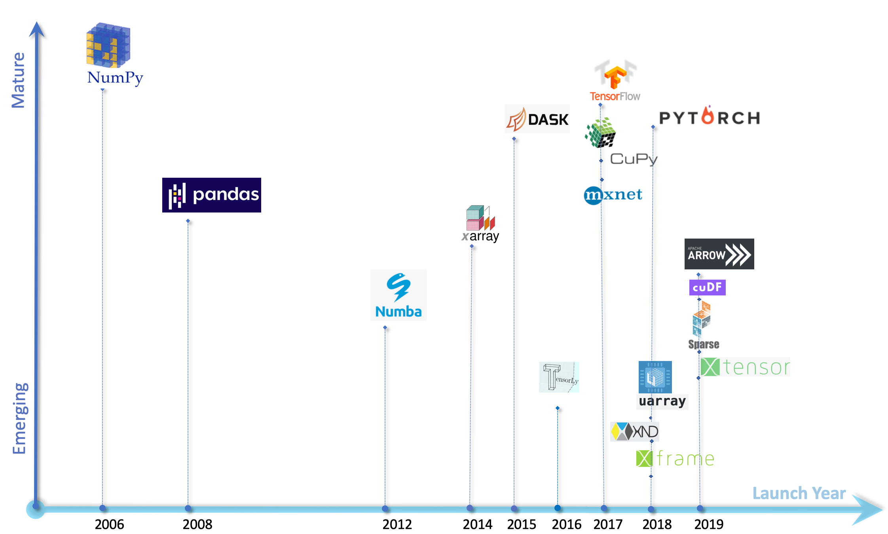

This document is a brief overview of the use of the Apache Arrow project in various open-source projects, some of which are quite well-known from data engineers: Pandas, Polars, DuckDB, etc. The Arrow library, together with the use of multi-core machines, is changing the landscape of analytical processing tools and big data tools.

## What is Apache Arrow?

The Arrow project (from the Apache foundation), created in 2016, defines a framework for creating analytical applications based on a columnar data format for in-memory data. This Arrow project includes the definition of its own columnar data format, an independent format from any language, for flat and hierarchical data, organized for efficient analytical processing on modern hardware like CPUs and GPUs.

In summary, the goals of the Arrow project are twofold:

[*The first goal is to be an efficient, language-independent open standard for columnar data interchange.
The second goal is to be a portable, high-performance computing foundation for doing analytics on that columnar data*](https://wesmckinney.com/blog/from-ursa-to-voltrondata/)

Arrow libraries implement the associated format and are available for various programming languages: C, C++, C#, Go, Java, JavaScript, Julia, MATLAB, Python, R, Ruby, and Rust. Since the data format is the same for all these languages, all data written using one language can naturally be read with another language.

The Parquet and ORC formats are popular examples of columnar data formats but for disk storage, whereas Arrow is a format defined for in-memory data. The definition of Arrow involves different trade-offs compared to those behind Parquet and ORC. Most tools related to one of these formats include conversion features to switch between them.

The Arrow library is increasingly used by notable projects, especially open-source projects. The following sections of this document present some of these projects.

## Use of Apache Arrow by DuckDB 

### DuckDB

[DuckDB](https://duckdb.org) is an open-source, column-oriented relational database initially developed by Mark Raasveldt and Hannes Mühleisen in the Netherlands. DuckDB was featured in a recent post [Quack Up Your Data Projects with DuckDB](/blogs/duckdb).

The very first release of DuckDB was in 2019. Version 1.0.0 was released in June 2024. DuckDB is not a transactional database (like PostgreSQL) but an analytical database.

DuckDB is coded in C++11 and does not rely on external dependencies. DuckDB stands out from the usual client/server model because it runs within the host process; for example, it is possible to call DuckDB within a Python program (via the corresponding Python bindings). DuckDB exploits vertical scalability rather than horizontal scalability. DuckDB can run on a laptop as well as on a server.

DuckDB runs on a single machine. There is no version of DuckDB that takes advantage of multiple machines at once. DuckDB [can exploit the different cores of a CPU](https://duckdb.org/docs/guides/performance/how_to_tune_workloads.html) via its multithreaded execution.

Finally, DuckDB has a significant limitation to consider: it is not possible to execute multiple SQL queries simultaneously on a single DuckDB instance. In comparison, a Spark cluster, for example, is instantiated to execute one specific processing task composed of a series of SQL queries if Spark SQL is used. Thus, this limitation of DuckDB is not a hindrance in nature.

### Relationship between DuckDB and Arrow

While the relationship between DuckDB and Arrow requires some clarification, it is clear that, as of 2021, Arrow (as a format) is natively supported by DuckDB, and DuckDB minimizes the processing cost of Arrow data. In other words, Arrow is treated as a "first-class citizen" by DuckDB. This is detailed in the following article: [DuckDB Quacks Arrow: A Zero-copy Data Integration between Apache Arrow and DuckDB](https://duckdb.org/2021/12/03/duck-arrow.html)

Here is some information about the DuckDB/Arrow integration:

*The zero-copy integration between DuckDB and Apache Arrow allows for rapid analysis of larger than memory datasets in Python and R using either SQL or relational APIs.
This integration allows users to query Arrow data using DuckDB's SQL Interface and API while taking advantage of DuckDB's parallel vectorized execution engine, without requiring any extra data copying. Additionally, this integration takes full advantage of Arrow's predicate and filter pushdown while scanning datasets.
This integration is unique because it uses zero-copy streaming of data between DuckDB and Arrow and vice versa so that you can compose a query using both together. This results in three main benefits:*

* *Larger Than Memory Analysis: Since both libraries support streaming query results, we are capable of executing on data without fully loading it from disk.*
* *Complex Data Types: DuckDB can efficiently process complex data types that can be stored in Arrow vectors, including arbitrarily nested structs, lists, and maps.*
* *Advanced Optimizer: DuckDB's state-of-the-art optimizer can push down filters and projections directly into Arrow scans. This significantly accelerates query execution.*

Whether DuckDB was built around Arrow or simply adopted Arrow very early on is still to be clarified, DuckDB has a special relationship with Arrow. This is why this database is included in this document. Furthermore, it is a database that competes with other processing tools mentioned in this document.

### Positioning of DuckDB

The rationale behind DuckDB is that there are fewer, or far fewer, big data processing tasks than some might think. There is thus a place for a database like DuckDB. This is explained in [Dorian's blog](/blogs/duckdb). In short: big data is

* complex
* not needed often
* .. dead because it concerns only one percent of users

## Use of Apache Arrow by Pandas 2

The Pandas library is an open-source Python library (BSD license) created in 2008, which allows for data manipulation and analysis. It provides data structures and operations for manipulating numerical tables and time series.
The Pandas library is built around the Series and DataFrame data structures. The former corresponds to 1-dimensional arrays (vectors), while the latter corresponds to 2-dimensional arrays (composed of columns and rows). Its implementation also uses the NumPy library (for "Numerical Python") created in 2006.

In 2017, Wes McKinney, the creator of Pandas, wrote an article listing a number of friction points related to using the Pandas library: Apache Arrow and the [10 Things I Hate About pandas](https://wesmckinney.com/blog/apache-arrow-pandas-internals/)
Faced with these problems, Arrow (to which Wes McKinney, the creator of Pandas, contributed) emerged as a project to bring a number of solutions to the Pandas project:

*I [Wes McKinney] strongly feel that Arrow is a key technology for the next generation of data science tools. I laid out my vision for this recently in my JupyterCon keynote.*

At the time (2017), Arrow did not provide a complete solution to the problems encountered with Pandas but took a significant step toward a better Pandas library.
### Pandas 2.0

Since then, Pandas 2.0 was delivered in April 2023. The introduction of the "pyarrow" API allows defining data manipulated by Pandas 2 based on Arrow data structures (using the underlying C++ implementation of Arrow). This reduces the memory footprint of data storage and performs processing more efficiently.
By default, for backward compatibility reasons, Pandas 2 continues to instantiate in-memory data structures via NumPy, as in the example below:
pandas.Series([1, 2, 3, 4])
Using Arrow via "pyarrow" to represent data in Arrow format requires a new parameter: **pandas.Series([1, 2, 3, 4], dtype='int64[pyarrow]')**

Pandas 2.0 marks the beginning of Arrow integration. It appears that with this version of Pandas 2, the performances are not always better than Pandas 1.3, cf. [Pandas 2.0 vs Pandas 1.3 — Performance Comparison](https://medium.com/@santiagobasulto/pandas-2-0-performance-comparison-3f56b4719f58); the performance improvements mainly concern the storage and processing of string data.

Using PyArrow (via the “dtype” attribute, see the example above) allows Pandas to define DataFrames and Series according to the Arrow storage format.
This Arrow storage format offers more data types than NumPy, and also supports missing data (NA) for all data types.
Additionally, performance is also improved.

Pandas 2.0 also introduced the "Copy-on-Write" (CoW) mode which, by simplifying the semantics of certain operations, allows for better lazy evaluation (note: this evaluation mode must be explicitly activated to be operational, and will become the default behavior for Pandas 3.0).
Via operations involving indexes, some Pandas operations return a view of the initial DataFrame, and other operations return a (partial or complete) copy of the same initial DataFrame. Depending on the operation used, modifying the resulting DataFrame may impact, or not, the initial or source DataFrame. This makes the use of operations involving indexes difficult to understand.

The implementation of "Copy-on-Write" (CoW) eliminates the side effects that are not always easy to identify; in other words, any update operation will only concern a single DataFrame. Therefore, the "copy-on-write" (CoW) functionality ensures that any DataFrame (or Series) derived from another has the same semantics as a copy. When programming with Pandas, it is no longer necessary to make defensive data copies to avoid side effects, as CoW eliminates them. To do this, CoW uses a new lazy copy mechanism that defers the copy until the object in question is modified and only if that object shares data with another object.

### Pandas 2.1

Pandas 2.1 was delivered in August 2023, bringing performance improvements (with *pyarrow*). It also offers a "pd.options.future.infer_string" option, which, if defined, ensures that by default, any String type column is represented via Arrow, with associated performance improvements.

[According to the documentation](https://pandas.pydata.org/pandas-docs/version/2.1/whatsnew/v2.1.0.html);
by default, all strings are stored as NumPy objects.
The "pd.options.future.infer_string = True" object allows the systematic use of the Arrow storage format for strings, without needing to use the "dtype" attribute.

Pandas 2.1 also improves the "copy-on-write" mode (i.e., lazy copy) through bug fixes and associated performance enhancements. From Pandas 2.1, the Pandas team recommends using this mode in production.

### Pandas 2.2

Pandas 2.2, delivered in January 2024, continues the path of integration with Arrow.
## Use of Apache Arrow by Polars

While Pandas, the historic library of the Python ecosystem, is migrating to Arrow, i.e., integrating with Arrow version by version and iteratively improving associated performance, Polars, a competitor of Pandas, has been based on Arrow from the start.
[Polars](https://pola.rs) is another open-source Python library (MIT license) oriented towards analytical processing, created in 2020, and developed in Rust.

Like most other data processing libraries, the basic data structure used in Polars is the DataFrame. A DataFrame is a 2-dimensional data structure composed of rows and columns. The columns of a DataFrame consist of series, which are labeled one-dimensional arrays.

[Ritchie Vink](https://www.ritchievink.com/) started the development of Polars in 2020. [In a video](https://www.youtube.com/watch?v=QfLzEp-yt_U) from late 2023, he explains that he started Polars by leveraging the available experience with databases and query engines; experience that, according to Ritchie Vink, was not considered by previous DataFrame processing implementations (implicitly referring to Pandas, most likely).

He adds that Polars can be used to process up to 200 GB on a single machine (for processing larger data volumes, for example, beyond 1 TB, he recommends using PySpark).
The goal is to be able to process data that does not necessarily fit into memory and to unify data processing, whether big data or not.

One characteristic of Polars is that it leverages Rust's capabilities to offer a multi-threaded execution engine, which allows utilizing all CPU cores of a machine. Polars also takes advantage of the parallelism provided by modern CPUs' SIMD (Single Instruction Multiple Data) instructions, which pair well with the columnar format.

From the start, Polars was better at processing certain types of data than Pandas, such as columns containing strings, via Arrow. This advantage has diminished with the arrival of Pandas 2.
Another initial advantage of Polars lies in how it evaluates processing tasks. By default, Pandas uses eager evaluation, performing operations in the order they are written; Pandas only introduced lazy evaluation starting from version 2.0. In contrast, Polars has, since its inception, the capability to perform eager or lazy evaluation, for which a query optimizer will evaluate all required operations and determine the most efficient way to execute the code.

This can include, among other things, rewriting the execution order of operations or eliminating redundant calculations. For example, Polars' "read_csv()" method allows reading a CSV file immediately, while there is a sister method "scan_csv()" that performs the same operation but lazily.

Polars has a more limited ecosystem than Pandas. As of August 2023, it was noted that Polars was not yet compatible with most Python data visualization libraries or machine learning libraries (ML/AI) such as scikit-learn and PyTorch; the only exception was Plotly, which allows creating charts directly from Polars DataFrames.

## Comparison between Data Processing Engines

### Comparative Evolutions of Pandas and Polars

In 2017, Wes McKinney, the creator of Pandas, made an assessment of Pandas' limitations, and in the same article, he pointed to Arrow as a solution to evolve Pandas: [Apache Arrow and the 10 Things I Hate About pandas](https://wesmckinney.com/blog/apache-arrow-pandas-internals/). Wes McKinney also contributed to the Arrow project.
As it is more difficult to evolve software (here, Pandas) in a backward-compatible way without upsetting its user community than starting from scratch, Pandas has been (in a way) overtaken by Polars, whose community was quicker to leverage Arrow.

The multitude of Pandas configurations (with or without Arrow, and using or not the "Copy-on-Write" mode) does not help performance tests against Polars whose results are available on the web: it is not easy to find complete or honest tests implementing all possible Pandas configurations. Nonetheless, it is common for these tests to show Polars, ahead of Pandas in Arrow usage, being better in terms of performance.
It is likely that things will become clearer with the release of Pandas 3 (in the works as of July 1, 2024), as some performance-impacting options introduced in Pandas 2 will become defaults, i.e., will be activated by default, for Pandas 3.
### Other Data Processing Engines Based on Arrow

#### Vaex

Pandas 2 (and soon, Pandas 3) and Polars are not the only open-source processing libraries using Arrow. This is also the case for [Vaex](https://github.com/vaexio/vaex) (MIT license), which aims to be a more efficient alternative to Pandas. [According to a 2019 article](https://towardsdatascience.com/vaex-a-dataframe-with-super-strings-789b92e8d861):

*Vaex uses Apache Arrow data structures and C++ to speed up string operations by a factor of about ~30–100x on a quad core laptop, and up to 1000x on a 32 core machine. Nearly all of Pandas’ string operations are supported, and memory usage is practically zero because the lazy computations are done in chunks.*

#### DataFusion

Another project from the Apache foundation that uses Arrow is [DataFusion](https://datafusion.apache.org). The description of this project, provided by its own community, closely resembles that of the Polars project itself:

*Apache Arrow is a library which provides a standardized memory representation for columnar data. It also provides “kernels” for performing common operations on this data.*

*DataFusion is a library for executing queries in-process using the Apache Arrow memory model and computational kernels. It is designed to run within a single process, using threads for parallel query execution.*

*DataFusion is a very fast, extensible query engine for building high-quality data-centric systems in Rust, using the Apache Arrow in-memory format.*

*DataFusion offers SQL and Dataframe APIs, excellent performance, built-in support for CSV, Parquet, JSON, and Avro, extensive customization, and a great community.*

#### Databend

A project similar to DataFusion is [Databend](https://github.com/datafuselabs/databend). DataBend is a complete database. Like DataFusion, it is also written in Rust and uses Apache Arrow as its in-memory storage base, but unlike DataFusion, DataBend targets end users rather than database developers.

#### cuDF Pandas

The issue with libraries like Polars, Vaex, etc., is that their use requires rewriting code that leverages Pandas to achieve better performance. However, there is another alternative: [cuDF Pandas](https://rapids.ai/cudf-pandas/).

cuDF.pandas is built on cuDF, a GPU-based Python DataFrame processing library (based on the Apache Arrow columnar memory format) for loading, joining, aggregating, filtering, and manipulating data.
The use of cuDF Pandas is done either via a flag or via an extension (depending on the context). If it is possible to run the processing on a GPU, the Pandas code will run on the GPU. In cases where this is not possible, cuDF automatically switches to CPU execution. There is no need to write two versions of the code or manually manage the switch between GPU and CPU.

Not all GPUs are necessarily supported. At a minimum, it seems that cuDF Pandas supports NVIDIA GPUs.
In fact, cuDF is part of RAPIDS, an open-source suite of software libraries and APIs created and maintained by NVIDIA. RAPIDS is designed to enable data scientists and engineers to harness the parallel processing power of GPUs for data exploration and analysis pipelines.

Using a GPU instead of a CPU can significantly improve performance compared to CPU processing. Typically, these improvements materialize when the cost of transferring data to the GPU is largely outweighed by the acceleration provided by the GPU; more concretely, this is true starting from a certain size of the dataset and for a certain complexity of the processing performed.

For example, a test conducted in April 2024, for a dataset of approximately 9 GB, is presented in the article [Need for Speed: cuDF Pandas vs. Pandas](https://towardsdatascience.com/need-for-speed-cudf-pandas-vs-pandas-16b87009aefa).
In summary, the total time required for all tests for Pandas was 82.3 seconds, and the total time using cuDF Pandas was 30.36 seconds, representing a 60% improvement. This is not too bad, even though most of the time saved was spent loading the input data.

One of the most important points regarding the use of cuDF Pandas is that you do not need to modify your Pandas code at all. A simple notebook extension load or an additional flag in a Python call before running your program is all you need. The initial setup of your system may be a bit complicated, but it is a one-time operation, and I think the potential runtime benefits will compensate for that.

Other tests likely exist, but they were not thoroughly researched for writing this document.
#### FireDucks

The processing library [FireDucks](https://fireducks-dev.github.io) (3-Clause BSD license, a modified BSD license) was developed by an R&D team at NEC who seem a bit obsessed with accelerating Pandas code.

* The FireDucks library is multithreaded and can therefore run on multiple CPU cores.
* It includes and uses a JIT (just in time) compiler to produce native code at runtime.
* It is fully compatible with the Pandas API. The only difference lies in the import statement. No additional learning or code modification is required to start with FireDucks.
* It has a lazy execution mode (like Polars, for example).

As of writing [June 2, 2024], FireDucks is still in beta (FireDucks is at version 0.12.4 as of July 9, 2024).

For FireDucks, the user API and its execution are totally independent of each other via an intermediate language. FireDucks allows modifying the backend related to the execution engine, for example, a backend optimized for multicore execution, or a backend using accelerators such as GPUs... the backend can be modified via environment variables, allowing the user to change the backend without changing the user program at all.

The beta version of FireDucks includes a multithreaded backend for CPUs. This backend uses Apache Arrow as its data structure and adds its own parallelization on top of the DataFrame operations provided by Apache Arrow.
In other words, FireDucks, younger than Polars, is very similar, primarily due to its use of the Arrow library and providing a multithreaded backend and lazy evaluation.
The notable difference between FireDucks and Polars is that FireDucks' API is identical to Pandas', so, modulo the change in import statements, the code remains identical when switching from Pandas to FireDucks, which is not the case when switching from Pandas to Polars.

## Performance Comparison between Several of These Different Libraries

An article from February 2024, [Benchmarking High-Performance pandas Alternatives](https://www.datacamp.com/tutorial/benchmarking-high-performance-pandas-alternatives) compares the performances of these different libraries.

Ultimately, the implementations of these different libraries tend to converge... because they share a common foundation, either similar implementation patterns or a common library (Arrow) that implements such a foundation. Over the versions, we should see performance converge, provided the communities of these different projects desire to support the same use cases.

## Use of Apache Arrow for Spark

### Comet, an Apache Plugin, Arrow-based Accelerator

The Spark project is written in Java. But there are other implementations, using the same APIs, developed to be faster – for example, the Photon project (from Databricks) which is coded in C++ [https://www.databricks.com/product/photon](https://www.databricks.com/product/photon).

The Comet project (part of the DataFusion project) aims to replace part of Spark's current implementation to use the Arrow library. On March 6, 2024, the Arrow project announced the donation of the Comet project to the DataFusion project. The initial code for the Comet project [comes from Apple](https://thenewstack.io/apple-comet-brings-fast-vector-processing-to-apache-spark/); during the donation, Apple stated that “the project is not yet feature-complete, but parts of it are already used in production [at Apple, thus]”

Comet is an Apache plugin that is a native accelerator, based on Arrow, for Spark SQL; in other words, Comet uses Arrow to accelerate Spark processing. Comet aims to be used as a replacement for Spark's JVM-based SQL execution engine and potentially provide better performance. Using Comet will not impact Spark users: only the implementation under the hood will change.

The first release of the Comet project took place on July 20.

### Ballista, an Arrow-based Alternative to Spark

The Ballista subproject of the DataFusion project aims to provide a distributed execution engine built on DataFusion and thus on Arrow. As such, Ballista can be seen as a complete replacement for Spark SQL, but not necessarily with the same APIs (“The [Ballista] DataFrame API is inspired by Apache Spark and is currently better suited for ETL/SQL work than for data science” [https://datafusion.apache.org/ballista/contributors-guide/architecture.html](https://datafusion.apache.org/ballista/contributors-guide/architecture.html)). Ballista is inspired by Spark, with a number of differences:
The choice of Rust as the main execution language means that memory usage is deterministic and avoids the overhead of GC pauses.

* *Ballista is designed from the ground up to use columnar data, enabling a number of efficiencies such as vectorized processing (SIMD and GPU) and efficient compression. Although Spark does have some columnar support, it is still largely row-based today.*
* *The combination of Rust and Arrow provides excellent memory efficiency and memory usage can be 5x - 10x lower than Apache Spark in some cases, which means that more processing can fit on a single node, reducing the overhead of distributed compute.*
* *The use of Apache Arrow as the memory model and network protocol means that data can be exchanged between executors in any programming language with minimal serialization overhead.*

A Ballista execution environment includes, like Spark, scheduler nodes and executor nodes.

According to the [2024 documentation](https://datafusion.apache.org/blog/2024/07/20/datafusion-comet-0.1.0/),

* *Comet is an accelerator for Apache Spark that translates Spark physical plans to DataFusion physical plans for improved performance and efficiency without requiring any code changes.*
* *Comet [...] aims to provide 100% compatibility with Apache Spark. Any operators or expressions that are not fully compatible will fall back to Spark unless explicitly enabled by the user.*
* *This first release supports 15 data types, 13 operators, and 106 expressions. Comet is compatible with Apache Spark versions 3.3, 3.4, and 3.5. There is also experimental support for preview versions of Spark 4.0.*

As of today, there are at least 5 different implementations of Spark, respecting the same interfaces – or, at the very least, the part corresponding to Spark SQL:

* [The open-source Spark project from the Apache foundation](https://spark.apache.org)
* The version of Spark optimized by AWS (AWS includes, for example, query optimizations and optimized interaction with AWS S3 in its version of Spark)
    * *Amazon EMR provides multiple performance optimization features for Spark. [This topic explains each optimization feature in detail](https://docs.aws.amazon.com/emr/latest/ReleaseGuide/emr-spark-performance.html).
    * [Amazon EMR offers features to help optimize performance when using Spark to query, read and write data saved in Amazon S3](https://docs.aws.amazon.com/emr/latest/ReleaseGuide/emr-spark-s3-performance.html)
* The re-implementation of Spark by Databricks (the company that includes the creators of open-source Spark and the main contributors to this project) called [Photon](https://www.databricks.com/product/photon)
* The open-source Spark project, used with Comet, an Apache plugin, Arrow-based accelerator.
* And also the open-source Spark project, used in conjunction with the RAPIDS plugin which allows [executing Spark code on an NVIDIA GPU, without code changes](https://github.com/NVIDIA/spark-rapids)

## Use cases

Here is a selection of interesting use case videos:









## Conclusions

As Wes McKinney (creator of Pandas and co-creator of Arrow) pointed out, we are witnessing a defragmentation of the big data ecosystem. The Arrow project has played a significant role in this evolution and in fostering collaborations among open-source projects.

This document does not claim to provide an exhaustive list of all projects using Arrow, directly or indirectly. Alongside pre-big data tools and big data tools, new tools such as DuckDB, Pandas 2, Polars, DataFusion... are emerging. These tools can be used to handle data volumes from the pre-big data world and also from the "almost big data" world. These tools particularly benefit from better utilization of hardware resources through Arrow, allowing them to take advantage of vertical scalability, which is increasingly available in a cloud environment.

For those using Pandas v1, it is time to move to Pandas v2 or even consider using a competing tool that is also based on Arrow and more efficient in some cases.

Spark users are in a favorable position since improvements through new implementations will respect the Spark APIs, meaning existing Spark programs will be minimally impacted. However, the Comet accelerator is not yet ready for production for most users.
As for DuckDB, it is already used in production by many companies. It is a "Swiss Army knife" (via its extensions), efficient, and its use cases ride the wave of a kind of retreat from big data and the return of SQL (as opposed to NoSQL) which has never really gone away. Its use is expected to grow.

## Contact

- dominique.devito@thalesgroup.com
