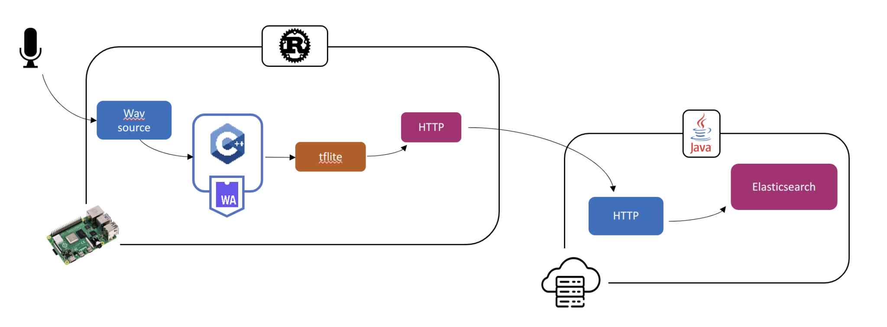
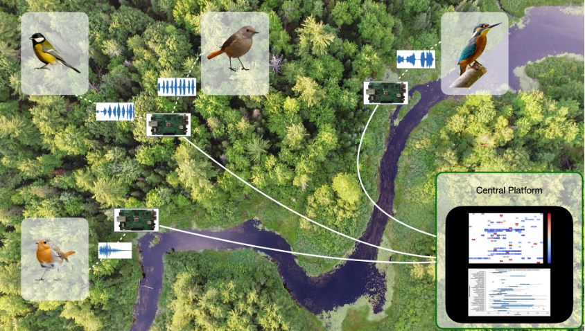


*Integrating AI models into Rust pipelines is a promising but challenging journey. With TensorFlow Lite, portability is possible — but only after overcoming missing bindings, outdated crates, and unsupported layers.*


This blog discusses a few challenges when integrating AI models into a Rust pipeline. We mainly focus on TensorFlow Lite models that are lightweight enough to run on edge devices like Raspberry Pi or RISC-V equivalent.

This experiment is part of a larger innovation track in charge of providing a Rust/WebAssembly function engine to design frugal serverless platforms. 

## BirdNET: Focus on an Environmental Use Case

We decided to work on a biodiversity tracking use case for various reasons. First, the topic is essential, and the damages to biodiversity are dramatic. Second, biodiversity tracking typically requires small edge devices with low batteries, which we want to address. Last, we are surrounded by specialists, particularly at the Nantes and Brest universities.  

After careful consideration, we settled on BirdNET, a preexisting TFLite model detecting bird species through their calls. We decided to demonstrate it on a Raspberry Pi equipped with a microphone and to deploy it in Brittany, France.

Here is an overall view of the target application:

The central platform runs on the google cloud platform and is out of the scope of this blog. 

## The Most Prominent Difficulty: Finding a Rust Library loading a TensorFlow Lite model

While our vision was clear and our enthusiasm high, we encountered several challenges while implementing this use case. First, crates loading a Tensorflow Lite model are rare. Bindings to the Lite version are not yet implemented in the official Tensorflow Rust crate. That’s why we looked at two other libraries: tract and tflite-rs.

Second, the latest BirdNET model (v2.4) relies on TensorFlow version 2. However, many Rust crates have not yet caught up to this newest version. The majority of these crates are designed to work with TensorFlow 1.15. So, we have tried to integrate an old version of the BirdNet model retrieved here in our test.

**Exploration of Tract crate:** The Tract crate is known for its activity and support in the Rust community. However, we found that the tract submodule, Tract-TFLite, was still under development. While attempting to use Tract-TFLite, which we know is unstable, we encountered translating proto-model to model errors. Stuck, we then decided to explore the possibility of converting the BirdNET model to ONNX format, hoping to overcome the limitations of the Tract-TFLite crate. However, we faced yet another obstacle: the BirdNET model relies on RFFT layers to compute mel-spectrogram, which is not supported by ONNX, making this conversion unviable for our use case.

**Tflite-rs crate:** TFlite-rs crate is less popular than tract and less active. But there is no alternative. So we tried it anyway. First, we encountered a significant roadblock when compiling our project due to a newer version of Rust (1.71.0). Unfortunately, we had to resort to using a fork of the Tflite crate, which, although functional, was not published as an official crate on Rust’s package registry. This workaround allowed us to bypass the compilation issue, but it highlighted the need for active maintenance and support for crucial Rust dependencies. After the compilation step, the model loading worked well, but the inference failed. As explained previously, BirdNet uses particular layers to compute mel-spectrogram, which are not supported by the Tflite crate (maybe due to version 1.15.5 of TensorFlow). 

Due to these issues, we kept the Tflite-rs crate as it only failed at inference time, while Tract failed during model import, even for a custom model. We decided to re-train our model without the (Birdnet) problematic layers (RFFT). The audio transformation into a spectrogram has been developed in C++ and integrated via Wasmtime into our Rust pipeline.

Why C++ and not Rust? Because the results differ too much from the librosa python library (the training part is done in Python on BirdCLEF 2021 data from Kaggle, we focus on species present in Britanny, France).

## Pipeline configuration

Our Rust pipeline, provided by the Reef project,  exhibits remarkable flexibility by enabling the seamless integration of new features by adding new nodes. In our latest catalog update, we introduced a tflite node, which leverages a forked version of the tflite-rs crate. This novel node empowers users to input a .tflite model file and a corresponding labels file, specify the target data column for model application, and even limit the prediction output to a selected top n results.

Additionally, our Wasmtime node plays a vital role by efficiently processing .wasm files. This node applies the Melspectrogram C++ function on audio data read upstream through a source node.

A side note: Wasmtime was preferred over other runtime (including WasmEdge) for two main reasons. First performance. Wasmtime significantly outperforms WasmEdge. Second, Wasmtime allows us to generate a complete target-specific binary without requiring any dynamic libraries installed on the target. 

Here is an architectural view: the inference is performed directly on the edge, and the results are transmitted via HTTP to the cloud, where another pipeline written in Java, Python, or Rust plays the role of a receiver to analyze further and process the data.

## Conclusion

While Rust is gaining ground in AI development, it does not yet offer the same breadth and maturity of Python tools and libraries. However, Rust’s strengths in performance, safety, and system-level programming make it a compelling choice for AI applications where these attributes are critical. We remain optimistic about the growth of the Rust community in supporting a wider set of models and functionalities.

## References

- [BirdNET](https://birdnet.cornell.edu/)  
- [TensorFlow Rust](https://github.com/tensorflow/rust)  
- [Tract crate](https://github.com/sonos/tract)  
- [tflite-rs crate](https://github.com/rgraup/tflite-rs)  
- [BirdCLEF 2021 dataset](https://www.kaggle.com/competitions/birdclef-2021)  
- [Librosa](https://librosa.org/)  
- [Original blog post](https://punchplatform.com/2023/09/14/navigating-the-challenges-of-integrating-tensorflow-lite-into-rust-a-birdnet-use-case/)  
