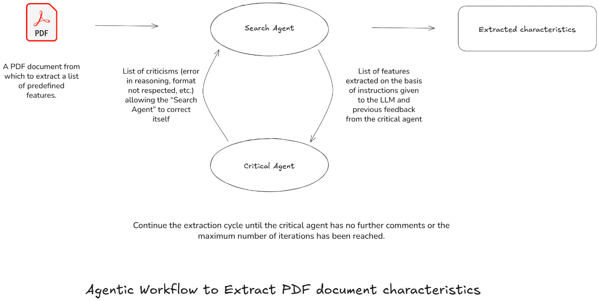


The authors propose a **two-agent architecture**—a *Search Agent* that extracts
target properties and a *Critical Agent* that critiques and refines the
outputs—to pull accurate, structured data (e.g., voltage ratings from electronic
datasheets) out of messy, non-uniform PDFs. The approach outperforms
traditional PDF-parsing libraries in **speed**, **precision**, and **scalability**,
while retaining human-in-the-loop safeguards against hallucination and data-
sensitivity issues.:contentReference[oaicite:0]{index=0}


---

## Introduction

Extracting information from documents is crucial for facilitating information retrieval, data analysis, or targeting specific details automatically. Imagine a world where analyzing thousands of complex documents no longer requires hours of manual labor.

Before the era of agents, we relied on libraries like PDFMiner and PyMuPDF for document processing. These libraries share several common weaknesses. They often struggle with extracting structured content, such as tables and images. Additionally, many of these libraries lack Optical Character Recognition (OCR) support, rendering them unsuitable for extracting text from scanned or image-heavy PDFs. Furthermore, their performance can be slow with larger files.

Thanks to the advanced technology of large language models (LLMs), this future is now possible. LLM agents are revolutionizing information extraction from PDF files, freeing up valuable time for professionals. In this article, we will explore how these agents operate, their practical applications, and methods to optimize their performance.

## What is an agent?

Intelligent agents are autonomous entities programmed to perform specific tasks within a defined environment. These systems are capable of perceiving and interacting with their environment, making decisions, and taking actions to achieve determined objectives.

LLM agents are based on LLMs, giving them better reasoning skills and the ability to interact with other systems. LLMs are trained on massive datasets of textual information, enabling them to understand and produce natural language in a sophisticated manner. In practice, they can read, interpret, and extract relevant information from PDF documents, even if they do not follow a single template and can include scans or plain text. Moreover, LLMs have the capability to extract complex information from various document elements, including handwritten notes, checkboxes in forms, images, tables, and graphs.

Using LLM agents for extracting information from PDFs has several advantages:

1. **Automation**: Tasks that were previously manual and used to take a lot of time are now done automatically. This allows people to focus on more important and relevant topics.  
2. **Precision**: They are good at finding and getting the right information, which helps to reduce human mistakes.  
3. **Speed**: They can handle large amounts of documents much faster than traditional methods like recognizing document patterns in documents.  
4. **Autonomy**: They can work on their own, without needing constant supervision, allowing users to focus on other important tasks.

It is crucial to be vigilant about data sensitivity when using LLM agents. Furthermore, attention must be paid to hallucinations, as LLMs can provide answers that seem true but are not. Therefore, it is important to have an evaluation mechanism in place that incorporates human intervention to check the quality of the extracted information.

## Different use-cases

LLM agents find their utility in various sectors. Here are some detailed examples:

1. **National Security**: The agent can extract data from intelligence reports, surveillance documents, and risk analyses. For example, by extracting mentions of specific threats from a national security report.  
2. **Aerospace and Defense**: Technical manuals, test reports, and maintenance schedules for weapon systems and aerospace can be automatically analyzed by the agent to extract critical data such as test results and maintenance recommendations.  
3. **Cybersecurity**: LLM agents can scan threat reports, security logs, and audits to identify vulnerabilities and security incidents. For example, locating indicators of compromise in a cyberattack report.

## Communication between agents

Communication between multiple LLM agents is crucial for optimizing results. Here are some key concepts:

1. **Task coordination**: A primary agent can assign specific subtasks to secondary agents. For example, one agent may extract raw data while another organizes and validates it.  
2. **Mutual validation**: Agents can share their results with each other for mutual validation, thereby improving accuracy.  
3. **Iteration for improvement**: Through iterative communication, agents can continuously improve and refine their methods and outcomes, ensuring their reliability and security.

Agents stimulate each other to reach an acceptable consensus enhancing the overall quality of their results.

## How can a performant agent be defined for property extraction?

To define a performant agent for extracting specific properties, it is essential to follow a structured approach. We applied this approach to achieve one of the needs of our business partner. The goal is to extract characteristics of electronic components, such as voltage ratings, from various public PDF datasheets. These datasheets have diverse templates, as each manufacturer creates its own design and layout.

- **Create a specific search agent for the “search task” and assign a clear role**: Instantiate an agent and assign a role like “You're an electronic component datasheet specialist”.  
- **Assign responsibilities to the “Search agent”**: Define the responsibilities and objectives of the agent clearly. For example, for an electronic datasheet, the task could be extracting information of electronic components. For example, “Your role is to extract precisely these characteristics: …”  
- **Definition of parameters to extract information with context**: Each characteristic must be defined with its context. For example, the "resistance" of an electronic component must be defined in ohm, so the agent must know the unit of the characteristics.  
- **JSON output format with justification**: Structure the extracted data in JSON format for easy use, accompanied by justifications, ensuring traceability and promoting continuous improvement.

## How the results be improved with another agent?

To optimize the performance of a main “Search agent”, using a complementary agent is essential to criticize the extracted answers, indicating in particular the information extracted incorrectly and the reasons for these errors. This “Critical Agent” can help improve performance and reliability by focusing on certain elements of interest. Here is how:

1. **Validation of data format**: The agent verifies the compliance of extracted data with the required format.  
2. **Verification of units**: The reflection agent ensures the consistency of units of measurement (e.g., meters, dollars, etc.).  
3. **Verification of rules**: This agent serves to check business rules.  
4. **Iterative communication**: The reflection agent provides feedback and recommendations to the search agent. For example, if errors are detected, the reflection agent suggests adjustments that the search agent integrates to refine its extraction in subsequent iterations.

It is important to define a maximum number of exchanges between the "Search agent" and the "Critical agent" in order to provide a response within a reasonable timeframe and to avoid endless loops of exchanges.

## Conclusion

The use of agents for information extraction represents a significant advancement in automation and optimization of technical processes. These agents transform complex documents into actionable information quickly and with high precision. Through their adaptability and scalability, they promise to innovatively automate and optimize complex operations.

A structured approach that allows for clearly defining objectives, specifying parameters to extract, and validating results is crucial for ensuring the accuracy and reliability of extracted data. To fully leverage this technology, it is essential to implement a rigorous evaluation and validation methodology with the support of a business expert. This includes:

1. **Define parameters and objectives**: Establish specific and clear criteria for the data to be extracted and the objectives to be achieved.  
2. **Structured Data Format**: Utilize standard output formats such as JSON to facilitate verification and use of extracted data.  
3. **Mutual Validation**: Set up a protocol for evaluating the extraction methodology, based on a dataset representative of the use cases, composed of couples (PDF documents, characteristics to be extracted). This ground truth must be validated by the business expert to guarantee the accuracy of what the agents need to extract.  
4. **Feedback Loop**: Set up iterative cycles of feedback and adjustments to continuously improve agent performance. Improvements can be of various kinds: Prompt engineering, adding a new agent, selecting a high-performance LLM, etc.

Understanding and utilizing these agents in a methodical and structured approach can provide a robust foundation for reliable and high-quality technical analyses.

---

## Further reading

* Charlotte Jacobé de Naurois & Julien Meynard, *Leveraging LLM Agents for
  Efficient Property Extraction from PDFs* (Thales Group Limited
  Distribution).  
* [LangChain Agents Docs](https://python.langchain.com/docs/modules/agents/)  
* Developed as part of the 2025 **CLEAR** innovation track

 

