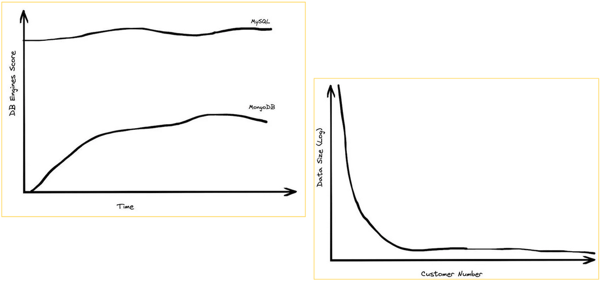
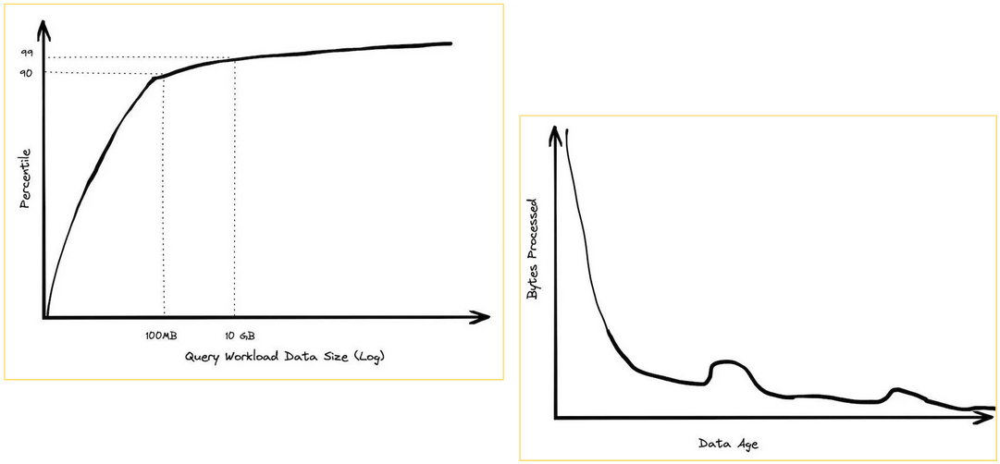
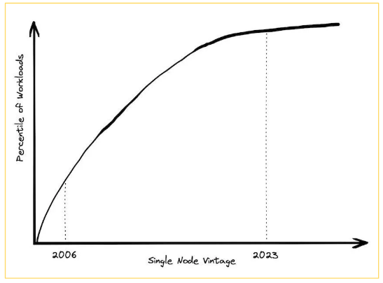
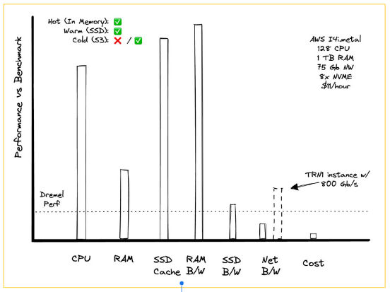
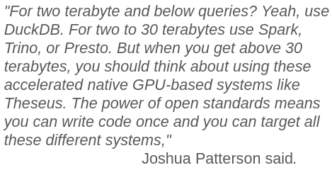
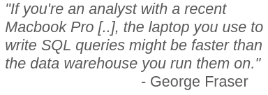

There are dozens and dozens of data analysis engines, each claiming to be the fastest, the lightest, or the most flexible. But in this ocean of contenders, where some turn out to be ugly ducklings, lies a hidden gem: **DuckDB**. Still young and growing, this little duck has, in my opinion, a particularly interesting place in the vast pond of data analysis.
  
## Quack is DuckDB ?

According to the DuckDB documentation: "DuckDB is a simple RDBMS, portable, fast, and extensible." Let’s dive into the details:

**Simple RDBMS**: DuckDB operates on the same principles as SQLite. It's a SQL-based engine adhering to ACID principles, where the entire database is stored in a single file. This simplicity makes it highly accessible and easy to use for various applications.

**Portable**:Written in C++, DuckDB is designed to be *compiled and executed everywhere*, with a footprint of around 25MB.

**Fast** : Utilizing a columnar storage format and vectorized execution, Benchs are cool. Having tested it extensively, I found the performance to be genuinely remarkable.

**Extensible** : DuckDB supports easy integration of extensions and connectors. For instance, I have used extensions for interfacing with Iceberg, Delta Lake, and HTTPFS ... 

In essence, DuckDB is a single-file database that runs in memory, allowing for efficient SQL-based analytical processing. However, it’s important to note that DuckDB is not a traditional distributed database with persistent storage. Instead, it’s designed as an in-memory OLAP (Online Analytical Processing) system, running on a single machine with multiple client APIs (Go, Java, Python, CLI, Rust, etc.), making it ideal for fast, interactive data analysis.

In order to better understand the positioning and advantages of this "duck," let's situate this technology within the current ecosystem.

## Where is the Duck ? 

I appreciate the caricature of the data analysis engines landscape presented in the first reference (in French): .

On one side, we have the "JVM data engineers" working with Spark, Flink, and Beam. To build their data pipelines and perform analyses, they need to be Java experts, familiar with the 27 types of JVMs. Ultimately, at a small/medium scale, it becomes incomprehensible, quickly unusable due to maintenance challenges, high costs, and less-than-stellar performance.

On the other side, there are the "SQL data engineers" using tools like Snowflake, Druid, Clickhouse, and Samza to do practical things.

Finally, we have the "data scientists" who often use dataframe engines like Pandas.

So, for example, to help situate everything, nowadays we have:
Polars, a powerful Rust engine working with dataframes, serves as a bridge between data scientists and the Spark ecosystem.
In this context, DuckDB can be seen as a bridge between the world of JVM data engineers and SQL data engineers because it allows users to quacks SQL on your own warehouse.

For those interested in a deeper comparison between DuckDB and Polars, you can read more in this [2]

Now that we've paddled through DuckDB's place in the current ecosystem, let's dive into what makes DuckDB so cool and why it's a quacking good choice for data analysis.

## Why is it important ? 

For several reasons:

### SQL Is Key

What encapsulates the principle of what we often call the "modern data stack" is the concept of replacing complicated code with SQL. SQL is code that everyone understands, easy to produce, easy to maintain, and therefore significantly less expensive.

You've probably already grasped my opinion on this topic, but I'll reiterate: **SQL is, in my view, vital in data analysis**, especially for projects of reasonable scale. This leads to a question: who really works on data projects at an enormous scale?

**Spoiler**: not so many.

### BigData is Dead



There is a well-known conference and blog by Jordan Tigani, one of the founders  of BigQuery, on this topic [3]. I’ve included the conference video above, but I will try to summarize the key points to support my words:
 
#### We want smaller ones

We often see the big data curve showing the exponential growth of global world data volumes. Looking at this curve, one might quickly feel overwhelmed and think, "Ahhh, I need more compute power, always more!" But in reality, **this curve doesn't concern most people**.

To temper this daunting curve, let's play the curve game ourselves and introduce a few of our own. Note that these curves come from the above-mentioned conference and are based on feedback from BigQuery users.

The first curve shows that MongoDB, the most popular NoSQL database, is actually on the decline and never really reached the popularity of MySQL/PostgreSQL databases.
The second curve demonstrates that a large majority of users don't have massive amounts of data. To give you an idea, the vast majority of **customers have less than 1TB of data, and the median is around 100GB**.

Even though some clients still have a lot of data, it doesn't often translate to huge queries.

This leads us to the next question: who really needs big querying?

#### Who needs big querying 

One of the major advancements in modern data architectures is the decoupling of storage and compute. Increasing storage capacity by tenfold rarely means you need to increase compute capacity by tenfold as well.

Among BigQuery customers who paid more than $1,000 per year, **90% of queries were under 100MB, and 99% were under 10GB**. Additionally, observations show that clients with moderate data sizes occasionally run large queries, whereas clients with enormous data volumes rarely perform large queries.

This indicates that with good analytical practices, there's almost never a need to query enormous volumes of data. Large queries often come from less data-driven organizations that panic and generate reports at the last minute, querying a week or even a month's worth of data.

All these points are usage observations that suggest that, based on the experience of recent years, **almost no one needs to query on the order of several terabytes**. However, there are also technical reasons why big data is dead.

#### Yesterday big data is no longer big data

In 2006, at the beginning of AWS EC2, the only available instance was a single core with 2GB of RAM. Today, 18 years later, a standard instance typically has 64 cores and 256GB of RAM. You can even get monster machines with 24TB of RAM and 445 cores.

One of the definitions of big data is "data processing that cannot fit on a single machine." So yes, in 2006, big data meant handling just a few gigabytes of data. But today, with the advancement of hardware, **the threshold for big data has significantly moved**. Who really needs multiple machines for computation today?

So, why would we still use multiple machines?

### Why not scale up ?

For this section, I was inspired by a blog [4] that compares the performance of Dremel (the distributed engine that is the ancestor of BigQuery) and a single instance.

The result is that in 2008, with Dremel, it took 3,000 standard nodes to handle an 87TB dataset. Today, 16 years later, it is possible to achieve similar performance without the magic of distributed computing on a single instance costing **$11 per hour**.

Of course, this may be less applicable for on-premises setups where you need to manage resilience yourself, but the overall point remains clear.

However, the data ecosystem still faces the prejudice that if you don't know how to do distributed computing, you're a clown. So now you will be able to respond "no, my friend, I am a duck" because the fact is, **it is becoming unnecessary to complicate things with distributed black magic**. Just because it's more complex doesn't mean it's better.

I would add an authoritative argument I read online from Joshua Patterson, the CEO of Voltron Data, a very active company in the data ecosystem and one of the main contributors to Apache Arrow [5]:

Given these insights, it becomes evident that we no longer need to rely on distributed systems for most of our data processing needs, because you can just put a duck on a single instance. But let's take this a step further: if one instance is sufficient for the majority of use cases, why not harness the full power of our workstations directly?

With the diminishing necessity for distributed computing, it's important to realize that **the machines we work on today are already powerhouses**. They can meet the majority of compute requirements effectively and efficiently.

To support my point, I will refer to a blog post by George Fraser, the CEO of Fivetran, who compares the performance of DuckDB on his local machine with a standard cloud provider data warehouse [6].

The conclusion of this article is striking, and I love this phrase:

I find this cool because it reverses the traditional big data paradigm of "move compute to the data" to "move the data to the compute." From my perspective, this opens up many doors for the future, particularly with the use of WebAssembly (WASM).

## What now ?

So finally, the only real question that remains is: **are you in the 1% dealing with big data?**
If not, I invite you to consider adopting a promising little duck.

With DuckDB, you can simplify and enhance your data stack.

I have personally explored two approaches that I will summarize to show you how this tool can change the game:

- Utilizing the DuckDB WebAssembly client, which I started to introduce in the previous section.
- Building a "low cost open source data stack" with tools like dbt, DuckDB, S3, Iceberg, and Superset.

### WebAssembly: Mozilla FireDuck

WebAssembly (WASM) is revolutionizing the way we think about web applications by allowing high-performance execution of code directly in the browser. One of the exciting developments is the ability to run the DuckDB engine natively within a browser environment, thanks to WASM.

So, you can execute the DuckDB engine directly in your browser. This means you can perform complex data operations and aggregations on the client side without needing a powerful server. Having tested it, the performance is impressive; I was able to aggregate few gigabytes of data directly in my browser in the blink of an eye.

For front-end developers, this means a significant shift in how dashboards and data-driven applications are built. You can develop more responsive and efficient applications without the overhead of constant server communication for data processing. This can lead to quicker load times and a better user experience.

A new term is emerging with this technology: **Distributed Dashboarding**. Instead of relying on a central, expensive instance to handle all your data processing, you can now perform these tasks locally on your machine. Imagine running your data aggregations for your dashboard directly in the browser. This approach not only reduces costs but also improves performance by leveraging the power of modern workstations.

I've already touched on this in the previous section, but this new principle seems simply revolutionary because **it transforms our way of thinking about data**. It could transform how we think about client-side processing and data management. The potential for creating powerful, more efficient, cost-effective decentralized applications is immense.
So, get ready to embrace the power of Mozilla FireDuck and revolutionize your front-end development workflow!

### Building a Quack-tastic Low-Cost Data Stack

Following the theme of utilizing powerful yet cost-effective solutions, I explored the creation of a low-cost open-source data stack. By leveraging DuckDB along with other open-source tools such as dbt, minio , Iceberg, and Superset, you can achieve a robust and efficient data architecture without breaking the bank.

This stack uses well-known free-to-use tools:

- **dbt** (Data Build Tool): Integrates with DuckDB and facilitates data transformations by offering a kind of SQL workflow orchestrator.
- **DuckDB**: Our favorite in-process SQL OLAP database management system that provides high-performance analytics.
- **MinIO**: An object storage service that will serve as our only database in this setup.
- **Apache Iceberg**: A storage layer that enhances and simplifies the management of large volumes of data.
- **Apache Superset**: An open-source data visualization tool, which is also the most popular Apache project and a very relevant alternative to Tableau, for example.
This stack is **easy to understand, maintain, and scale**, and it is already capable of addressing many use cases at a low cost.

To illustrate the real-world benefits, consider how Okta **managed to save hundreds of thousands of dollars** by incorporating DuckDB into their data processing workflow. For more details on their success story, you can watch their presentation here.



Exploring the full benefits of this architecture would warrant a dedicated blog post or presentation, but in the meantime, I encourage you to check out MotherDuck's website. This startup, which raised $52 million in 2023, is building a comprehensive data warehouse solution based on DuckDB. They offer a wealth of interesting blogs and videos [7].

## Conclusions

Throughout this blog, we have explored the impressive capabilities of DuckDB and how it can revolutionize your data stack. From running complex queries directly in your browser with WebAssembly to building a low-cost, open-source data stack, DuckDB offers powerful solutions that are both accessible and efficient.

In summary, DuckDB stands out for its:

- **Simplicity** and Portability: A lightweight yet powerful SQL OLAP database that can run anywhere.
- **Performance**: High-speed data processing and aggregations, even on large datasets.
- **Flexibility**: Integrates seamlessly with other open-source tools to create robust data stacks.
- **Cost-effectiveness**: Reduces the need for expensive infrastructure by leveraging local compute power.

Whether you’re a data scientist, a front-end developer, or an engineer, DuckDB offers tools and features that can simplify your workflow and enhance your data analysis capabilities. By embracing this “little duck,” you can navigate the modern data landscape with ease and efficiency.

Thank you for reading, and happy quacking with DuckDB!

## Contacts

- dorian.finelbacha.e@thalesdigitale.io

## References

- 1 Youtube duckDB Quick Presentation : https://www.youtube.com/watch?v=6xBBbqn0CZQ&t=651s
- 2 duckDB vs Polars : https://motherduck.com/blog/duckdb-versus-pandas-versus-polars/
- 3 BigData is dead : https://motherduck.com/blog/big-data-is-dead/
- 4 Joys of Scaling up : https://motherduck.com/blog/the-simple-joys-of-scaling-up/
- 5 Joshua Patterson Interview : https://www.theregister.com/2024/03/19/voltron_data_arrow/
- 6 George Fraser Bench : https://www.fivetran.com/blog/how-fast-is-duckdb-really
- 7 Data Warehousing with DuckDB https://motherduck.com/blog/announcing-motherduck-general-availability-data-warehousing-with-duckdb/
- 9 Youtube Big Data is Dead  https://www.youtube.com/watch?v=lisIQ9ohU8g
- 10 Youtube Okta feedback https://www.youtube.com/watch?v=TrmJilG4GXk

