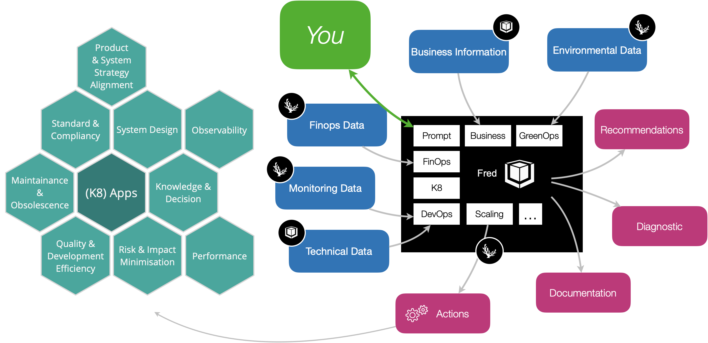
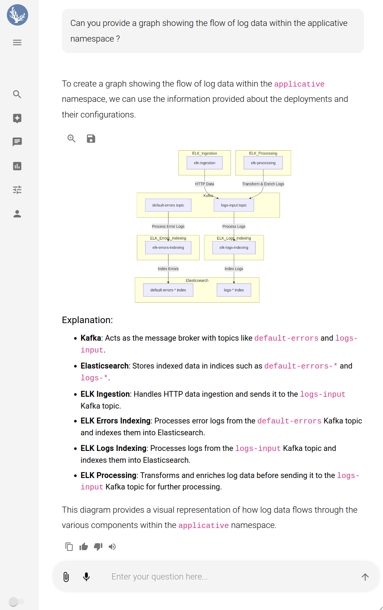
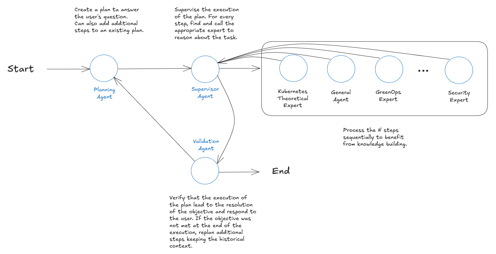
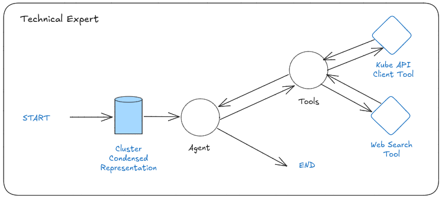
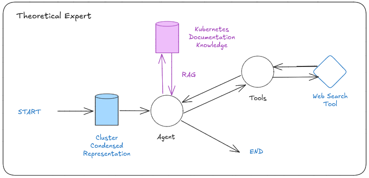
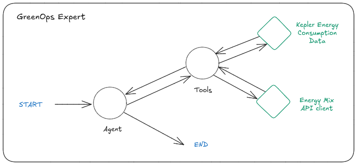
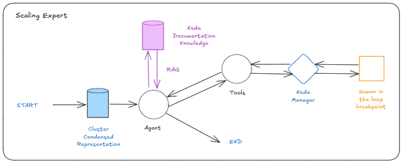


This work is also available as a [report](Fred.pdf).


## Introduction

Kubernetes is a strategic technology for Thales group and Thales Services Numériques in particular. 
We maintain, like many, our own distribution (Kubernetes together with a number of key cloud-native technologies) 
to serve as common platform/sdk for our many data processing use cases. 

As part of an internal innovation project, we decided to tackle the issue of Kubernetes applications operational complexity, with a focus on a particular use case: frugality. How can we efficiently design, maintain, or improve kubernetes applications while ensuring their overall costs are understood and hopefully reduced, without sacrifying the expected functional requirements. These are tough questions. Despite all the well-known benefits of Kubernetes (standardization, declarative orchestration patterns, open communities etc.), mastering the exploding CNCF eco-system requires a multi-domain expertise that is out of reach or expensive for many companies.
Worst, what is smart today is obsolete the year after. Architects are asked to produce frugal, scalable, secured, easy-to-maintain and easy-to-modernize solutions. 
Needless to say, they need help.    

Recognizing these challenges, we decided to leverage generative AI to develop an open source AI assistant, called *Fred*, to help our architects and administrators to manage their Kubernetes applications. In contrast to the many generative AI initiatives ([KoPylot](https://github.com/avsthiago/kopylot), [Kubert](https://mykubert.com/), [cast.ai](https://cast.ai/) to name a few), our focus is to tackle higher-level architectural considerations:  does my architecture conform to best practice eco-design recommandations ? how could I reduce my energy consumption ? Can you help me assess the data flow of my entire application ?

For this purpose, Fred features a modular multi-agent architecture that is well suited for building *domain-specific* experts. 
By customizing this architecture, we have created an assistant capable of deep analysis, management, and optimization of Kubernetes clusters.

    

Fred is a now an open source project composed of a python backend and a companion UI, highlighed next. 

    

This article presents an in-depth look at Fred's architecture and details how we have adapted it to meet the specific needs of Kubernetes management. 
In its current status, Fred provides automatic documentation and explanations of an kubernetes application, 
generate so-called eco-score reports for each components, and goes up to provide actionable insights and optimizations. 

Our development process includes extensive data engineering focused on Kubernetes components, enabling Fred to perform in-context learning and adapt to various operational scenarios. Importantly, Fred emphasizes identifying and implementing optimizations to reduce operational costs, energy consumption, and carbon footprint. 

## Fred's Novel Architecture

Drawing from contemporary AI literature, Fred leverages a modular multi-agent system that integrates planning, chain-of-thought reasoning, specialized expertise, and secure tool usage to provide comprehensive solutions. This architecture is engineered to address intricate tasks by decomposing them into manageable steps, assigning them to domain-specific experts, and ensuring that the outcomes meet the user's objectives. This approach aligns with the [Plan-and-Solve Prompting](https://arxiv.org/pdf/2305.04091) method, which emphasizes creating structured plans followed by step-by-step solutions to enhance reasoning capabilities in large language models.

    

### Planning Agent: Crafting Tailored Strategies

At the core of Fred's operation is the Planning Agent, which initiates the problem-solving process. This agent is responsible for understanding the user's request and devising a strategic plan to address it. The Planning Agent employs a dynamic and adaptive approach to problem decomposition, tailoring its strategies to the complexity of the task. Simpler tasks result in concise plans, while more intricate problems lead to detailed plans with additional steps. This adaptability ensures Fred's responses are both efficient and comprehensive, regardless of task difficulty.

The planning is not generic; it is tailored to the collective expertise of the available agents, ensuring that each step is assigned to the most suitable expert. By leveraging the unique strengths of specialized agents, the Planning Agent optimizes the execution of each task, ensuring high-quality results across domains.

The Planning Agent's ability to structure effective plans is informed by principles of zero-shot reasoning. Drawing inspiration from findings in [Language Models as Zero-Shot Planners](https://arxiv.org/pdf/2201.07207) [Huang et al., 2022], the Planning Agent uses its inherent reasoning capabilities to generate detailed plans without requiring extensive task-specific training. By leveraging techniques like Zero-shot-CoT (Chain of Thought), which involves prompting the system to "think step by step," Fred's Planning Agent achieves enhanced performance on tasks involving arithmetic, logical reasoning, and symbolic processing.

### Supervisor Agent: Orchestrating Expert Collaboration

Once the plan is established, the **Supervisor Agent** takes charge of orchestrating the workflow. This agent dispatches tasks to the appropriate experts in a sequential manner, ensuring that each step builds upon the results of the previous ones. By sequentially adding the outcomes of earlier steps to the context, the Supervisor Agent maintains a coherent flow of information and reasoning throughout the problem-solving process. This sequential execution is crucial for tasks that require cumulative knowledge and incremental reasoning.

The effectiveness of this approach is supported by findings in [Chain-of-Thought Prompting Elicits Reasoning in Large Language Models](https://arxiv.org/pdf/2201.11903) [Wei et al., 2023], which demonstrate that chain-of-thought prompting can elicit advanced reasoning capabilities in large language models, enhancing their ability to handle multi-step tasks.

### Specialized Expert Agents: Domain-Specific Problem Solvers

Fred's architecture features a suite of **Specialized Expert Agents**, each designed to tackle tasks within their specific domains of expertise. These agents are powered by extensive **knowledge bases** that are enhanced through in-context learning or integrated using Retrieval Augmented Generation (RAG) methods. This empowers them to reason more effectively and provide solutions deeply informed by specialized knowledge.

In addition to their knowledge bases, these experts are equipped with **domain-specific capabilities**. For example, a Kubernetes expert agent might have the ability to query the Kubernetes API to retrieve real-time information about workloads running in a cluster. By integrating such capabilities, the experts can perform actions beyond static analysis, dynamically interacting with the environment to collect information and implement changes.

Complementing these specialized agents is the **General Agent**, which handles tasks requiring broad understanding rather than deep domain-specific knowledge. This agent ensures that Fred can address general queries and provide comprehensive support, filling in gaps that specialized experts might not cover. The General Agent is crucial for maintaining the assistant's versatility, allowing it to respond effectively to a wide spectrum of user requests.

All agents operate within the **ReAct (Reasoning and Acting) framework**, granting them access to various **tools** and functions necessary for their tasks. These tools range from web search capabilities to APIs that modify system configurations. Importantly, the use of these tools is governed by security protocols that incorporate **human-in-the-loop** interactions. Before an agent performs a critical action—especially one that modifies system states—the process pauses to allow for user approval. This ensures all significant changes are vetted, maintaining system **integrity and security**. Non-critical actions that do not alter system configurations may proceed without interruption, streamlining the workflow.

### Validation Agent: Ensuring Goal Fulfillment

After all tasks have been executed, the **Validation Agent** assesses whether the plan has successfully met the user's objectives. This agent reviews the outcomes of each step, ensuring that the collective results align with the intended goals. If the objectives are met, the Validation Agent summarizes the findings and presents them to the user in a coherent and actionable format.

If the objectives are not fully achieved, the process is iterative. The Validation Agent triggers a feedback loop by consulting the Planning Agent to revise the plan. Additional steps are added as necessary, and the cycle of execution and validation repeats. This iterative process continues until the user's goals are satisfactorily met, ensuring a thorough and effective problem-solving approach.

## Challenges in Implementing Fred for Kubernetes

Implementing Fred within Kubernetes environments presents a series of significant challenges due to the inherent complexity and scale of Kubernetes operations. These challenges stem from the vast volume of data, the diversity of domains involved, and the necessity for deep contextual understanding. This section explores these obstacles in detail.

### Data Volume and Complexity

Kubernetes clusters involve an large amount of data, primarily YAML configuration files that define the state and behavior of every component within the system. These YAML files are not only extensive but also highly intricate, encompassing detailed specifications for deployments, services, configurations, and policies. The sheer volume and complexity of this data pose a substantial challenge for large language models (LLMs) that power Fred's expert agents. Without a refined strategy Fred would suffer from:

- **Decreased Accuracy**: The model may struggle to maintain precision when processing large datasets.
- **Loss of Specificity**: Important details might be overlooked or generalized, reducing the effectiveness of analyses.
- **Hallucinations**: The model might generate information that is not present in the input data, leading to unreliable outputs.
- **Context Window Limitations**: The vast amount of information exceeds the context window of LLMs, making it difficult to process raw data effectively.

These factors collectively hinder Fred's ability to accurately analyze and interpret Kubernetes configurations, 
thereby limiting its effectiveness in managing and optimizing Kubernetes environments.

### Diversity of Domains to Explore

Kubernetes management is inherently multidisciplinary, spanning a vast array of domains that require specialized knowledge and expertise. 
While the following are key examples, they represent only a subset of the broader spectrum of considerations involved in effectively managing Kubernetes environments:

- **Kubernetes System Internals**: Understanding the core functionalities, components, and operational mechanics of Kubernetes.
- **Scaling and Performance Optimization**: Ensuring workloads and clusters can scale efficiently to meet demand while maintaining performance.
- **Cybersecurity**: Securing the cluster against vulnerabilities, threats, and ensuring robust configuration management.
- **Regulatory Compliance**: Adhering to various legal and industry-specific standards, such as GDPR, HIPAA, and others.
- **Financial Operations (FinOps)**: Optimizing the cost-efficiency of cloud resources and workloads.
- **Green Operations (GreenOps)**: Minimizing energy consumption and environmental impact in Kubernetes operations.
- **Software Architecture**: Aligning deployments with best practices in software design and architecture to maintain system robustness and flexibility.

The breadth of these domains makes it challenging for a single AI model or agent to provide accurate and relevant analyses across all areas. Relying on zero-shot prompting, where the model attempts to generate responses without domain-specific training or context, often results in generic or irrelevant outputs. This diversity necessitates a more nuanced approach to ensure that each domain is adequately addressed, complicating the implementation of Fred for Kubernetes.

### Lack of Contextual Information

Optimizing Kubernetes operations requires more than technical proficiency; it necessitates a deep understanding of the organization's unique business 
context and how users interact with the system. Without this contextual insight, even advanced AI models may offer recommendations that miss the mark. Critical contextual elements include:

- **Service Level Agreements (SLAs)**: Defined performance and availability metrics that must be met to ensure contractual compliance.
- **Enterprise Requirements and Best Practices**: Organizations often establish internal guidelines dictating how systems should be managed. These might include recommendations for cost management, energy conservation, or performance benchmarks specific to their business priorities.
- **Security Policies**: Organizational guidelines and standards for maintaining security across systems and data.
- **Regulatory and Compliance Mandates**: Specific requirements, such as adhering to GDPR, HIPAA, or other industry standards, can dictate how resources are allocated and managed.
- **User Behavior and Usage Patterns**: Insights into when and how users engage with the system. For instance, if analytics reveal minimal user activity on weekends, it may be advantageous to scale down certain services during that period to conserve resources and reduce energy consumption.

AI models, including large language models, typically lack access to this proprietary and sensitive information unless it is explicitly provided. Without a comprehensive understanding of these contextual factors, Fred may struggle to make recommendations that align with business objectives, adhere to compliance standards, or respect critical operational constraints. This lack of contextual awareness can lead to suboptimal or even detrimental outcomes in Kubernetes management and optimization efforts.

## Starting with Data Engineering

As always in solving complex data problems, a careful and initial data engineering effort is the way to go.
We started by making Fred construct a foundational knowledge model of our target kubernetes application. This first phase is automatic. 
This model helps each expert in using its specialized tools effectively, to gather additional specific, detailed information as needed.

Note that studies like Li et al. (2023) have highlighted that while LLMs are capable of handling extensive token sequences, they often struggle to maintain high performance in complex, context-rich scenarios. This is why the focus of our data engineering effort consists mostly in *reducing* the information volume and focusing on critical content. We then mitigate issues related to context window limitations and maintain the models' accuracy and relevance. This overall approach ensures that Fred's expert agents can process complex information without being hindered by the limitations of current LLM technology.

Here is how it works in practice: Fred first collects by kubernetes API calls a sound understanding of the application. It then transforms it into a high-level overview of the cluster's architecture and workloads. By presenting its experts with this global topology, Fred enable them to comprehend the relationships and dependencies between different components. 

Fred then iteratively condense and improve its topology model and focuses on essential information. Sometimes by gathering information 
using specific API points (config maps, kubernetes operators API, external sources). In turn this further reduces the cognitive load on each expert agents. 

To implement this strategy, we collaborate closely with our company Kubernetes experts and support teams to identify key data points, such as container images, software versions, scaling parameters like replica counts, ingress configurations, etc. Extracting and summarizing this critical information provides the agents with a concise yet comprehensive snapshot of the system's operational state. We proceed with the same approach for the key cloud-native components we heavily rely upon in our projects. For example Kafka, Opensearch, Minio, Clickouse, Keycloack (to name just a few) are often used. We provide Fred with insights for each so that it can further complete its knowledge.  

To facilitate this process, we implemented a hierarchical, or pyramidal, summarization strategy. Through advanced LLM engineering techniques, 
we generate natural language overviews at multiple levels of abstraction. We start by creating summaries for individual workloads (deployments, statefulsets, jobs etc..), 
then aggregate these into summaries for namespaces, and finally compile a cluster-wide overview. This multi-tiered representation enables Fred's specialized expert agents to navigate from broad overviews to specific details seamlessly. It enhances their ability to identify patterns, anomalies, and areas of concern within the cluster.

## Fred Specialized Expert Agents

We just described the overall logic of Fred internal workflow. Let us now describe the current specialized agents, 
each designed to address specific domains within Kubernetes management. Fred is of course designed to facilitate the plugin of additional experts.

### Kubernetes Technical Expert

The **Kubernetes Technical Expert** focuses on providing precise diagnostics and troubleshooting within Kubernetes clusters. 

- **Simplified Kubernetes API Access**: Queries Kubernetes APIs to retrieve raw YAML object definitions for deployments, services, and configurations.
- **Current Knowledge Integration**: References up-to-date documentation and community resources for accurate recommendations.
- **ReAct Framework**: Utilizes structured reasoning to assess misconfigurations, deprecated API usage, and optimization opportunities.

    

This agent delivers granular analyses of cluster components, aiding administrators in identifying and addressing technical issues efficiently.

### Theoretical Kubernetes Expert

The **Theoretical Kubernetes Expert** ensures cluster configurations align with best practices and theoretical guidelines.

- **Cluster Topology Insight**: Builds on a high-level understanding of the cluster’s architecture to evaluate design adherence.
- **Guideline-Driven Analysis**: Employs Kubernetes documentation and best practices as a knowledge base, using Retrieval Augmented Generation (RAG) for precise recommendations.
- **Context-Aware Reasoning**: Identifies deviations from standards and provides actionable guidance.

    

This expert is particularly valuable for compliance and for enhancing system maintainability through alignment with theoretical frameworks.

### GreenOps Expert

The **GreenOps Expert** addresses sustainability by focusing on reducing the cluster's energy consumption and carbon footprint.

- **Energy Data Analysis**: Utilizes tools like Kepler probes to access and analyze energy consumption metrics at the node and workload levels.
- **Energy Mix Insights**: Incorporates information on renewable versus non-renewable energy sources to suggest eco-friendly optimizations.
- **Targeted Recommendations**: Proposes workload adjustments and scheduling strategies to balance performance with sustainability.

    

This agent supports both environmental goals and cost savings by optimizing energy use.

### Scaling Expert

The **Scaling Expert** optimizes workload scalability and resource efficiency within Kubernetes environments.

- **Dynamic Scaling Strategies**: Leverages [Keda](https://keda.sh/) Kubernetes Event-Driven Autoscaling to adjust resources based on workload demand.
- **Human-in-the-Loop Validation**: Ensures administrators can review and approve scaling actions before execution.
- **Collaborative Optimization**: Works alongside other agents to balance scalability with sustainability.

    

This agent enhances system responsiveness and operational efficiency by aligning resource allocation with demand.


This topic is our current hot implementation topic. Our goal is to have Fred generate precise scale up and own configuration leveraging technologies such as [Keda](https://keda.sh/) and [Karpenter](https://karpenter.sh/).
Configuring a kubernetes application with these technologies can yield to significant costs and energy reductions. Yet it is rarely put in place, to our view simply because of the
overall complexity and expertise level required. 


### Collaborative Expertise

Last, Fred’s agents collaborate through the Supervisor Agent to address complex, multi-domain challenges. 
For example, the GreenOps Expert and Scaling Expert might jointly optimize resource usage while minimizing 
energy consumption, delivering solutions that are both efficient and sustainable.

## Incorporating Contextual Facts for Enhanced Decision-Making

Technical data often falls short in capturing the full spectrum of considerations necessary for optimal decision-making. 
To bridge this gap, we have implemented a mechanism that allows users, developers, and architects to input **Facts**—natural 
language annotations linked to specific components within the system, such as workloads, namespaces, or the entire cluster. 
These Facts provide crucial contextual information that enhances Fred's ability to deliver tailored and accurate recommendations.

These Facts encompass a wide range of contextual information:

- **Technical Constraints**: Details about hardware limitations, software dependencies, or network requirements that influence how components should be managed.
- **Usage Patterns**: Information on application usage, including peak traffic periods, critical user interactions, or specific workload characteristics affecting performance.
- **Justifications for Technical Choices**: Explanations behind particular configurations or architectural decisions, providing rationale that might not be evident from the system's state.
- **Business Constraints**: Insights into budgetary limits, cost optimization goals, or strategic priorities impacting resource allocation and scaling decisions.
- **Legal and Compliance Requirements**: Details on regulatory standards, data privacy laws, or industry-specific compliance mandates that the system must adhere to.

### Enhancing Expert Agents' Reasoning Capabilities

By integrating these Facts into Fred's reasoning process, the expert agents gain a deeper understanding of the operational environment. 
This additional layer of context enables them to make more informed and precise recommendations, ensuring that optimization strategies are not only technically sound but also aligned with organizational objectives.

For example, if a workload is annotated with a Fact indicating that it handles sensitive financial data subject to stringent compliance regulations, 
the Security Expert Agent will prioritize recommendations that enhance data protection and regulatory compliance over purely performance-based optimizations.

### Improving Accuracy and Personalization

The inclusion of Facts helps to prevent generic or irrelevant suggestions that might arise from a lack of contextual awareness. 
By tailoring advice to the specific needs and constraints of different components, Fred ensures that optimizations are aligned with the organization's priorities.

This approach offers several benefits:

- **Enhanced Reasoning**: With access to context that goes beyond raw technical metrics, the expert agents can better infer the implications of various optimization actions.
- **Improved Accuracy**: Contextual data helps prevent recommendations that might technically optimize the system but conflict with business objectives or legal requirements.
- **Personalized Recommendations**: Tailoring advice to the specific needs and constraints of different components ensures that optimizations are relevant and actionable.

### Aligning AI with Human Expertise

Our approach aligns with contemporary AI research emphasizing the importance of contextual information in effective decision-making. 
By enabling users to provide natural language Facts, we create a collaborative environment where human expertise complements AI capabilities. Users contribute their domain knowledge and strategic insights, while Fred processes this information alongside technical data to generate holistic recommendations.

This synergy between human input and AI processing enhances the overall effectiveness of Kubernetes management, ensuring that both technical and non-technical considerations are accounted for.
We believe it is one of our work original contribution.

## Case Study: Fact-Driven Optimization

Consider a scenario where a namespace is annotated with the following Fact:

*"This namespace hosts a customer-facing application that experiences peak traffic during business hours in the Eastern Time Zone. It is critical for maintaining SLA commitments with our top-tier clients."*

With this context, the Scaling Expert Agent can:

- Prioritize resource allocation during peak hours to maintain performance and meet SLA commitments.
- Schedule maintenance and updates during off-peak hours to minimize impact on users.
- Coordinate with the GreenOps Expert to optimize energy consumption without compromising service quality.

Similarly, Facts related to legal and compliance requirements enable Fred to align its recommendations with regulatory mandates. For instance, annotating a workload with a Fact such as:

*"This application processes personal health information and must comply with HIPAA regulations."*

This informs the Security Expert Agent to:

- Ensure that data encryption is enforced both at rest and in transit.
- Verify that access controls and audit logs meet HIPAA standards.
- Recommend configurations that enhance data privacy and security compliance.

## Conclusions

Fred simplifies Kubernetes management through a modular multi-agent architecture designed for specialized analysis, optimization, and decision-making. 
By addressing technical, theoretical, sustainability, and scalability challenges, Fred delivers actionable insights tailored to the complexities of Kubernetes environments.

Its collaborative framework, supported by human-in-the-loop interactions and enriched with contextual Facts, ensures that recommendations align with both operational 
and strategic goals. As Kubernetes continues to evolve, Fred’s adaptability and modularity position it as a valuable tool for improving efficiency, sustainability, 
and innovation in cloud computing.

The integration of Facts not only improves immediate decision-making but also contributes to continuous improvement over time. As more contextual information is added, Fred's expert agents refine their understanding of the operational environment, leading to progressively better recommendations. This mechanism allows for dynamic updates to the system's context as business priorities, regulatory environments, or technical constraints evolve, ensuring that Fred's guidance remains relevant and up-to-date.

Fred exemplifies how generative AI can transform Kubernetes management, offering a scalable, future-ready solution for modern IT infrastructures.
After a first year of development, Fred is now used internally on real applications. 

## Annex: State-of-the-Art

In this chapter, we cite the most relevant papers and explain how they influenced the design of Fred. The **Selected Papers** provided direct inspiration and are foundational to Fred's architecture. The **Evaluated Papers**, while valuable, were analyzed but deemed less pertinent to Fred's current implementation due to constraints like computational cost or alignment with our objectives.

### Selected Strategies

The following papers have strongly inspired the design or Fred.

- **Plan-and-Solve Prompting: Improving Zero-Shot Chain-of-Thought Reasoning by Large Language Models**  
  [26/05/2023 - [Paper Link](https://arxiv.org/pdf/2305.04091)]  
  Summary: This study explores enhancements to zero-shot prompting for large language models (LLMs) in tackling multi-step reasoning tasks. While Zero-shot Chain-of-Thought (CoT) prompting has demonstrated effectiveness by encouraging models to “think step by step,” it still struggles with calculation, missing-step, and semantic misunderstanding errors. To address these issues, the authors introduce Plan-and-Solve (PS) prompting, a method that first creates a structured plan dividing tasks into smaller steps, followed by a step-by-step solution process. An improved version, PS+ prompting, adds further detailed instructions to reduce errors and improve reasoning quality. This paper is one of the main pillars of the Fred architecture. The planning step is entirely inspired by this. It shows that LLM planning drastically improves reasoning capabilities. In the case of Fred, it is also used to benefit from the "separation of concerns" where experts can be focused on more specific tasks.

- **ReAct: Synergizing Reasoning and Acting in Language Models**  
  [10/03/2023 - [Paper Link](https://arxiv.org/pdf/2210.03629)]  
  Summary: This paper introduces ReAct, a method using large language models (LLMs) to generate interleaved reasoning and actions, enhancing task performance and interpretability. By combining reasoning traces with task-specific actions, ReAct improves over traditional methods in tasks like question answering and decision making, reducing hallucinations and error propagation, and outperforming baseline models in both success rate and human interpretability. ReAct is the major architecture that we chose to present has reasoning architecture for the experts. It is a good balance between computational cost and reasoning capabilities. It is also a good balance between accuracy and interpretability.

- **Large Language Models are Zero-Shot Reasoners**  
  [29/01/2023 - [Paper Link](https://arxiv.org/pdf/2205.11916)]  
  Summary: This study demonstrates that large language models (LLMs) can achieve high performance in complex reasoning tasks using zero-shot prompting, simply by adding “Let’s think step by step” before responses. This approach, called Zero-shot-CoT, significantly improves accuracy across diverse reasoning benchmarks without using task-specific examples. Results show marked performance gains on arithmetic, symbolic, and logical reasoning tasks, highlighting LLMs’ potential for broad zero-shot reasoning capabilities and suggesting the need to explore these abilities before relying on fine-tuning or few-shot learning. This paper was a major inspiration for Fred. We benefit from the prompt technic used in this paper to improve the reasoning capabilities of the planning step in the Fred architecture that leverages the Zero-shot-CoT approach.

- **Chain-of-Thought Prompting Elicits Reasoning in Large Language Models**  
  [10/01/2023 - [Paper Link](https://arxiv.org/pdf/2201.11903)]  
  Summary: This study demonstrates that using “chain-of-thought” prompting—providing examples of intermediate reasoning steps—significantly enhances large language models’ reasoning abilities. Testing on three models showed marked improvements in arithmetic, commonsense, and symbolic tasks, with notable gains, such as state-of-the-art performance on the GSM8K math benchmark when using only a few exemplars.  Even if it was not a main inspiration for Fred architecture, this paper shows that chaining reasoning steps can improve reasoning capabilities. This is a good argument for the planning step in the Fred architecture but also for the osage of each expert response as input for the next expert.

- **Language Models as Zero-Shot Planners: Extracting Actionable Knowledge for Embodied Agents**  
  [08/03/2022 - [Paper Link](https://arxiv.org/pdf/2201.07207)]  
  Summary: This paper explores whether large language models (LLMs) can generate actionable steps for high-level tasks in interactive environments. While previous methods relied on explicit, step-by-step training, the authors find that sufficiently large, pre-trained LLMs can break down complex tasks into intermediate plans when prompted correctly. However, these plans often don’t translate directly to executable actions. The authors propose a solution that refines these plans based on demonstrations, improving action execution in the VirtualHome environment. Human evaluations highlight a balance between execution accuracy and task correctness, indicating potential for LLMs in practical task planning. This paper motivates the case for the planning step in the Fred architecture. It shows that LLMs can generate plans that can be used to improve reasoning capabilities.

- **GPT3-to-plan: Extracting plans from text using GPT-3**  
  [14/06/2021 - [Paper Link](https://arxiv.org/pdf/2106.07131)]  
  Summary: This paper examines using GPT-3 for extracting structured workflows from natural language descriptions in industries like finance. Initial results indicate that GPT-3 performs comparably to existing plan extraction methods, suggesting its potential for automating repetitive procedural tasks. This was one of the first papers to show that LLMs can be used to generate plans. It provided us wit some initial motivation.

### Evaluated Papers

The following papers were evaluated but judged less directly pertinent for Fred’s current architecture:

- **An LLM Compiler for Parallel Function Calling**  
  [05/06/2024 - [Paper Link](https://arxiv.org/pdf/2312.04511)]  
  Summary: The recent advancements in large language models (LLMs) have enabled the authors to call external functions to overcome limitations like knowledge cutoffs and poor arithmetic skills, allowing them to handle more complex tasks. Current methods, however, rely on sequential function calls, which can lead to high latency, increased costs, and potential inaccuracies. LLMCompiler addresses these issues by enabling parallel function execution through a three-component system: a Function Calling Planner for execution strategy, a Task Fetching Unit for dispatching tasks, and an Executor for parallel execution. Testing shows that LLMCompiler significantly reduces latency (up to 3.7× faster), lowers costs (up to 6.7×), and improves accuracy (by up to 9%) compared to sequential methods like ReAct. The application of this technique in a future version of Fred could allow for faster and cheaper reasoning. However, we should better evaluate the current architecture before considering such a change.

- **Language Agent Tree Search (LATS): Unifying Reasoning, Acting, and Planning in Language Models**  
  [06/10/2023 - [Paper Link](https://arxiv.org/pdf/2310.04406)]  
  Summary: This paper presents Language Agent Tree Search (LATS), a novel framework that enhances language models (LMs) for decision-making by integrating Monte Carlo Tree Search with LM-driven value functions and self-reflection. Unlike traditional LM-based agents limited by basic acting processes, LATS enables more effective reasoning, planning, and adaptive problem-solving through external feedback. Experimental results demonstrate LATS’s versatility and efficacy across various tasks, including programming, interactive question-answering, web navigation, and math, where it achieves high accuracy and competitive performance, notably surpassing state-of-the-art benchmarks on HumanEval for programming with GPT-4 and performing effectively in web navigation tasks with GPT-3.5. This technique could be used to improve the reasoning capabilities of Fred. However, the computational cost of such a system is likely to be too high for our experiments. We will stick with lower accuracy for experts with reasonable computational cost with ReAct architecture for example.

- **ReWOO: Decoupling Reasoning from Observations for Efficient Augmented Language Models**  
  [23/05/2023 - [Paper Link](https://arxiv.org/pdf/2305.18323)]  
  Summary: This study introduces ReWOO (Reasoning WithOut Observation), a modular paradigm for Augmented Language Models (ALMs) that separates the reasoning process from external observations, significantly enhancing computational efficiency. Unlike traditional ALMs, which interleave reasoning with tool-based observations and suffer from redundant prompts, ReWOO reduces token usage, achieving 5× token efficiency and a 4% accuracy boost on multi-step reasoning tasks like HotpotQA. It also enhances robustness in cases of tool failure and supports offloading reasoning from large models (e.g., GPT-3.5) to smaller models (e.g., 7B LLaMA), promoting scalable and efficient ALM systems. The study provides code and data for replication. The ReWOO approach could be used for Fred experts as a replacement of  ReAct when the expert have a lot of tools to reason with. The advantage would be lower computational cost and higher accuracy. However, the planning step would be more complex to implement.

- **Inner Monologue: Embodied Reasoning through Planning with Language Models**  
  [12/07/2022 - [Paper Link](https://arxiv.org/abs/2207.05608)]  
  Summary: Recent studies show that Large Language Models (LLMs) can enhance robot planning and interaction by using natural language feedback to improve reasoning in embodied tasks. This research demonstrates that LLMs, without additional training, can leverage feedback sources like success detection and scene descriptions to form an “inner monologue”, enhancing their ability to complete complex tasks in both simulated and real-world environments. We might consider that the human in the loop operations and feedbacks could be used to improve the reasoning capabilities of the experts. However, this is not the current focus of the Fred architecture.

