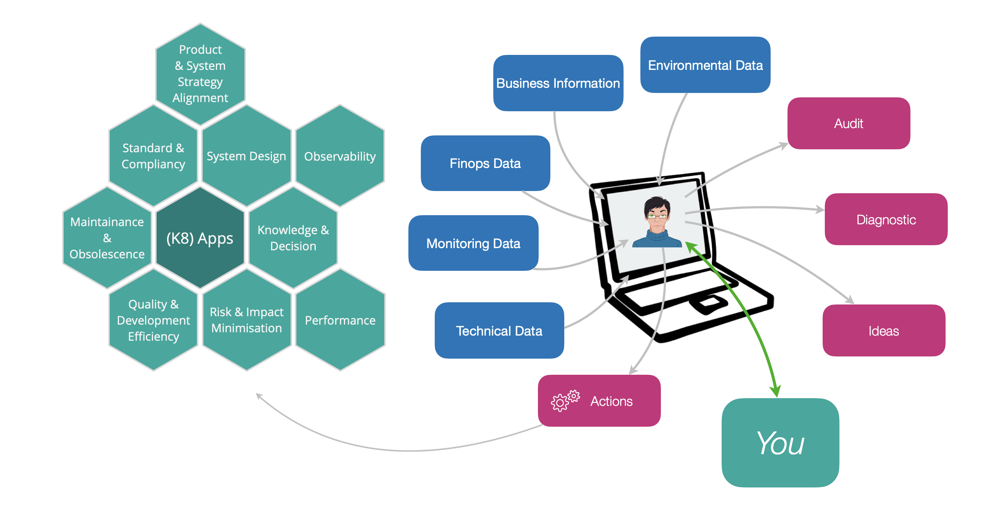

## Why a K8 assistant ?

Fred is an AI assistant with a knack for making sense of complex Kubernetes applications. Fred's role is best illustrated with a picture: 

What you see on the left-side of that picture is our core business at Thales Services Numérique. Architecture, security, compliance mastered for designing critical applications. These are complex topics. 

Besides, we work a lot with Kubernetes, on clouds or, very often, on premise. And we know how much expertise it takes to design and maintain complex Kubernetes applications and what it takes to simply keep pace with the exploding kubernetes technology ecosystem. In fact, Kubernetes itself is simple. What's not is the CNCF ecosystems made of operators, schedulers, extensions (CNI, CSI, meshes, etc..) that are available to design tiny or large scale applications, multi-cluster multi-tenant multi-cloud architectures, and even tackle edge and far edge end-to-end solutions. 

It was thus a natural idea to design an LLM powered assistant to make our life easier and more effective. As part of the frugal IT initiative, 
we challenged ourselve with an ambitious innovation goal: make our assistant help to identify and put in place configurations to drastically reduce the overall 
cluster costs. We are not fully yet there, but the current state of Fred is quite interesting and promising. By simply providing to the system administrators 
an interactive companion, Fred has become really helpful on real platforms. 

Fred works tirelessly to extract, analyze, and summarize information so you don’t have to. Fred takes into account auto-dicovered data, external data (like environmental data should it advise you about electricity consumption), and interact with you to complete its knowledge with the essential business and usage facts required to fully grasp what your application is about. Fred is simple to use on any Kubernetes application.

## Fred in action

Here are a few answers from interrogating Fred on a real AWS (EKS) IoT application. In the next prompt capture we ask fred a synthetic
representation of the data flow:



Next we ask him about the business usage of the application. Fred here take advantage of one of its most innovative feature: dialog with the user to capture the essential business usage of the application. That knowledge is key to understand what part of the application can (or cannot) be optimized.



Fred has many advanced features, the prompt shown here is a very small part of it. Get in touch with us for a complete demonstration.

## Contacts

- dimitri.tombroff@thalesgroup.com
- tanguy.jouannic@thalesgroup.com

