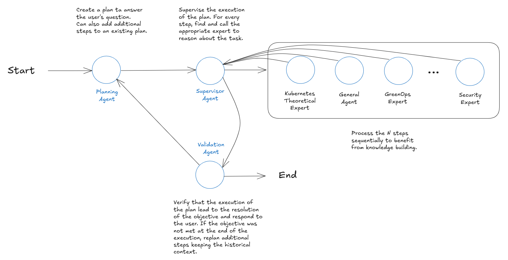
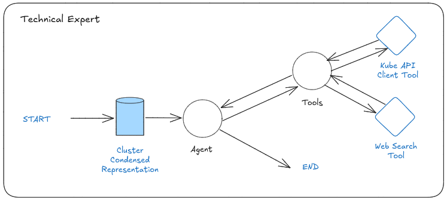
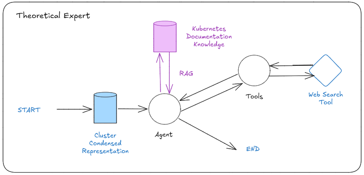
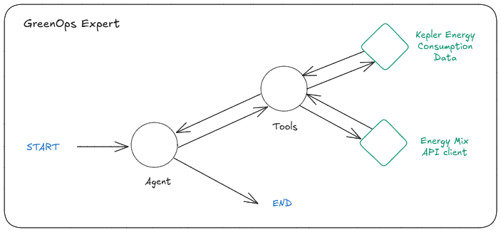
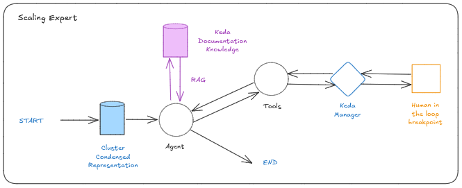

# Fred: A Modular Multi-Agent AI Assistant for Kubernetes Deep Analysis, Management, and Optimization

Fred is a AI-powered chatbot assistant product, featuring a modular multi-agent architecture that enables the development of specialized experts across various domains. Leveraging this flexible design, we have developed a version of Fred tailored for Kubernetes environments, focusing on deep analysis, management, and optimization. This article presents Fred's architecture and explores how we have customized it to address the complexities of Kubernetes, enhancing operational efficiency, security, compliance, and environmental sustainability.

## Introduction

In the rapidly evolving landscape of cloud computing and container orchestration, Kubernetes has emerged as a powerful solution for deploying and managing applications at scale. Its robust feature set offers unparalleled flexibility and scalability, making it the go-to choice for organizations worldwide. However, this power comes with inherent complexity that can pose significant challenges, regardless of the cluster size. Efficiently navigating Kubernetes requires a deep understanding of its intricate components, and misconfigurations can lead to inefficiencies or critical lapses in areas such as security, compliance, and cost management.

Recognizing these challenges, we have developped a specialized AI assistant version tailored for Kubernetes environments. Fred features a modular multi-agent architecture that is ideally suited for building domain-specific experts. By customizing this architecture, we have created an assistant capable of deep analysis, management, and optimization of Kubernetes clusters.

This article presents an in-depth look at Fred's architecture and details how we have adapted it to meet the specific needs of Kubernetes management. Employing a system of dedicated expert agents empowered by specialized tools and rich knowledge bases, Fred addresses the complexities of Kubernetes by providing actionable insights and optimizations. Our development process includes extensive data engineering focused on Kubernetes components, enabling Fred to perform in-context learning and adapt to various operational scenarios.

Importantly, Fred's Kubernetes-focused version emphasizes identifying and implementing optimizations to reduce operational costs, energy consumption, and carbon footprint. By concentrating on these aspects, Fred not only enhances efficiency but also contributes to sustainable practices in multiple environments, including cloud and edge computing.

Moreover, certain expert agents within Fred have been customized to address specific use cases, ensuring that our solution is both technologically advanced and highly relevant to real-world industrial contexts. This article offers a comprehensive review of our innovation, exploring how Fred's modular multi-agent architecture has been harnessed to create a powerful tool for Kubernetes deep analysis, management, and optimization.

## 1 Fred's Novel Architecture

Fred's architecture represents a significant advancement in the design of AI assistants. Drawing from contemporary AI literature, Fred leverages a modular multi-agent system that integrates planning, chain-of-thought reasoning, specialized expertise, and secure tool usage to provide comprehensive solutions. This architecture is engineered to address intricate tasks by decomposing them into manageable steps, assigning them to domain-specific experts, and ensuring that the outcomes meet the user's objectives. This approach aligns with the Plan-and-Solve prompting method discussed in [Plan-and-Solve Prompting](https://arxiv.org/pdf/2305.04091), which emphasizes creating structured plans followed by step-by-step solutions to enhance reasoning capabilities in large language models [Wang et al., 2023].

### Planning Agent: Crafting Tailored Strategies

At the core of Fred's operation is the Planning Agent, which initiates the problem-solving process. This agent is responsible for understanding the user's request and devising a strategic plan to address it. The Planning Agent employs a dynamic and adaptive approach to problem decomposition, tailoring its strategies to the complexity of the task. Simpler tasks result in concise plans, while more intricate problems lead to detailed plans with additional steps. This adaptability ensures Fred's responses are both efficient and comprehensive, regardless of task difficulty.

The planning is not generic; it is tailored to the collective expertise of the available agents, ensuring that each step is assigned to the most suitable expert. By leveraging the unique strengths of specialized agents, the Planning Agent optimizes the execution of each task, ensuring high-quality results across domains.

The Planning Agent's ability to structure effective plans is informed by principles of zero-shot reasoning. Drawing inspiration from findings in [Language Models as Zero-Shot Planners](https://arxiv.org/pdf/2201.07207) [Huang et al., 2022], the Planning Agent uses its inherent reasoning capabilities to generate detailed plans without requiring extensive task-specific training. By leveraging techniques like Zero-shot-CoT (Chain of Thought), which involves prompting the system to "think step by step," Fred's Planning Agent achieves enhanced performance on tasks involving arithmetic, logical reasoning, and symbolic processing.

### Supervisor Agent: Orchestrating Expert Collaboration

Once the plan is established, the **Supervisor Agent** takes charge of orchestrating the workflow. This agent dispatches tasks to the appropriate experts in a sequential manner, ensuring that each step builds upon the results of the previous ones. By sequentially adding the outcomes of earlier steps to the context, the Supervisor Agent maintains a coherent flow of information and reasoning throughout the problem-solving process. This sequential execution is crucial for tasks that require cumulative knowledge and incremental reasoning.

The effectiveness of this approach is supported by findings in [Chain-of-Thought Prompting Elicits Reasoning in Large Language Models](https://arxiv.org/pdf/2201.11903) [Wei et al., 2023], which demonstrate that chain-of-thought prompting can elicit advanced reasoning capabilities in large language models, enhancing their ability to handle multi-step tasks.

### Specialized Expert Agents: Domain-Specific Problem Solvers

Fred's architecture features a suite of **Specialized Expert Agents**, each designed to tackle tasks within their specific domains of expertise. These agents are powered by extensive **knowledge bases** that are enhanced through in-context learning or integrated using Retrieval Augmented Generation (RAG) methods. This empowers them to reason more effectively and provide solutions deeply informed by specialized knowledge.

In addition to their knowledge bases, these experts are equipped with **domain-specific capabilities**. For example, a Kubernetes expert agent might have the ability to query the Kubernetes API to retrieve real-time information about workloads running in a cluster. By integrating such capabilities, the experts can perform actions beyond static analysis, dynamically interacting with the environment to collect information and implement changes.

Complementing these specialized agents is the **General Agent**, which handles tasks requiring broad understanding rather than deep domain-specific knowledge. This agent ensures that Fred can address general queries and provide comprehensive support, filling in gaps that specialized experts might not cover. The General Agent is crucial for maintaining the assistant's versatility, allowing it to respond effectively to a wide spectrum of user requests.

All agents operate within the **ReAct (Reasoning and Acting) framework**, granting them access to various **tools** and functions necessary for their tasks. These tools range from web search capabilities to APIs that modify system configurations. Importantly, the use of these tools is governed by security protocols that incorporate **human-in-the-loop** interactions. Before an agent performs a critical action—especially one that modifies system states—the process pauses to allow for user approval. This ensures all significant changes are vetted, maintaining system **integrity and security**. Non-critical actions that do not alter system configurations may proceed without interruption, streamlining the workflow.

### Validation Agent: Ensuring Goal Fulfillment

After all tasks have been executed, the **Validation Agent** assesses whether the plan has successfully met the user's objectives. This agent reviews the outcomes of each step, ensuring that the collective results align with the intended goals. If the objectives are met, the Validation Agent summarizes the findings and presents them to the user in a coherent and actionable format.

If the objectives are not fully achieved, the process is iterative. The Validation Agent triggers a feedback loop by consulting the Planning Agent to revise the plan. Additional steps are added as necessary, and the cycle of execution and validation repeats. This iterative process continues until the user's goals are satisfactorily met, ensuring a thorough and effective problem-solving approach.

## 2 Challenges in Implementing Fred for Kubernetes

Implementing Fred within Kubernetes environments presents a series of significant challenges due to the inherent complexity and scale of Kubernetes operations. These challenges stem from the vast volume of data, the diversity of domains involved, and the necessity for deep contextual understanding. This section explores these obstacles in detail.

### Data Volume and Complexity

Kubernetes clusters generate an enormous amount of data, primarily through YAML configuration files that define the state and behavior of every component within the system. These YAML files are not only extensive but also highly intricate, encompassing detailed specifications for deployments, services, configurations, and policies. The sheer volume and complexity of this data pose a substantial challenge for large language models (LLMs) that power Fred's expert agents.

The extensive data can overwhelm LLMs, leading to several issues:

- **Decreased Accuracy**: The model may struggle to maintain precision when processing large datasets.
- **Loss of Specificity**: Important details might be overlooked or generalized, reducing the effectiveness of analyses.
- **Hallucinations**: The model might generate information that is not present in the input data, leading to unreliable outputs.
- **Context Window Limitations**: The vast amount of information exceeds the context window of LLMs, making it difficult to process raw data effectively.

These factors collectively hinder Fred's ability to accurately analyze and interpret Kubernetes configurations, thereby limiting its effectiveness in managing and optimizing Kubernetes environments.

### Diversity of Domains to Explore

Kubernetes management is inherently multidisciplinary, spanning a vast array of domains that require specialized knowledge and expertise. While the following are key examples, they represent only a subset of the broader spectrum of considerations involved in effectively managing Kubernetes environments:

- **Kubernetes System Internals**: Understanding the core functionalities, components, and operational mechanics of Kubernetes.
- **Scaling and Performance Optimization**: Ensuring workloads and clusters can scale efficiently to meet demand while maintaining performance.
- **Cybersecurity**: Securing the cluster against vulnerabilities, threats, and ensuring robust configuration management.
- **Regulatory Compliance**: Adhering to various legal and industry-specific standards, such as GDPR, HIPAA, and others.
- **Financial Operations (FinOps)**: Optimizing the cost-efficiency of cloud resources and workloads.
- **Green Operations (GreenOps)**: Minimizing energy consumption and environmental impact in Kubernetes operations.
- **Software Architecture**: Aligning deployments with best practices in software design and architecture to maintain system robustness and flexibility.

The breadth of these domains makes it challenging for a single AI model or agent to provide accurate and relevant analyses across all areas. Relying on zero-shot prompting, where the model attempts to generate responses without domain-specific training or context, often results in generic or irrelevant outputs. This diversity necessitates a more nuanced approach to ensure that each domain is adequately addressed, complicating the implementation of Fred for Kubernetes.

### Lack of Contextual Information

Optimizing Kubernetes operations requires more than technical proficiency; it necessitates a deep understanding of the organization's unique business context and how users interact with the system. Without this contextual insight, even advanced AI models may offer recommendations that miss the mark. Critical contextual elements include:

- **Service Level Agreements (SLAs)**: Defined performance and availability metrics that must be met to ensure contractual compliance.
- **Enterprise Requirements and Best Practices**: Organizations often establish internal guidelines dictating how systems should be managed. These might include recommendations for cost management, energy conservation, or performance benchmarks specific to their business priorities.
- **Security Policies**: Organizational guidelines and standards for maintaining security across systems and data.
- **Regulatory and Compliance Mandates**: Specific requirements, such as adhering to GDPR, HIPAA, or other industry standards, can dictate how resources are allocated and managed.
- **User Behavior and Usage Patterns**: Insights into when and how users engage with the system. For instance, if analytics reveal minimal user activity on weekends, it may be advantageous to scale down certain services during that period to conserve resources and reduce energy consumption.

AI models, including large language models, typically lack access to this proprietary and sensitive information unless it is explicitly provided. Without a comprehensive understanding of these contextual factors, Fred may struggle to make recommendations that align with business objectives, adhere to compliance standards, or respect critical operational constraints. This lack of contextual awareness can lead to suboptimal or even detrimental outcomes in Kubernetes management and optimization efforts.

## 3 Overcoming Data Volume Challenges with Strategic Data Engineering

Addressing the immense data volume and complexity inherent in Kubernetes environments is essential for the effective functioning of Fred's modular multi-agent architecture. Our strategic data engineering approach not only streamlines the vast amounts of information but also equips Fred's specialized expert agents with a comprehensive initial understanding of the cluster's topology. This foundational knowledge is crucial for the experts to utilize their specialized tools effectively, enabling them to gather specific, detailed information as needed.

### Providing Experts with a Global Cluster Topology

Kubernetes clusters generate extensive and intricate YAML configuration files that define every component and behavior within the system. To empower Fred's expert agents, we first distill this raw data into core information that offers a high-level overview of the cluster's architecture and workloads. By presenting the experts with this global topology, we enable them to comprehend the relationships and dependencies between different components. This holistic view is critical for effective analysis, as it allows the agents to identify areas of interest and potential issues within the cluster.

### Streamlining Data for Enhanced LLM Performance

Directly processing the full scope of Kubernetes data with Large Language Models (LLMs) can overwhelm these models, leading to decreased accuracy and potential errors such as hallucinations or loss of specificity. By focusing on essential information, we reduce the cognitive load on the LLM-powered expert agents. This selective data reduction ensures that the agents can maintain high performance while still having access to the critical details necessary for their tasks.

We collaborate closely with Kubernetes experts to identify key data points, such as container images, software versions, scaling parameters like replica counts, and ingress configurations. Extracting and summarizing this critical information provides the agents with a concise yet comprehensive snapshot of the system's operational state.

### Enabling Targeted Information Gathering with Specialized Tools

With a solid initial understanding of the cluster's topology, Fred's expert agents are better positioned to leverage their domain-specific tools to gather additional, detailed information on-demand. This two-step approach—first obtaining a global overview, then drilling down into specifics—allows the agents to operate efficiently and effectively. They can focus their tools on areas that require deeper analysis, avoiding unnecessary data processing and ensuring that the information gathered is relevant and actionable.

### Hierarchical Summarization for Multi-Level Insights

To facilitate this process, we implement a hierarchical, or pyramidal, summarization strategy. Through advanced LLM engineering techniques, we generate natural language overviews at multiple levels of abstraction. We start by creating summaries for individual workloads, then aggregate these into summaries for namespaces, and finally compile a cluster-wide overview. This multi-tiered representation enables Fred's specialized expert agents to navigate from broad overviews to specific details seamlessly. It enhances their ability to identify patterns, anomalies, and areas of concern within the cluster.

### Aligning with Contemporary AI Research

Our data engineering strategies are informed by recent findings in AI research. Studies like Li et al. (2023) have highlighted that while LLMs are capable of handling extensive token sequences, they often struggle to maintain high performance in complex, context-rich scenarios. By strategically reducing the data volume and focusing on critical content, we mitigate issues related to context window limitations and maintain the models' accuracy and relevance. This approach ensures that Fred's expert agents can process complex information without being hindered by the limitations of current LLM technology.

### Enhancing Fred's Efficacy in Kubernetes Management

By equipping the expert agents with a comprehensive initial view of the Kubernetes cluster, we enhance their ability to perform deep analysis, management, and optimization tasks. The combination of strategic data reduction and targeted information gathering enables Fred to address the complexities of Kubernetes environments effectively. This approach not only streamlines data processing but also ensures that the experts remain agile and effective in delivering actionable insights. Consequently, Fred is better equipped to enhance operational efficiency, security, compliance, and sustainability within Kubernetes clusters, directly addressing the challenges outlined earlier.

## 4 Specialized Expert Agents for Kubernetes Management

To address the multifaceted challenges of Kubernetes management, we have developed a suite of specialized expert agents within Fred's modular architecture. Each expert is designed to tackle specific domains, leveraging tailored tools and knowledge bases to provide in-depth analysis and actionable recommendations. This section introduces four key experts we have integrated into Fred, highlighting their unique capabilities and contributions to optimizing Kubernetes environments. While these are the initial experts, our architecture allows for continuous expansion, and we have plans to develop additional experts to cover more domains in the future.

### Kubernetes Technical Expert

The **Kubernetes Technical Expert** is designed to provide deep technical insights into the Kubernetes cluster. Equipped with an in-context understanding of the **Cluster Topology** provided by our strategic data engineering, this expert excels in analyzing the intricate details of the cluster's components and configurations.

#### Capabilities and Tools

- **ReAct Architecture**: Utilizing the Reasoning and Acting framework, the expert systematically approaches problem-solving by reasoning about the cluster's state and taking appropriate actions.
- **Simplified Kubernetes API Access**: Through specialized tools, it can query a simplified version of the Kubernetes API, allowing it to retrieve full definitions of Kubernetes objects in their raw YAML format. This access enables the expert to delve into the specifics of deployments, services, configurations, and more.
- **Web Browsing**: The expert can also browse the web to reference the latest documentation, community discussions, or known issues, ensuring that its recommendations are up-to-date with current best practices.

#### Role in Kubernetes Management

The Kubernetes Technical Expert serves as a vital resource for technical diagnostics and troubleshooting. By analyzing the raw configurations and current state of the cluster, it can identify misconfigurations, deprecated API usages, or potential areas for optimization. Its ability to access detailed object definitions allows for a granular examination of the cluster, making it an indispensable tool for administrators seeking to maintain optimal performance and stability.

### Theoretical Kubernetes Expert

Complementing the technical expertise, the **Theoretical Kubernetes Expert** focuses on aligning the cluster's configuration with established best practices and theoretical guidelines. This expert brings a wealth of knowledge from official documentation and theoretical frameworks to inform its analyses.

#### Capabilities and Tools

- **Cluster Topology In-Context**: Similar to the technical expert, it begins with a comprehensive understanding of the cluster's topology.
- **Retrieval Augmented Generation (RAG)**: It leverages a RAG approach with the Kubernetes documentation serving as its knowledge base. This integration enables the expert to provide informed recommendations grounded in official guidelines and best practices.
- **ReAct Architecture and Web Search**: Utilizing the ReAct framework, the expert can reason through complex scenarios and perform web searches to gather additional information or clarify ambiguities.

#### Role in Kubernetes Management
The Theoretical Kubernetes Expert excels in ensuring that the cluster adheres to recommended standards and practices. It can identify deviations from guidelines, suggest improvements, and provide explanations based on authoritative sources. This expert is particularly valuable for compliance, training, and aligning operations with industry standards.

### GreenOps Expert

The **GreenOps Expert** addresses the growing need for sustainable and energy-efficient Kubernetes operations. Focusing on reducing the carbon footprint of the system, this expert provides insights and recommendations to make the cluster more environmentally friendly.

#### Capabilities and Tools
- **Energy Consumption Analysis**: Equipped with tools to access data from **Kepler probes** within the cluster, the expert can analyze detailed time-series data on energy consumption at various levels, including nodes and workloads.
- **Energy Mix Data Access**: Through additional APIs and tooling, it can retrieve information about the energy mix (e.g., renewable vs. non-renewable sources) powering the data centers or edge locations where the cluster operates.
- **ReAct Architecture**: The expert uses the ReAct framework to reason about energy consumption patterns and suggest actionable strategies for optimization.

#### Role in Kubernetes Management
The GreenOps Expert plays a critical role in promoting sustainable practices. By analyzing consumption data and understanding the energy sources, it can recommend workload adjustments, scheduling changes, or configuration tweaks that reduce energy usage. This not only contributes to environmental sustainability but can also result in cost savings.

### Scaling Expert

The **Scaling Expert** is dedicated to optimizing the scalability and performance of workloads within the Kubernetes cluster. Leveraging **KEDA (Kubernetes Event-Driven Autoscaling)** technology, this expert ensures that applications can efficiently scale in response to demand while minimizing resource waste.

#### Capabilities and Tools
- **Cluster Topology and KEDA Knowledge Base**: The expert takes the cluster topology in-context and utilizes a RAG approach with the KEDA documentation to inform its scaling strategies.
- **Simplified KEDA Functions**: Through a set of simplified KEDA functions, it can implement scaling actions, adjusting the number of replicas or resources allocated to workloads based on defined metrics or events.
- **Human-in-the-Loop Interaction**: Before executing any scaling actions, the expert incorporates a human-in-the-loop process. This ensures that administrators have the opportunity to review and approve changes, maintaining control over critical operations.
- **ReAct Architecture**: Utilizing the ReAct framework, the expert can reason about current workload demands and predict scaling needs.

#### Role in Kubernetes Management
The Scaling Expert enhances the cluster's ability to respond dynamically to changing workloads. By efficiently scaling applications up or down, it helps maintain performance during peak demand while reducing resource usage during low-traffic periods. This expert contributes to both operational efficiency and cost-effectiveness, aligning resource allocation with actual needs.

### Enhancing Collaboration Among Experts

An essential aspect of Fred's architecture is the ability of these specialized experts to collaborate. By sharing insights and findings through the Supervisor Agent, they can collectively address complex issues that span multiple domains. For example, the Scaling Expert and the GreenOps Expert might work together to optimize resource usage while minimizing energy consumption, providing solutions that are both efficient and sustainable.

## 5 Incorporating Contextual Facts for Enhanced Decision-Making

In managing complex Kubernetes environments, purely technical data often falls short in capturing the full spectrum of considerations necessary for optimal decision-making. To bridge this gap, we have implemented a mechanism that allows users, developers, and architects to input **Facts**—natural language annotations linked to specific components within the system, such as workloads, namespaces, or the entire cluster. These Facts provide crucial contextual information that enhances Fred's ability to deliver tailored and accurate recommendations.

### Enriching the Knowledge Base with User-Provided Context

While Fred's expert agents are adept at analyzing technical configurations and system states, they require additional context to align their recommendations with business objectives, compliance requirements, and operational constraints. By allowing stakeholders to annotate system components with Facts, we enrich Fred's knowledge base with insights that are not readily apparent from technical data alone.

These Facts encompass a wide range of contextual information:

- **Technical Constraints**: Details about hardware limitations, software dependencies, or network requirements that influence how components should be managed.
- **Usage Patterns**: Information on application usage, including peak traffic periods, critical user interactions, or specific workload characteristics affecting performance.
- **Justifications for Technical Choices**: Explanations behind particular configurations or architectural decisions, providing rationale that might not be evident from the system's state.
- **Business Constraints**: Insights into budgetary limits, cost optimization goals, or strategic priorities impacting resource allocation and scaling decisions.
- **Legal and Compliance Requirements**: Details on regulatory standards, data privacy laws, or industry-specific compliance mandates that the system must adhere to.

### Enhancing Expert Agents' Reasoning Capabilities

By integrating these Facts into Fred's reasoning process, the expert agents gain a deeper understanding of the operational environment. This additional layer of context enables them to make more informed and precise recommendations, ensuring that optimization strategies are not only technically sound but also aligned with organizational objectives.

For example, if a workload is annotated with a Fact indicating that it handles sensitive financial data subject to stringent compliance regulations, the Security Expert Agent will prioritize recommendations that enhance data protection and regulatory compliance over purely performance-based optimizations.

### Improving Accuracy and Personalization

The inclusion of Facts helps to prevent generic or irrelevant suggestions that might arise from a lack of contextual awareness. By tailoring advice to the specific needs and constraints of different components, Fred ensures that optimizations are aligned with the organization's priorities.

This approach offers several benefits:

- **Enhanced Reasoning**: With access to context that goes beyond raw technical metrics, the expert agents can better infer the implications of various optimization actions.
- **Improved Accuracy**: Contextual data helps prevent recommendations that might technically optimize the system but conflict with business objectives or legal requirements.
- **Personalized Recommendations**: Tailoring advice to the specific needs and constraints of different components ensures that optimizations are relevant and actionable.

### Aligning AI with Human Expertise

Our approach aligns with contemporary AI research emphasizing the importance of contextual information in effective decision-making. By enabling users to provide natural language Facts, we create a collaborative environment where human expertise complements AI capabilities. Users contribute their domain knowledge and strategic insights, while Fred processes this information alongside technical data to generate holistic recommendations.

This synergy between human input and AI processing enhances the overall effectiveness of Kubernetes management, ensuring that both technical and non-technical considerations are accounted for.

### Case Study: Fact-Driven Optimization

Consider a scenario where a namespace is annotated with the following Fact:

*"This namespace hosts a customer-facing application that experiences peak traffic during business hours in the Eastern Time Zone. It is critical for maintaining SLA commitments with our top-tier clients."*

With this context, the Scaling Expert Agent can:

- Prioritize resource allocation during peak hours to maintain performance and meet SLA commitments.
- Schedule maintenance and updates during off-peak hours to minimize impact on users.
- Coordinate with the GreenOps Expert to optimize energy consumption without compromising service quality.

### Enhancing Security and Compliance

Similarly, Facts related to legal and compliance requirements enable Fred to align its recommendations with regulatory mandates. For instance, annotating a workload with a Fact such as:

*"This application processes personal health information and must comply with HIPAA regulations."*

This informs the Security Expert Agent to:

- Ensure that data encryption is enforced both at rest and in transit.
- Verify that access controls and audit logs meet HIPAA standards.
- Recommend configurations that enhance data privacy and security compliance.

### Facilitating Continuous Improvement

The integration of Facts not only improves immediate decision-making but also contributes to continuous improvement over time. As more contextual information is added, Fred's expert agents refine their understanding of the operational environment, leading to progressively better recommendations.

Moreover, this mechanism allows for dynamic updates to the system's context as business priorities, regulatory environments, or technical constraints evolve, ensuring that Fred's guidance remains relevant and up-to-date.

## 6 Conclusion

Fred represents a significant advancement in the management and optimization of Kubernetes environments, addressing the intricate challenges that organizations face in deploying and maintaining containerized applications at scale. By leveraging a modular multi-agent architecture, Fred brings together specialized expert agents, each equipped with domain-specific knowledge and tools, to provide comprehensive solutions tailored to the complexities of Kubernetes operations.

The innovative design of Fred's architecture—comprising the Planning Agent, Supervisor Agent, specialized expert agents, and the Validation Agent—ensures a collaborative and iterative approach to problem-solving. This framework allows for tasks to be decomposed into manageable steps, assigned to the most suitable experts, and refined through feedback loops until the user's objectives are fully met. The inclusion of human-in-the-loop interactions further enhances the system's reliability and security, particularly when executing critical actions that modify system states.

Addressing the challenges of data volume and complexity inherent in Kubernetes environments, Fred employs strategic data engineering to provide experts with a global cluster topology. This approach streamlines the vast amounts of configuration data into hierarchical summaries, enabling expert agents to process information effectively within the limitations of large language models. By doing so, Fred maintains high performance and accuracy in its analyses, avoiding common pitfalls such as decreased specificity and hallucinations.

The deployment of specialized expert agents—including the Kubernetes Technical Expert, Theoretical Kubernetes Expert, GreenOps Expert, and Scaling Expert—demonstrates Fred's capacity to cover a diverse range of domains critical to Kubernetes management. Each expert brings unique capabilities, from deep technical diagnostics and adherence to best practices to sustainability-focused optimizations and dynamic scaling strategies. Their ability to collaborate ensures that complex, multidimensional challenges are addressed holistically, resulting in solutions that are both efficient and aligned with organizational objectives.

Furthermore, the incorporation of contextual Facts enhances Fred's decision-making process by embedding user-provided annotations into its knowledge base. This integration ensures that recommendations are not only technically sound but also cognizant of business constraints, compliance requirements, and strategic priorities. By aligning AI-driven insights with human expertise, Fred delivers personalized and accurate guidance that respects the nuances of each operational environment.

In summary, Fred stands as a powerful tool for organizations seeking to harness the full potential of Kubernetes while mitigating its complexities. Its modular multi-agent architecture, combined with strategic data engineering and contextual awareness, enables it to deliver deep analysis, effective management, and optimization that is both technologically advanced and pragmatically relevant. As cloud computing and container orchestration continue to evolve, Fred offers a scalable and adaptable solution poised to meet the growing demands of modern IT infrastructures.

Looking forward, the flexibility of Fred's architecture allows for the continuous integration of new expert agents, further expanding its capabilities to cover additional domains and emerging challenges. By staying attuned to technological advancements and organizational needs, Fred is well-positioned to remain at the forefront of AI-assisted Kubernetes management, driving efficiency, sustainability, and innovation in the cloud computing landscape.
