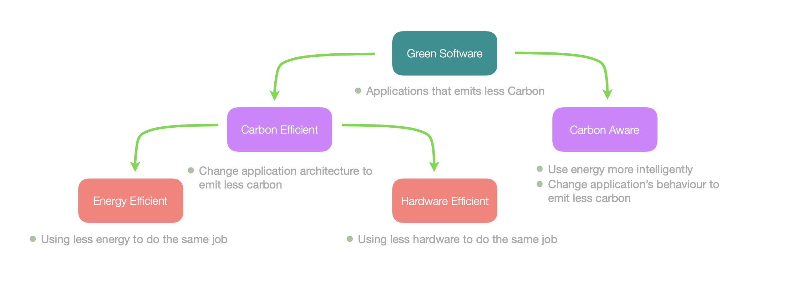
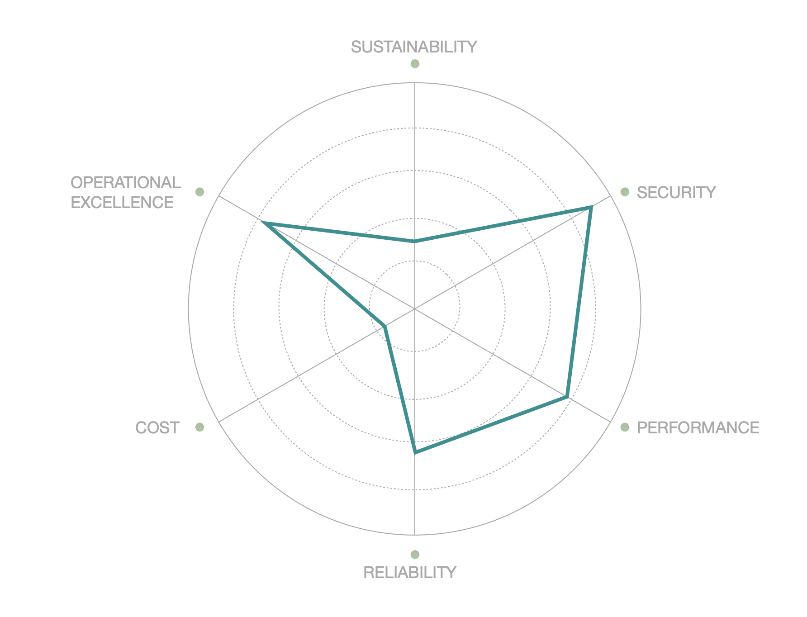

> This blog describes one of the [Frugal IT](/building-blocks/frugal-it) component called **Adviser**.

## Introduction

The adviser is Frugal IT's component in charge of assisting the user with compliancy and recommandations with respect to 
green IT considerations.
Before reviewing its intent and features, let us review the basic eco conception terminology.

### Green IT

Behind the term Green IT or Green Software, three areas of action can be identified:

1. **Energy Efficiency** : Creating applications that consume as little as possible while still delivering the required functional services.
2. **Hardware Efficiency** : Using as few hardware resources as possible and replacing them as infrequently as possible.
    * if manufacturing a computer produces 4 tons of CO2, then changing it every year results in 4 tons of CO2 per year just for manufacturing. However, keeping the same computer for 4 years results in 1 ton of CO2 per year related to manufacturing.
3. **Carbon Awareness** : Optimizing energy usage, for example, by deferring processes when local carbon intensity is excessive or relocating processes accordingly.

### Frugal by Design

**Frugal by design** simply refers to integrating efficiency and sustainability principles into the initial stages of designing systems, products, or processes. This methodology emphasizes minimizing resource consumption, reducing waste, and optimizing performance from the outset, rather than retrofitting existing designs with efficiency measures.

The goal is not only to address the immediate efficiency needs but also to anticipate future challenges, creating robust, scalable, and adaptable solutions. 

## Goals

The frugal It adviser is a software component designed to assist architects, system integrators and administrators in the complex task of auditing their architecture either upfront, or at built or run time. 

Let us review in more details the adviser objectives:

### Score

As its core, the adviser takes an input description of an architecture. That description is first decomposed into
its various architectural layers and components. Based on this input dataset, an **eco score** is then computed
to provide valuable incents on what part or component comply or not to the best green IT recommandations. 

Note that tools exist to evaluate code quality based on green programming rules, but there are no tools to determine at the architectural level if the decisions made will be efficient. Well designed software, in the green sense, cannot compensate for poor green architecture. In contrast a sound architecture can mitigate the effects of poor coding practices.

### Explain

Scoring is a start, but explaining the reasons behing that score is more relevant and credible.
The adviser is designed to provide explanations.

### Recommend

SIn addition to score and explanations, providing recommendations for improvments would be very valuable. The adviser 
willn whenever possible, provide such recommandations.

### Inform

Achieving a green architecture should not come at the expense of other crucial pillars, such as security, which remains vital for Thales and many of our clients. Therefore, we provide information on how our solutions impact performance, security, resilience, and, to a lesser degree, cost. 

Interestingly, some choices made to enhance sustainability might inadvertently reduce efficiency in other parts of the architecture. For example, compressing data to reduce transmission volumes is a good practice, but it can lead to increased energy consumption during compression and decompression. Thus, it is essential to consider multiple parameters and their interdependencies before making such decisions.

Informing the user about such frictions and trade-offs is thus another valuavle feature. 

## Experimental Development strategy

Following an initial phase of research and prototyping in 2023 under the project name Footprint Modeling Tool (FMT), this initiative has now joined the broader Frugal IT initiative. As part of this larger effort, it has evolved into the Frugal IT Adviser. This transition marks a shift towards concrete implementation and advanced prototyping.

The Frugal IT adviser will first be demonstratated on an architecture description dynamically obtained from a real-life 
Kuvernetes application. It will next be demonstrated from a drawio architecture document. The methodology is described in [a separate post](/blogs/green-k8-experiment).

## Contacts

- gilles.poirot@thalesgroup.com