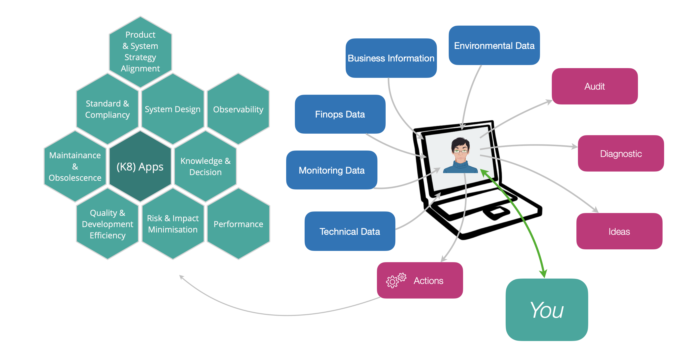

## A Word Before Fred Takes Over

Before diving into this blog, let us introduce Fred. Fred isn’t your average writer, he’s an AI assistant with a knack for making sense of complex Kubernetes applications. Fred's role is best illustrated with a picture: 

Today, we asked Fred to provide a short synthetic blog to describe a real K8s clustered application running on AWS. The rest of this blog is Fred's content. He achieved this without any a priori knowledge.

Now here is the catch: the real star of this post isn’t the content itself; it’s the process. Fred works tirelessly to extract, analyze, and summarize information so you don’t have to. Fred takes into account auto-dicovered data, external data (like environmental data should it advise you about electricity consumption), and interact with you to complete its knowledge with the essential business and usage facts required to fully grasp what your application is about. Fred is simple to use on any Kubernetes application.

Fred has many advanced features, this blog is a very small part of it. Get in touch with us for a complete demonstration.


A last word: don’t tell Fred he’s not getting a promotion; he's a bit sensitive about that.


## Understanding Kubernetes Clusters: A Deep Dive into the Rift Cluster

Kubernetes has become the de facto standard for container orchestration, providing a robust platform for deploying, scaling, and managing containerized applications. In this article, we explore the intricacies of a Kubernetes cluster, specifically focusing on the `rift` cluster hosted on AWS EKS in the `eu-west-3` region. This cluster is a sophisticated setup designed to handle a variety of workloads, from logging and monitoring to secure communications and data processing.

## Cluster Overview

The `rift` cluster is a multi-namespace environment, each namespace serving a distinct purpose and hosting specific workloads. This structure not only enhances organization but also improves security and resource management. Let's delve into the key namespaces and their roles within the cluster.

### Applicative Namespace

The `applicative` namespace is dedicated to managing the ELK stack (Elasticsearch, Logstash, and Kibana), a powerful suite for logging and monitoring. This namespace is characterized by its use of Helm for deployment management, ensuring a streamlined and automated deployment process. Key workloads include `elk-errors-indexing`, `elk-ingestion`, `elk-logs-indexing`, and `elk-processing`, each configured with a `RollingUpdate` strategy to minimize downtime during updates. Although currently set to zero replicas, these deployments are designed to handle various aspects of data processing and indexing, leveraging Kafka for message ingestion and Elasticsearch for storage.

### Cert-Manager Namespace

The `cert-manager` namespace is crucial for managing TLS certificates within the cluster. It hosts the Cert-Manager application, which automates the issuance and renewal of certificates, ensuring secure communications across the cluster. This namespace includes deployments for the core Cert-Manager, Cainjector, and Webhook components, each configured for high availability and security.

### Doc-Store Namespace

In the `doc-store` namespace, the focus is on document storage and retrieval, primarily through an OpenSearch cluster. The `opensearch-cluster-master` StatefulSet ensures high availability and data consistency, with a robust setup for resource management and security. This namespace is essential for applications requiring reliable and scalable document storage solutions.

### GitLab-Runner Namespace

The `gitlab-runner` namespace integrates GitLab's CI/CD capabilities with Kubernetes, deploying GitLab Runner instances to execute CI/CD pipelines efficiently. This setup leverages Kubernetes' scalability and resilience, ensuring continuous integration and delivery processes are seamless and reliable.

### Ingress Namespace

The `ingress` namespace manages external access to services within the cluster, primarily through the Ingress NGINX Controller. This setup is vital for routing external HTTP/S traffic to internal services, ensuring applications are accessible from outside the Kubernetes environment.

### Karpenter Namespace

Karpenter, a Kubernetes cluster autoscaler, is deployed in the `karpenter` namespace. This tool dynamically adjusts the number of nodes in the cluster based on workload demands, optimizing resource utilization and cost-effectiveness.

### Keda Namespace

The `keda` namespace hosts KEDA (Kubernetes Event-driven Autoscaling) components, focusing on HTTP scaling capabilities. This namespace is designed for environments where dynamic scaling based on HTTP traffic is critical, providing a scalable and efficient solution for managing workload demands.

### Monitoring Namespace

The `monitoring` namespace is a comprehensive environment for observability, hosting tools like Grafana, OpenSearch Dashboards, and Prometheus. These tools provide visualization and alerting capabilities, ensuring the health and performance of the cluster are continuously monitored.

### Processing Namespace

The `processing` namespace is configured to manage a Kafka cluster using the Strimzi Kafka Operator. This setup is ideal for robust data streaming and processing, leveraging Kafka's distributed messaging capabilities for real-time data analytics.

### Rift Namespace

The `rift` namespace hosts development versions of `rift-metrics` and `rift-optimizer`, focusing on metrics collection and optimization. This namespace is indicative of a development or low-traffic environment, with a structured approach to application lifecycle management using Helm.

## Conclusion

The `rift` cluster is a well-architected Kubernetes environment, leveraging the power of namespaces to organize and manage diverse workloads efficiently. Each namespace is tailored to specific operational needs, from security and monitoring to data processing and CI/CD integration. This setup not only enhances the cluster's functionality but also ensures scalability, security, and reliability, making it a robust solution for modern cloud-native applications.

## Contacts

- dimitri.tombroff@thalesgroup.com
- tanguy.jouannic@thalesgroup.com

