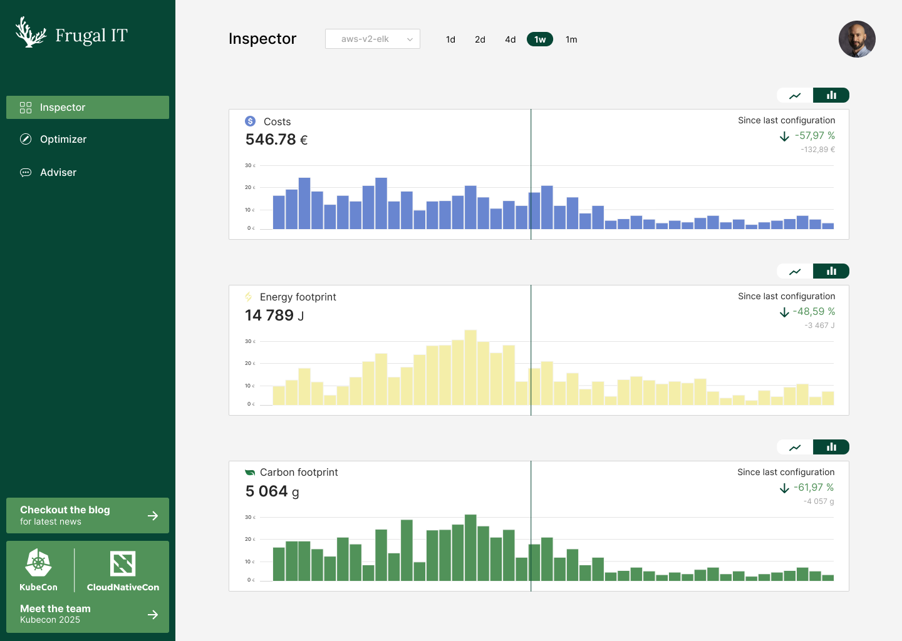
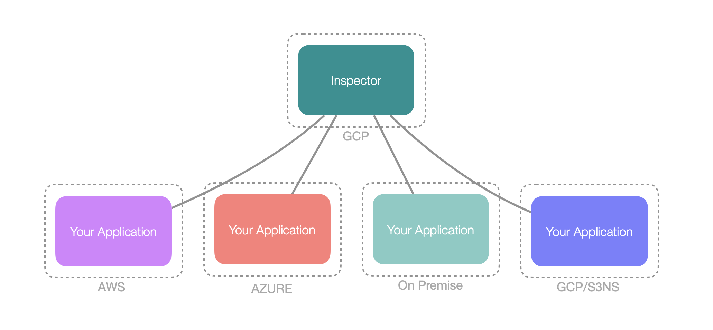

> This blog describes one of the [Frugal IT](/building-blocks/frugal-it) component called **Inspector**, the Thales carbon monitoring and assement tool.

## Introduction

The notion of carbon footprint is a vast subject that encompasses the production of objects and products, practices and usages, based on methodologies such as the french  [Référentiel général d'écoconception de services numériques](https://ecoresponsable.numerique.gouv.fr/publications/referentiel-general-ecoconception/) in the digital context.

The evolution of the consideration of the impacts of human activities on the environment is reflected in an evolution of the normative and regulatory frameworks with which companies must comply. Namely:

* The [ISO 26000 Social Responsability](https://www.iso.org/iso-26000-social-responsibility.html) standards, for the implementation of strategies favorable to sustainable development, 
* The [ISO 14001 environmental management](https://www.iso.org/standards/popular/iso-14000-family)
* The [ISO 5001 Energy management](https://www.iso.org/iso-50001-energy-management.html)

At European level, the Green Pact for Europe and, in particular, [Directive 2009/125/EC](https://eur-lex.europa.eu/legal-content/FR/TXT/HTML/?uri=CELEX:32009L0125) of October 21, 2009, have led to the introduction of *carbon footprint assessment* standards. This assessment dynamic has been present in the Thales Group for many years in its industrial activities for the production of goods and equipment, and is gradually taking hold in the digital sector. 

The frugal-IT inspector component, born from the 2023 THALC innovation track, is participating with the ambition of helping to define and achieve carbon footprint reduction targets by providing effective measurement and assesment tools. 

## A difficult problem

Assessing the carbon footprint of digital solutions has the particularity of being strongly linked to the hardware on which the solution is run. Micro-services and cloud-native architectures bring additional complexity, as a digital service, in order to be rendered, is no longer executed on a single machine, but on a set of components with varying characteristics, from Bare-Metal infrastructures to Function-as-a-Service to shared Kubernetes clusters on Virtual Machines. These topographies are at the root of the choices that have forged the inspector. 

## The inspector at a glance

The inspector is commposed of a set of *probes* to collect energy related metrics, and a *central service* (SaaS or on-premise) to aggregate and help you understand your inpacts.

### Probes 

A set of probes are available for bare metal, VmWare, Kubernetes infrastructure. 
Their use makes it possible to evaluate the energy consumption of the components that make up a digital solution in a single, autonomous way. This makes it possible to measure server or process independently. The data collected is transmitted securely to the central platform, which aggregates and enriches it, taking into account in real time the carbon content of the energy supplying the data center. This approach makes it possible to take energy consumption and its impact into account more widely in computationally-intensive processes.

### The cockpit

The inspector cockpit provides both a high level view of your infrastructure costs and impacts, 
and access to more detailed dashboards to
investigate at a more detailed level which resource or component has some impactn and when. 

Interestlingly, the inspector cockpit is the starting point to additional features to assess and optimise your application. Refer to the [Frugal IT building block](/building-blocks/frugalit) for the big picture. 

### A Cloud native solution

From the outset, the inspector has been designed to be cloud-native and eco-friendly, so it can be deployed on-premise or on a public cloud provider. A version currently deployed on the Google Cloud Platform in a multi-tenant configuration enables development teams and digital solution operators to deploy only the probes they need internally on their infrastructure, with data aggregation and consolidation taking place securely on the central platform.  

Of course, the inspector can be also installed on your private cloud or platform. It has been specifically
packaged to run on the [Kast thales containerized platform](/building-blocks/kast).

## Contacts

- jean-felix.berthiau@thalesgroup.com
- thomas.heusse@thalesgroup.com
