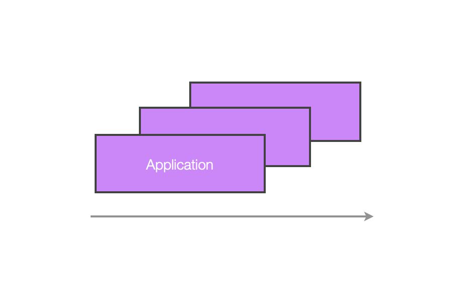
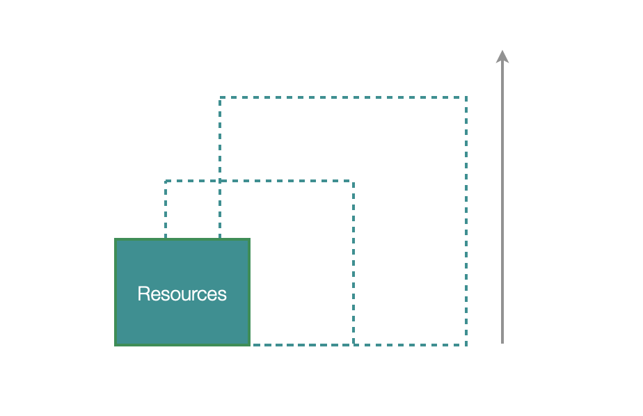
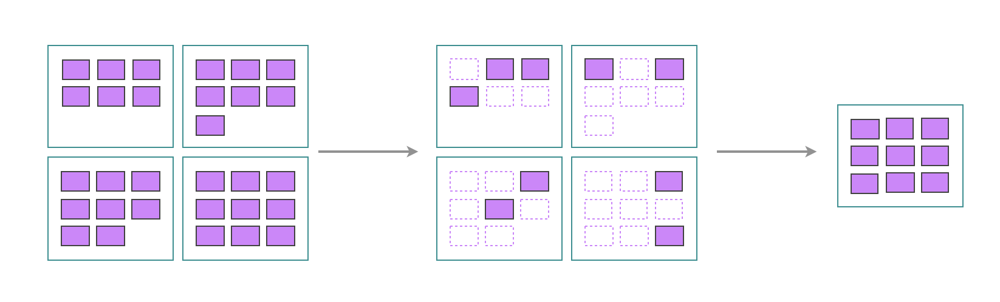
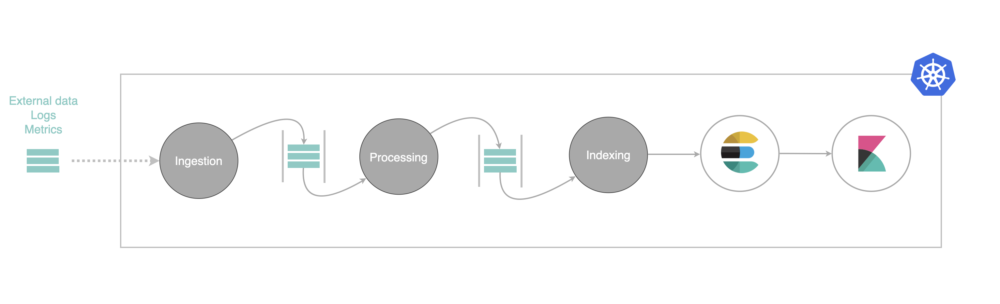

> This technical blog describes one of the [Frugal IT](/building-blocks/frugal-it) component called **Optimiser**. It highlights our we tackle important challenges to address cost and energy reduction or cloud native solutions. In particular
> - **Dynamic Resource Management**: Automated scaling of applications to optimize resource use.
> - **Generative AI Tools**: Simplifying complex configurations for Kubernetes environments.
> - **Intelligent Orchestration**: Planning resource usage based on renewable energy availability to minimize carbon footprint.

## Overview

Reducing the energy footprint of cloud-native applications has become a critical issue. 
This is not only to reduce and control costs but also to contribute to essential efforts to reduce carbon energy consumption, 
which is leading humanity toward unprecedented climate change and environmental degradation.

For over a decade, cloud platforms and Kubernetes have provided various ways to adjust an application's load based on demand. 
This is called Scaling, which is divided into two categories: horizontal and vertical scaling.

Horizontal scaling refers to adding or reducing application replicas to distribute a varying load across more or fewer application instances.
Vertical scaling refers to adding capacity to an existing infrastructure.
Many technologies ([1],[2]) enable these principles. Yet, most Kubernetes resources in public clouds are largely underutilized. 
In Kubernetes clusters with 50 CPUs or more, only 13% of the provisioned CPUs and 20% of the memory are used on average ([3]). 
This overprovisioning is due to a cautious approach by DevOps teams to avoid service interruptions and the complexity of accurately 
predicting resource needs from the start. This caution is often seen as essential for critical services.

Moreover, detailed analysis shows that even in large clusters with 1,000 CPUs or more, the average CPU usage is only 17%. This overprovisioning trend is similar on major cloud platforms like AWS, Azure, and Google Cloud, with CPU utilization rates of 11%, 11%, and 17%, respectively ([4]). 
These data highlight the major challenge of resource optimization in Kubernetes environments, leading to a vast amount of unused but electrically powered resources.

## The optimiser

### An original and innovative project

The Frugal-IT optimiser aims to facilitate the dynamic management of computing resources to ultimately 
shut down as much of the IT infrastructure as possible while respecting essential service levels as expressed by the user.

Why shut down? the optimiser's team seeks significant gains rather than fine-tuning optimizations. The simple act of 
shutting down an application every night, can yield substantial financial and carbon savings.

With the help of generative AI, the user is assisted by the optimiser to apply automatically the required Kubernetes configurations.
The optimiser is truly innovative and more ambitious than merely adjusting resources based on load. 
It can also manage the restart of resources to benefit from non-carbon energy. This is similar to scheduling a washing machine to run at night to take advantage of cheap energy, which changes based on tidal or wind conditions.

Let's examine the key features of the optimiser.

### Dynamic resource management

The first step is to configure this application to shut down and restart automatically based on actual needs and ambient energy conditions.
Under the scene, two technologies are used. The first called [keda](https://keda.sh/) dynamically sizes application 
components based on real-time events and workloads. 
The second, a newer open-source technology from Amazon ([2]), complements this by optimizing Kubernetes node management, 
allowing efficient resource allocation and deallocation based on needs. This enables the optimiser to reduce the number 
of active nodes during low load and increase them during peak load.

This overall strategy allows us to completely decommission virtual resources or even shut down servers on our on-premise infrastructure. 
This initial step is the starting point for designing the generative AI assistant, making this work simple, fast, and measurable.

### Configuration assistance

Generative AI agents (currently developed on GPT-4o) come into play to automate the creation of these optimal configurations. 

The **optimiser assistant** analyzes the existing Kubernetes configurations and infers the application's architecture without the user needing to provide information. The goal is to ask the user only for essential characteristics and constraints of their solution, allowing the assistant to deduce the scaling strategies itself.

Say the solution architect expresses that *"the external IoT probes that send data to my application have three days of autonomy during which they store data locally"* and *"business users only handle indexed data between 9:30 AM and 5 PM except on Wednesdays and accept a one-day delay on data"*, 
the assistant will suggest adapted dynamic resource management strategies to the user.

We designed the optimiser to let the user apply the assistant recommandations very easily, and monitor
the resulting gains using intuitive yet simple dashboards. This approach significantly reduces the complexity and time needed to configure scaling for cloud-native applications, making this technology accessible to more organizations. Another key benefit is to readjust configurations in case of architectural changes or load variations.

### Intelligent planning

Another important feature of the optimiser is to help the user configure its application according to the most favorable energy mix. 
For example, in regions where wind or hydroelectric power is significant, the optimiser can schedule the restart of resources during periods when these energy sources are available.

This intelligent orchestration not only optimizes energy consumption but also maximizes the use of renewable energies, thereby reducing the overall carbon footprint of IT infrastructures.

## How to optimise ?


*There is a large class of problems that are easy to imagine and build demos for, but extremely hard to make products out of. For example, self-driving: It’s easy to demo a car self-driving around a block, but making it into a product takes a decade.*


Our goal is to allow the user to optimise its kubernetes application. We do that first *without* the help of an AI assistant, by defining simple but effective strategies. This is explained next. Second, we design an AI assistant to help him identifying such possible optimisations.

### Defining optimisation strategies

Let us first consider a sample
application. It is depicted next.

This application, a well-known log management pipeline, contains stream processors (**ingestion**, **processing**, **indexing**). The incoming data (logs) are inserted in a first queue, then parsed enriched, inserted in turn in a second queue, and at the end indexed into an (elasticsearch) database. Is this application representative of many ? In fact yes, it contains a database (elasticsearch), a temporary queuing component (say Kafka), some visualisation tool (Kibana). Replace these by others and this architecture is indeed representative of many, orchestrating a mix of streaming and batch components. 

Here is now the interesting part, for each stage of our architecture we express a basic optimisation strategy to scale up/down up to shutdown completely the specific component(s). 

Here are the rules, expressed using human understandable terms.
1. **Ingestion** : *because external probes have one day of local buffering autonomy, ingestion must start once a day, and last until all the probes traffic falls down to their nominal rate*.
2. **Queuing** : *queuing components can be shutdown when they are no more active consumers and producers*
3. **Processing** : *processing applications can stop when they consumed all the queued items, they should start if there are again some*
4. **Indexing** : *same as processing*
5. **Database** : *the elasticsearch database can be stop if there are no consumers nor producers. It should start if some user show up.*
6. **UIs**: *Kibana can be stop at night and during the week-end, or if nobody uses it for more than 10 minutes. It should start on demand*

ThSuche rules are, in fact, rather generic. They can be applied to countless applications. 
The frugal-IT patented idea is twofolds: first a dedicated kubernetes agent will expose a REST API to implement such rules. The REST API will expose simple criterions such as start nd stop conditions on dates, schedules, period, or the presence or absence of input/output data, consumers, produces. The few verbs of this API are well-defined and associated to a precise semantics. 

### Assist the user

This provides the AI assistant with a small number of deterministic *functions*. Based on the architecture and business logic knowledge, the assistant is capable of suggesting the right rule(s) to the user. It becomes then easy to propose the user to apply such rule, and estimate the benefits. 

A dedicated blog follows explainingf how we implement this part.

## SaaS or ir gapped

As required by Thales, the frugal-It components are naturally designed to work completely on-premise, alongside Kubernetes solutions deployed on offline and secure infrastructures. However, it will be deployed and demonstrated as an online cloud Service. Its multi-tenant design makes it possible 
for customers to benefit from a SaaS frugal-it companion capable of monitoring their (Aws|Gcp|Azure|On-Premise) kubernetes application.

This architecture is not only useful for offering a competitive service to a larger audience but also to 
consume information about the ambient energy mix and share efficiently that information to all customer instances. 

## Conclusions

The frugal IT positions itself as a key technology in reducing the energy footprint of cloud-native applications. Through dynamic resource management, the use of generative AI, and intelligent orchestration based on energy conditions, it offers a sustainable and energy-efficient solution, meeting the growing needs for reducing the environmental impact of IT infrastructures.

## Contacts

- lorenzo.gerardi@thalesgroup.com
- reyyan.tekkin@thalesgroup.com
- tanguy.jouannic@thalesgroup.com

## References

- 1 Keda: https://keda.sh/
- 2 Karpenter: https://aws.amazon.com/blogs/containers/scalable-and-cost-effective-event-driven-workloads-with-keda-and-karpenter-on-amazon-eks
- 3 https://www.theregister.com/2024/03/01/kubernetes_cluster_overprovisioning/
- 4 https://www.nextplatform.com/2024/03/04/kubernetes-clusters-have-massive-overprovisioning-of-compute-and-memory/

