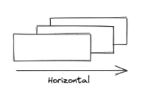
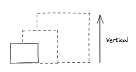

## Abstract

> This technical blog highlights our we tackle important challenge to address cost and energy reduction or cloud native solutions. In particular
> - **Dynamic Resource Management**: Automated scaling of applications to optimize resource use.
> - **Generative AI Tools**: Simplifying complex configurations for Kubernetes environments.
> - **Intelligent Orchestration**: Planning resource usage based on renewable energy availability to minimize carbon footprint.

## Introduction

Reducing the energy footprint of cloud-native applications has become a critical issue. This is not only to reduce and control costs but also to contribute to essential efforts to reduce carbon energy consumption, which is leading humanity toward unprecedented climate change and environmental degradation.

For over a decade, cloud platforms and Kubernetes have provided various ways to adjust an application's load based on demand. This is called Scaling, which is divided into two categories: horizontal and vertical scaling.

Horizontal scaling refers to adding or reducing application replicas to distribute a varying load across more or fewer application instances.
Vertical scaling refers to adding capacity to an existing infrastructure.
Many technologies (like [1] and [2]) enable these principles. Yet, most Kubernetes resources in public clouds are largely underutilized. In Kubernetes clusters with 50 CPUs or more, only 13% of the provisioned CPUs and 20% of the memory are used on average ([3]). This overprovisioning is due to a cautious approach by DevOps teams to avoid service interruptions and the complexity of accurately predicting resource needs from the start. This caution is often seen as essential for critical services.

Moreover, detailed analysis shows that even in large clusters with 1,000 CPUs or more, the average CPU usage is only 17%. This overprovisioning trend is similar on major cloud platforms like AWS, Azure, and Google Cloud, with CPU utilization rates of 11%, 11%, and 17%, respectively ([4]). These data highlight the major challenge of resource optimization in Kubernetes environments, leading to a vast amount of unused but electrically powered resources.

## An Original and Innovative Project

Rift aims to facilitate, or even completely manage, the dynamic management of computing resources to ultimately 
shut down as much of the IT infrastructure as possible while respecting essential service levels as expressed by the user.

Why shut down? Rift's team seeks significant gains rather than fine-tuning optimizations. The simple act of 
an application shutting down naturally, without requiring explicit and complex configuration, can yield substantial financial and carbon savings.

Automation and AI tools, like those proposed by Rift, are crucial for improving efficiency, reducing costs, and minimizing the carbon footprint of cloud-native infrastructures. By using generative AI to automate complex Kubernetes configurations, Rift can help reduce significant resource waste by dynamically adjusting workloads and maximizing the use of renewable energies.

Rift is truly innovative and more ambitious than merely adjusting resources based on load. It also manages the restart of resources to benefit from non-carbon energy. This is similar to scheduling a washing machine to run at night to take advantage of cheap energy, which changes based on tidal or wind conditions.

Rift aims to apply this type of virtuous planning as an orchestration assistant. Let's examine the key steps and features of Rift's development.

## Dynamic Resource Management

Rift is developed and demonstrated on a realistic and well-known target application, such as IoT or log management, 
deployed on a Kubernetes platform.

The first step is to configure this application to shut down and restart automatically based on actual needs and ambient energy conditions.
Two technologies are used here. The first called [keda](https://keda.sh/) dynamically sizes application components based on real-time events and workloads. 
The second, a newer open-source technology from Amazon ([2]), complements this by optimizing Kubernetes node management, 
allowing efficient resource allocation and deallocation based on needs. This enables us to reduce the number of active nodes during low load and increase them during peak load.

Combining these two strategies (horizontal and vertical) allows us to completely decommission virtual resources or even shut down servers on our on-premise infrastructure. This step is the starting point for designing the Rift assistant, making this work simple, fast, and measurable.

Step Two: Automatic Configuration Generation
Generative AI agents (currently developed on GPT-4) come into play to automate the creation of these configurations. For simplicity, we will refer to these agents as the Rift assistant.

The Rift assistant analyzes existing Kubernetes configurations and infers the application's architecture without the user needing to provide information. The goal is to ask the user only for essential characteristics and constraints of their solution, allowing the Rift assistant to deduce the scaling strategies itself.

For example, if the solution architect specifies, "the IoT probes have three days of autonomy during which they store data locally," and "business users only handle indexed data between 9:30 AM and 5 PM except on Wednesdays and accept a one-day delay on data," the Rift assistant can automatically generate configurations for the application to sometimes shut down completely while respecting the specified contract.

This approach significantly reduces the complexity and time needed to configure scaling for cloud-native applications, making this technology accessible to more organizations. Additionally, the Rift assistant can readjust configurations in case of architectural changes or load variations.

Step Three: Intelligent Orchestration and Virtuous Planning
As required by Thales, Rift is naturally designed to work completely on-premise, alongside Kubernetes solutions deployed on offline and secure infrastructures. However, it will be deployed and demonstrated as a shared service, available online as a Service. Rift can thus manage Kubernetes applications deployed on GCP, AWS, Azure, or on-premise from a secure multi-tenant instance hosted on GCP.

This architecture is not only useful for offering a competitive service to a larger audience but also allows Rift to consume information about the ambient energy mix. Rift relies on existing components of the Thalc platform ([5]), of which it is an integral part.

Rift includes a planner to restart application services to benefit from the most favorable energy mix, as much as possible. For example, in regions where wind or hydroelectric power is significant, Rift can schedule the restart of resources during periods when these energy sources are available.

This intelligent orchestration not only optimizes energy consumption but also maximizes the use of renewable energies, thereby reducing the overall carbon footprint of IT infrastructures.

Conclusions
Rift positions itself as a key player in reducing the energy footprint of cloud-native applications. Through dynamic resource management, the use of generative AI, and intelligent orchestration based on energy conditions, Rift offers a sustainable and energy-efficient solution, meeting the growing needs for reducing the environmental impact of IT infrastructures.

Rift is part of an asset strategy complementing Thalc and Fmt innovation projects, aiming to significantly strengthen Thales Service Numériques' eco-design offering.

## Contacts

- lorenzo.girardi@thalesgroup.com
- reyyan.tekkin@thalesgroup.com
- tanguy.jouannic@thalesgroup.com

## References

- 1 Keda: https://keda.sh/
- 2 Karpenter: https://aws.amazon.com/blogs/containers/scalable-and-cost-effective-event-driven-workloads-with-keda-and-karpenter-on-amazon-eks
- 3 https://www.theregister.com/2024/03/01/kubernetes_cluster_overprovisioning/
- 4 https://www.nextplatform.com/2024/03/04/kubernetes-clusters-have-massive-overprovisioning-of-compute-and-memory/
- 5 Thalc: Thales Carbon calculator

