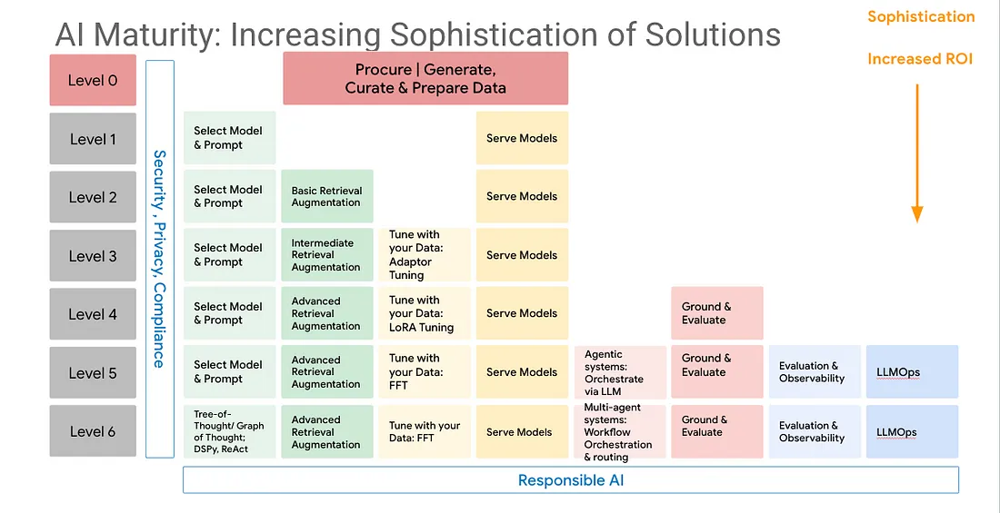


*Among the many promising generative AI use cases, helping users to evaluate the compliancy of their 
solution  with complex regulation is a particularly important one. This blog provides a quick overview of these
use cases, and briefly provides a simple methodology and common vocabulary to help you grasp the risks
to consider and the corresponding maturity level of your AI solution you should plan to implement.*


## Compliancy and Regulations

The regulatory landscape, including the [US Executive Order](https://www.whitehouse.gov/briefing-room/presidential-actions/2023/10/30/executive-order-on-the-safe-secure-and-trustworthy-development-and-use-of-artificial-intelligence/), the [Bletchley Park Declaration](https://www.gov.uk/government/publications/ai-safety-summit-2023-the-bletchley-declaration/the-bletchley-declaration-by-countries-attending-the-ai-safety-summit-1-2-november-2023) or the [EU`s AI Act](https://digital-strategy.ec.europa.eu/en/policies/regulatory-framework-ai) is ever increasing. 
The task to evaluate how compliant a software architecture or its implementation is is costly and error prone. 

Generative AI is a possible  solution ([1], [2]): 

* **Automated Risk Assessment**: Generative AI excels in analyzing vast datasets to identify potential risks and compliance breaches. It can autonomously assess the compliance landscape, flagging potential areas of concern and enabling proactive mitigation strategies.
* **Policy Creation and Documentation**: Crafting and updating compliance policies is a time-consuming task. Generative AI can assist in the creation and maintenance of policies by analyzing regulatory texts and generating comprehensive, easily understandable documentation tailored to the specific needs of a business.
* **Training and Awareness**: Keeping employees informed about the latest compliance requirements is crucial. Generative AI can generate training materials and awareness campaigns, ensuring that staff members are well-versed in the evolving landscape of regulatory compliance.
* **Real-time Monitoring and Reporting**:
Generative AI facilitates real-time monitoring of transactions and activities, automatically generating reports that highlight potential compliance issues. This proactive approach allows businesses to address concerns promptly, reducing the risk of regulatory penalties.

The expected benefits are *enhanced efficiency*, *improved accuracy* and *consistency*, an easier adaptability to regulatory changes, and of course cost reduction by automating repetitive compliance tasks and avoiding penalties for non-compliance.

## Risks

Using generative AI requires careful consideration ([3]). Company-sensitive information and personally identifiable data must be protected, and potential compliancy to the above mentionned regulations must be  anticipated.

The following schema proposes 6 levels of AI maturity.

* Level 0: If the primary goal or capability is to collect and organize data for future GenAI initiatives, the organization is likely at Level 0. data of course is the foundational element that fuels AI; whether predictive AI or generative AI.
* Level 1 & 2: If the focus is on using GenAI for basic tasks like content generation , summarizing content, question answering using the base capability and knowledge of the foundation model being served or to information retrieval, the organization might be at Levels 1 or 2.
* Level 3 & 4: Organizations looking to customize GenAI models with their data or ensure the quality and relevance of outputs are likely at Levels 3 or 4.
* Level 5 & 6: For complex use cases requiring multi-agent systems, advanced reasoning, or responsible AI practices, organizations might be aiming for Levels 5 or 6.

## References

1. [Generative AI for compliance: Framework, applications, benefits and solution, leewayhertz](https://www.leewayhertz.com/generative-ai-for-compliance/)
2. [Generative AI in Compliance: Revolutionizing Regulatory Adherence](https://medium.com/@iamamellstephen/generative-ai-in-compliance-revolutionizing-regulatory-adherence-c07801c64187)
3. [Unleashing AI to Transform Regulatory Compliance](https://www.kaizenreporting.com/adopting-ai-regulatory-compliance/)
4. [The GenAI Maturity Model](https://medium.com/@dr-arsanjani/the-genai-maturity-model-a1a42f6f390b)