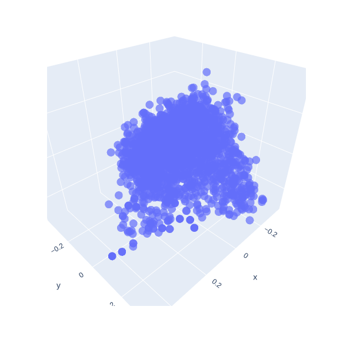
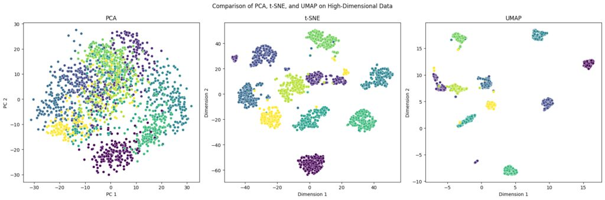
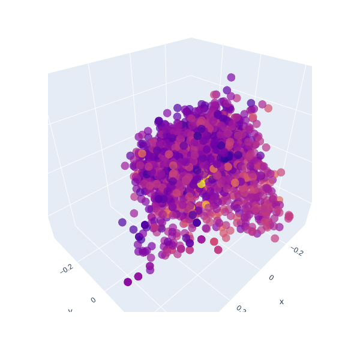
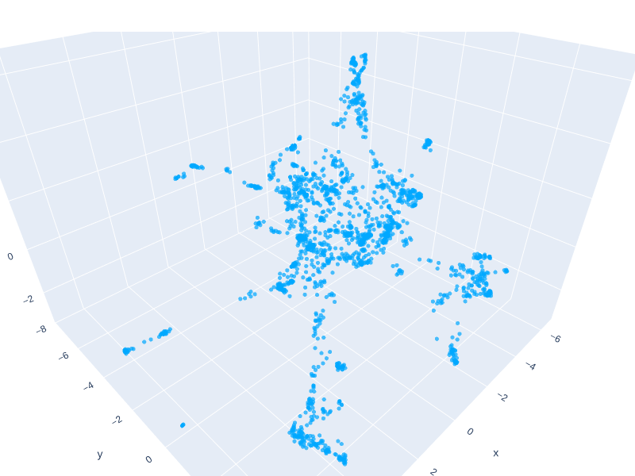
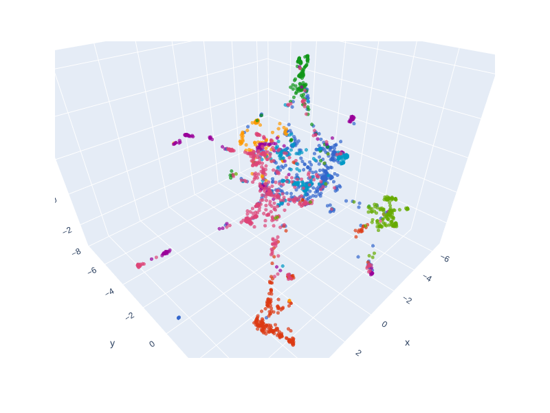
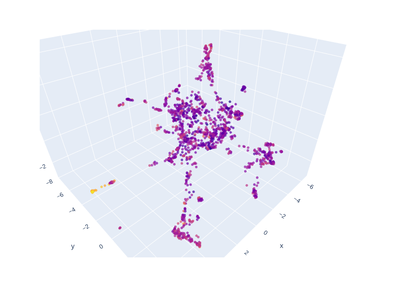

# From 1024 Dimensions to 3D: Visualizing and Diagnosing Document Embeddings with UMAP

Working with modern language models, such as **BGE-M3** used for our Knowledge Base, means manipulating embedding vectors in an abstract 1024-dimensional space. These "semantic coordinates" are the key to similarity search (RAG), but they are, by nature, invisible.

Yet, *seeing* the semantic structure of your documents is an invaluable diagnostic tool. How do all our document _chunks_ group together? Are important sections isolated from purely technical sections (such as footers)?

We explored a three-step approach to answer these questions:

1.  **Dimensionality reduction:** Moving from 1024 dimensions to 3D for visualization.
2.  **Semantic clustering:** Identifying groups of documents by meaning.
3.  **Anomaly detection:** Spotting low-quality *chunks*.

## 1. Why Visualization is Difficult: The Failure of Linear Methods

The objective is simple: project all our (embedding) vectors into a three-dimensional space (X, Y, Z) to create an interactive 3D point cloud.

### Attempt A: The Linear Approach with PCA

The first idea, often the simplest, is to use **Principal Component Analysis (PCA)**.

**Why it didn't work for semantics:** PCA is a *linear* algorithm. It excels at preserving the global variance of the data (the general shape of the entire point cloud). However, in the language domain, semantic similarity is inherently **non-linear**.

#### The Donut Analogy: The Trap of Non-Linear Data

To illustrate why PCA fails here, imagine that your semantic data forms the structure of a **donut** (a torus) in high-dimensional space.

1.  **The Center is Empty:** The geometric center of this donut (the Centroid) falls in the hole in the middle, i.e., an area where no real semantic data exists.
2.  **Misleading Projection:** PCA looks for the axis that maximizes variance. By projecting the donut points onto the principal axes, points located on the top face of the ring (e.g., *chunks* about software architecture) and points located on the bottom face (e.g., *chunks* about licenses) risk being superimposed.
3.  **Topology Destruction:** PCA destroys the "local" structure. It doesn't respect the fact that to go from one point to another on the donut, you must follow the curve of the ring, not cross through the hole in the middle. By flattening the data, it makes it impossible to clearly separate semantic clusters that should nonetheless be distinct.

This is why, in our case, PCA crushed the small tight "clusters," making theme separation impossible.

### Attempt B: The "Average" Approach with Geometric Centroid

Another approach to understanding our data was to calculate the **Centroid** (the average vector in 1024D space) and measure the distance of each *chunk* from this center.

*Dark blue is the shortest distance, yellow is the largest distance*

**Why it didn't work for visualization:** Although this calculation is not intended for 3D visualization, it offers good diagnostics. It revealed very distant *chunks* like `---\nhide:\n- toc\n---` or `## Common Languages`, formatting or metadata markers that are semantically very different from the body text. Conversely, generic titles like `## Features` are very close to the center.

**Conclusion:** Distance to Centroid is an excellent **quality filter**, but a poor **semantic visualization** tool.

## 2. The Solution: UMAP for Semantic Projection

For a visualization that respects the *semantic topology* of our embeddings, we turned to **UMAP (Uniform Manifold Approximation and Projection)**.

UMAP is a **non-linear** algorithm. It aims to preserve local distances, meaning that if two *chunks* are semantically close in 1024D, they will remain so in 3D. It works by assuming that the data lies on a low-dimensional *manifold*, and it seeks to respect this non-linear shape.

### Algorithm Choice: Classic UMAP vs Parametric UMAP

UMAP exists in two main forms:

1.  **Classic UMAP (Non-Parametric):** This is the standard version, lightweight and incredibly efficient, based on constructing a fuzzy neighbor graph and optimizing distances.
2.  **Parametric UMAP:** This version uses a small neural network (often implemented with heavy frameworks like TensorFlow or PyTorch) to *learn* the projection function. Its advantage is being able to project new points very quickly after initial training.

**In our case,** we chose **Classic UMAP**. This decision was motivated by the need for a lighter solution and the absence of *deep learning* dependencies (TensorFlow) in our working environment. Classic UMAP nevertheless did an excellent job of revealing the semantic structure of our data.

* **Output dimensions:** 3D.
* **Metric:** `cosine` (the standard for text embeddings).
* **Training data:** 2159 vectors of 1024 dimensions (BGE-M3).

**The result:** The 3D projection immediately revealed a clear structure, with several distinct "clouds" and filaments of points connecting to each other. These clouds represent our main semantic themes.

## 3. Improving Readability with K-Means Clustering

Although the UMAP projection is visually structured, the human eye struggles to define thematic boundaries. To add "group-based" readability, we applied the **K-Means** algorithm.

* **Crucial point:** We ran K-Means on the **original 1024D embeddings** and not on UMAP's 3D coordinates. This is essential to ensure that clustering is based on the full semantic richness of the model.
* **Determining K:** Using the **Elbow Method** on inertia, the curve suggests an optimal number of clusters.
* **Final clustering:** We chose $\mathbf{K=8}$ clusters.

**The result:** By coloring the 3D UMAP points according to their membership in the 8 K-Means clusters (in 1024D), the semantic map becomes not only readable, but each visual group now represents a well-defined content theme (GitLab, Architecture, Specific Technologies, etc.).

## 4. Diagnostics: Detecting Low-Quality Chunks

Thanks to UMAP visualization and Centroid analysis, we have two powerful tools for *diagnosing* our Knowledge Base:

1.  **UMAP Visualization + Clustering:** If an isolated *chunk* is outside all main clusters, it is semantically unique and may be poorly encoded.
2.  **Distance to Centroid:** If a *chunk* has an abnormally high distance, it is a strong candidate for "noise" or metadata.

Analysis of the most distant *outliers* in 1024D confirmed our hypothesis about low-quality *chunks*:

* **Outlier Examples:** `## Common Languages`, `- TLS_DHE_RSA_WITH_AES_128_CBC_SHA256 (0x0067)...` and many *chunks* containing only `---` and lists. These are preprocessing residues (document header YAML or technical lists) that should be filtered.

*Dark blue is the shortest distance, yellow is the largest distance*

**The result:** The Centroid perfectly detected non-textual "junk" that disrupts search, while UMAP provided the necessary clarity to validate the semantic cohesion of document groups.
