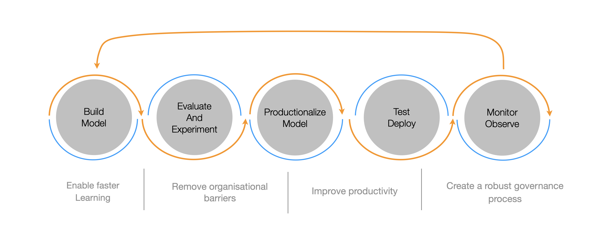

## Overview 


*For AI solutions to achieve lasting value, businesses need an iterative strategy paired with experimentation, robust engineering practices, and guardrails.*


This paper explains our strategy to design the [frugal-it](/blogs/frugalit) innovative greenops solution.
The goal of this paper is to be challenged and helped by you, the readers.

### Problem Statement

Our goal is to help architects, developpers and maintainers (referred to as users in the following) 
to reduce significantly the resources usage of their Kubernetes solutions. We plan to help them in three ways:

1. assist the users in understanding why their solution consume too much ressources
2. suggest to users possible optimisations and facilitate their evaluation
3. provide users with recommendations to help them identify if their solution complies to the best greenops practices and regulations.

### Why is it important

* Kubernetes is the de-facto standard service orchestrator platform. It is available on all clouds and on premise. It is in particular strategic to Thales defense and critical systems products and projects.
* 80% of cloud kubernetes ressources are under-utilized, leading to high energy consumption and costs.
* the technologies to scale down (i.e. reduce automatically) kubernetes applications exist but require a high expertise.
* frugality and cost optimisation are secondary concern, the first concern is robustess and continuous service.

#

## Work Hypothesis and Methodology

First, note that to succeed in exploring machine learning or generative AI, a continuous delivery process ([1]) is helpful.

It speaks for itself, as the iterations to a successful attempts require many confrontations with real users and use cases. To initiate concrete exploration while quickly initating such a cycle, we defined and put in place a concrete use case:

* The user is a software architect that designed a realistic end to end IoT Kubernetes solution. 
    * remote probes and captors collect and ship some data to a central Kubernetes solution where that data is processed, saved and displayed.    
* A number of technical components such as Queuing systems (i.e. [Kafka](https://kafka.apache.org/)), document stores (i.e. [Elasticsearch](https://www.elastic.co/)), storage components ([Minio]((https://min.io/), [Cloud storage](https://aws.amazon.com/s3/)), and
dashboarding ([Kibana](https://www.elastic.co/kibana), [Grafana](https://grafana.com/), [Superset](https://superset.apache.org/)) to ultimately present the data products to the customers. 

Such popular architecture is interesting because is is commonly used in various cybersecurity, IoT, Scada (civilian or military) solution. These are typically the applications we deal with in Thales. 
Besides, it is particularly easy to implement on top of the [Kast](/building-blocks/kast) distribution. 

### Input Data Selection

The input data is the description of the target Kubernetes application. This can come from several sources:

* Architecture and design documents
* Implementation documents, often grouped in some Wiki or equivalent internal tool
* The system itself assuming one can observe and/or guess its architectural structure dynamically
* Real-time KPIs, typically available from prometheus or equivalent monitoring stacks
* Logs, typically available from the solution monitoring plane (loki, elk etc ..)
* External data, for example meteolorogical data
* other informations that could be provided through separate human interactions

To scope our work we decided to work with three precise input datasets: 

1. The target solution dynamic configuration: this is called **config maps** in Kubernetes vocabulary. APIs make it possible to collect these, and they provide a fair and rather complete description of the structure and resources of the application.
2. Additional user provided inputs to enrich the input dataset with functional information: service level agreements, external devices properties that can have important impacts on the optimisation strategies, etc..
3. Real-time KPIs.

In the following we will refer to these information as the Input Dataset. 

### Target Optimisation Actions

Our goal is, ultimately, to assist the user to some optimisation patterns. We take here an important assumptions: 
there are a small number of optimisation techniques that are always combined to achieve a furgal and elastic architecture:

* start, stop, scale applications if there are some input requests. Sclae up these applications if the requests rate increase
* start or stop the application at fixed schedules, for example to avoid running unecessary processing at night
* start, stop, scale some application in function of input message in queuing solutions such as Kafka

This make us envision an AI assistant that will point the user to apply such (small number of) deterministic strategies. 
It is interesting to note that several such strategies will naturally combine each other, similarly to a domino effect, without yet 
being aware each one with the other. This is benefitial as there is no need to take into account some sort of dependencies
that would simply make the problem harder. 

### Capturing User feedback

To capture the user provided input, we propose a prompt like UI that is directly associated to the application ressources observed from the system. An example will best illustrates this strategy:

*Hello assistant, this kubernetes namespace called 'ingestion' is indeed in charge of receiving external sensor data. It can run sporadically as long as the sensor data can, once reconnected, flush their accumulated data.*


This strategy can be considered as labelizing the architectural elements with additional contextual data. It will be precious to ultimately help users
to evaluate possible optimisations.

### Multi-Agent Llm at play

Once the optimisation actions have been identified, and some of them implemented on our test platform, we can envision
a multi-agent pattern that will ultimatley select the possible actions depending on the input dataset and the user interactive requests. 


*multi agents are multiple independent actors powered by language models connected in a specific way..*


The multi-agent state machines allows for more controlled and flexible flows in a LLM applications. This approach introduces cycles into the runtime, enabling agents to reason about what to do next and handle more ambiguous inputs effectively. By capturing the user's intent from the prompt, such as **"I want to optimize my solution"** or **"Can you explain my solution architecture"**, the agent graph routes these queries to dedicated agents. Each then follows a loop: determining actions or responses, executing those actions, and repeating the process until a final response is generated. This method enhances the system's ability to manage complex tasks and provide tailored assistance.

A dedicated blog is in progress explaining the [technological component](https://blog.langchain.dev/langgraph/) used here.

## Business Value 

When exploring such innovative ideas, it is (very) common to end up with a workable solution that has lost too much of its
business value. To alleviate that risk we keep track of the business values we identify ourselves, and periodically review
these values with potential users and stakeholders. 

The identified business values are the following:

### Simplifying Documentation with AI

Having an assistant that describes a kubernetes running application has some immediate value as it alleviates the complexity of dealing with separate documentation to describe the solution and its implementations:

* it can be out of date
* it can be difficult to humanly process
* having immediate description without any other action that installing a probe renders the maintainance of complex solutions significantly simpler.

### Reducing Expertise Required for Elastic Solutions

Without AI assistance, having the well-known optimisation strategies at hand significantly reduce the expertise level required to design elastic solutions at hand. Our solutions provides API endpoints to do the complex work of applying a (Keda, Karpenter) configuration to automatically scale up or down the application.

### Enhancing User Interaction through AI Assistance

With the AI assistant, this work is further simplified. We also assume that users will be happy to provide useful information. Interactive prompts are way more intuitive and easy to use that providing inputs into separate complex documentations or tools. This is a win-win effect.

### An effective tool for compliancy 

Optimisation is one of our target, but once the input dataset is solid, one can immediately work on **compliancy** use cases:

* green IT rules sets
* security regulation and recommandations
* privacy regulations
* best practice architectural pattern

## References

- [1] [Build an AI strategy that survives first contact with reality](https://www.thoughtworks.com/insights/articles/build-an-ai-strategy-that-survives-first-contact-with-reality) 
- [2] [LangGraph](https://blog.langchain.dev/langgraph-multi-agent-workflows)