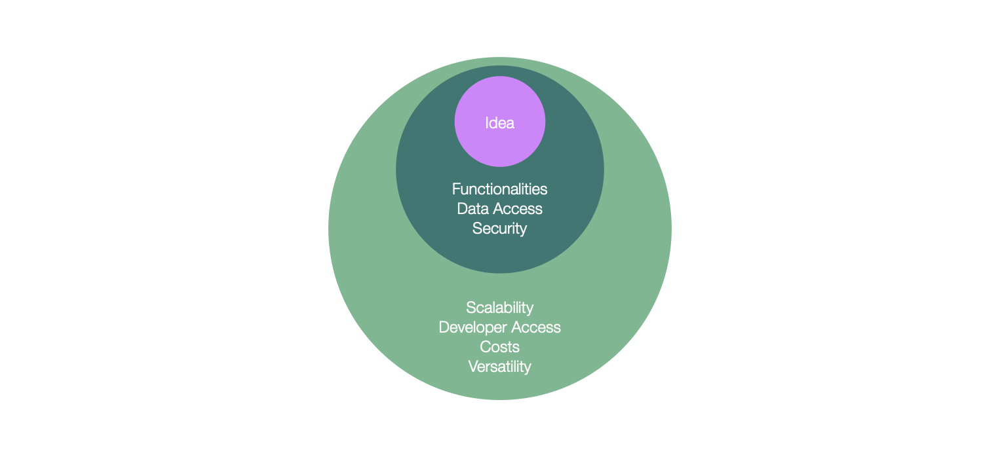


*Improving business performance through software development comes down to empowering developers, creating the right environment for them to innovate, and removing points of friction. Industry leaders refer to this capability as “Developer Velocity”.*


## Problem Statement

As an computer service company (in french: *ESN* for *entreprise de services du numérique"), we are strongly focused on innovation and client-centric solutions, particularly in sectors like defense, space, transportation, energy, and critical infrastructures. Our key focus areas include data valuation, artificial intelligence, cloud management, and security. 

This paper is a first in a serie to examine the conditions that favor innovation scale up. How can we ensure that an innovation culture and practice is widely spread among the company instead of restricted to a club of innovation specialists ? 

We first defend the need of improving developer velocity, and examine next how it helps to tackle AI innovation topics.

## Why Internal Developer Platforms matter

Before even considering specific business use cases, or the 2025-2030 technology and business trends, 
let us first ask ourselves how long does it take to demonstrate a promising new idea (assuming it is not about solving a complex algorithmic or theoretical issue) ?

If a developer has access to hosting infrastructure, the necessary data and security services and a decent laptop equipped with modern coding assistants, it usually takes just weeks. However, if the development environment must be set up for each idea, if unecessary security constraints are in the way, it leads to the partial or complete failure of the innovation attempt. 

Technical leaders from large global companies understand the importance of considering developers as first class citizens: 

*We wanted to empower the developer and move the needle ultimately on our company’s profitability.*


This requires, however, a well-defined strategy. What platform ? what tools ? who's in charge ? In the following we highlight our proposals.
In the next chapter we will examine how it would help to pursue our AI innovation tracks.

### Kubernetes as the Core Platform

Kubernetes has solidified its position as a cornerstone of modern infrastructure due to its scalability, resilience, and cost-effectiveness. It is not just a tool but a foundation for innovative platforms. Companies that master Kubernetes, especially by developing their own distributions, gain a significant advantage in resource management and operational efficiency, which are critical for fostering innovation.
According to a [recent pure storage survey](https://portworx.com/wp-content/uploads/2024/06/The-Voice-of-Kubernetes-Experts-Report-2024.pdf), among 527 seasoned entreprise experts from companies larger 500 employees:

- 91% have at least two years of Kubernetes experience.
- 56% have over 4 years.
- 80% plan to build most of their new applications on cloud native platforms over the next 5 years; 
- 86% build their cloud native platforms in hybrid cloud environments
- 54% are running AI/ML workloads on Kubernetes, 72% run databases, and 67% run analytics
- 58% will migrate some of their VMs to Kubernetes management by using technologies like KubeVirt;
- 65% plan to migrate their VMs within the next two years
- 96% currently have a platform engineering function  

### Leveraging Google Cloud

An innovation platform is not a production platform. It does not come with stringent service level agreements. However, it must function reliably, with minimal effort from the SRE team. AWS, Azure, OVH, and Google Cloud all offer robust managed Kubernetes services. Our company also provides an
[excellent managed Kubernetes platform](https://doc.kaas.thalesdigital.io/docs) and several internal ones.

That said, we suggest leveraging Google GKE Kubernetes for several reasons:

- Our company and Google jointly develop [S3NS](https://www.s3ns.io/en), so mastering GCP and GKE is a strategic direction.
- TSN is developing for the group its own [kubernetes data analytics plaform](/building-blocks/kast), which is kubernetes centric but does not need (or care) which Kubernetes it actually runs on. 
- TSN designs and delivers solutions for its customers on GCP. Mastering each cloud platform is essential.
- An innovation platform should come at minimal cost.

### Kast as Internal Developer Platform

Kubernetes has two major drawbacks. First, it is complex and leaves countless design choices for deploying, securing, and managing an application, which holds little value for innovators or developers. Second, Kubernetes is only an orchestration platform; what developers need are high-level data services (e.g., queuing, document, column or vector stores, inference servers). This is where [Kast](/building-blocks/kast) comes in.

Is Kast perfect? Can it serve as fundation for an [internal developer platform](https://learn.microsoft.com/en-us/platform-engineering/what-is-platform-engineering#what-is-an-internal-developer-platform) out of the box ? No. Clearly not. And that is exactly why we chose Kast. It provides extremely valuable services to simplify the deployment, monitoring, and security of applications. It also offers advanced data features. Choosing Kast accelerates our progress and ultimately is a win-win strategy. It helps us, and we can help Kast by requesting features or contributing to their development. Last but not least, whatever runs on our IDP runs on top of the most secured on-premise platforms.

### Managed by a small but dedicated team

We suggest a well-structured IDP,
centralized and managed by a specialized team, built on top of our GKE/GCP/Kast. 
This approach aligns with industry trends where 
[platform engineering](https://learn.microsoft.com/en-us/platform-engineering/what-is-platform-engineering) centralizes key resources and tools, reducing cognitive load on developers and allowing them to focus on creating and innovating. 

Today a team of one or two can provide automated deployment of complete platforms and provides standardized guidelines for developers
to deploy their application in matter of a few hours.  These set of guidelines must further be explicitly defined, reviewed and imposed as part of
TSN technical policy.

### Cost Efficiency and Developer Autonomy

The combination of google cloud, a shared gitlab, and Kast assembled in a centralized IDP provides
a powerful environment where developers can work autonomously but within a framework that optimizes 
resources and maintains control over the infrastructure, reducing operational costs. 

But what does it cost to build and maintain such IDP exactly ? To our view, *nothing*. If well engineered, with the right automation 
level to scale it on demand, the costs (SRE team included) are significantly smaller than the gains resulting from optimizing 
the work of tenths/hundreds of developers. 

Another significant colateral benefit: TSN *must* stay at the forefront of important IT and devops areas 
like DevSecOps, FinOps and now GreenOps. Maintaining an IDP on standard cloud and open source technologies 
will significantly enhance developers and architects expertise in these domains.

### Developer Laptops

This topic is often and surprisingly neglected. Like many ([17](https://www.amazon.com/Accelerate-Software-Performing-Technology-Organizations-ebook/dp/B09JWS32W1), [18](https://kyleake.medium.com/mckinsey-report-on-developer-velocity-how-software-excellence-fuels-business-performance-cf566634d203), [19](https://www.forrester.com/blogs/developer-experience-is-a-key-to-organizational-success/)) we consider in contrast that it is a fundamental one.  *"Companies that are best in developer experience velocity"*: 

- *outperform others in the market by four to five times*.
- *have 60% higher total shareholder returns and 20% higher operating margins than others in the market*.
- *appear to be more innovative, scoring 55% higher on innovation than those in the bottom quartile*.
- *score higher on customer satisfaction, brand perception and talent management*.
- *saw revenue growth almost two times faster than other software companies in the same period*.
- *utilise strong developer tools for planning, development, collaboration and continuous integration and delivery*.

As gor GPUs, only a few need them ([see this benchmark](https://www.theregister.com/2024/08/23/3090_ai_benchmark/)).

## Why AI innovation is hard

Almost 3 out of four of our innvation tracks include or are about artificial intelligence, and with no surprise, generative AI. 
AI applications pose a set of serious and still largely unsolved issues. Mostly related to the difficulty to deploy
and maintain them in production for the mid or long term.

### Maturity of MLOps Practices

While there are emerging best practices for MLOps, the field is still relatively young. Organizations often need to develop custom solutions or significantly adapt existing tools to meet their specific requirements. Most MLOps tools are designed with different assumptions and integrations in mind, making it difficult to stitch together a coherent pipeline that meets all needs (e.g., from data ingestion and preprocessing to model training, deployment, and monitoring). [MLOps Guide 2023-24: Decoding Machine Learning Ops](https://www.tredence.com/mlops-101)

### Cost and Complexity of Managed Services

Subscribing to one of the top [AI services providers](https://cioinfluence.com/it-and-devops/top-20-ai-cloud-companies-to-know-in-2024/) certainly simplify some aspects of deploying and managing AI applications. This approach can be a perfect match to quickly develop MVPs or test new ideas.  
But these services come with their own set of challenges. Besides their cost, each require a significant learning curve, configuration and tuning. 
Vendor lock-in is, of course, an issue as well. The Kubernetes ecosystem, in this space, is a challenger that makes it simpler to benefit from the latest open-source 
technologies (the same technologies that are often packaged and integrated by the aformentioned services providers), but alone, brings in his own complexity.

### Monitoring and Maintenance

Traditional monitoring tools are not sufficient for AI applications. Monitoring needs to cover not only the infrastructure (uptime, resource utilization) but also the models (performance, drift detection, fairness, etc.). This requires specialized tools and techniques, which are still evolving.

Deploying AI models into production is just the start. Maintaining them, retraining with new data, monitoring for performance degradation, and ensuring they remain secure and compliant over time is an ongoing challenge. This is not only technical problem, MLOps is more fundamentally a set of organizational and cultural practices ([A Multivocal Review of MLOps Practices, Challenges and Open Issues](https://ar5iv.labs.arxiv.org/html/2406.09737)). This whole lifecycle management is still maturing as a discipline.

### AI Security

AI security is a [distinct problem from traditional security](https://ar5iv.labs.arxiv.org/html/2402.12617v1).
AI applications, particularly in sensitive domains like finance, healthcare, or defense, handle large amounts of data that must be securely stored, processed, and transmitted. Ensuring data security involves setting up encryption, access controls, auditing, and more, which can be complex and error-prone, especially when dealing with multiple tools and environments.

Beyond data, models themselves need to be secured against threats like adversarial attacks, data poisoning, or unauthorized access. 
Implementing robust security measures across the entire MLOps pipeline is a non-trivial task.

Last, meeting regulatory requirements (GDPR, HIPAA, etc.) adds another layer of complexity, especially when managing data and models across different platforms and services.

## IDPs help AI innovation

Does it ? Our focus and strategy at TSN is mostly on developing AI solutions that are robust, easily deployable in production environments, 
and built with the highest standards of security in mind. Here are some observations. 

First, [Generative AI is fueling demand for Kubernetes](https://analyticsindiamag.com/ai-origins-evolution/how-generative-ai-is-fueling-demand-for-kubernetes/). Choosing Kubernetes is a natural choice for an ESN like TSN that does not seek
to reduce its expertise to one specific cloud provider or editor. 

Second, it is important to understand that leveraging the latest technologies is not good enough.
Today, with a combination of three open source technologies ([langchain](https://www.langchain.com/), [langfuse](https://langfuse.com/) and [langgraph](https://langchain-ai.github.io/langgraph/)), developers can quickly setup a multi-agent, monitored generative AI application. That is not innovation. Innovation is to apply it to a useful use case, and succeed in deploying in a real production environment. In that space, open sources lacks many features.

Last, assuming you agree by now that an IDP would help, why not a partnership with (say) [charmed kubeflow](https://charmed-kubeflow.io/) (or others). 
Certainly such a partnership would make sense. But as already stated, with our assets and a small team, we can benefit from both aspect: building an IDP 
does make us grow at reasonable costs on low level platform issues, and the resulting team interactions create new synergies. 

The TSN paradox is as follows. We have the software assets, many (many) DevOps and DevSecOps specialists, and 
many (not as many of coure) Data Scientists, and some (enough) MlOps specialists. And yet,
we lack efficiencies to setup and demonstrate our ideas in the expected weeks. Recent successes ([ogma](/blogs/ogma), [nyx](/blogs/nyx) among others) were illustrative of the advocated IDP approach. In turn these projects pave the way to define shared devops practices, architectural patterns, and a cultural change
to make small and geographically distributed teams or individuals work together. The next step is to make these practice explicitly part of our
technical policy. We are working on it.

## References

- [1] [Platform owners must master platform optimization to drive innovation](https://thenewstack.io/platform-owners-must-master-platform-optimization-to-drive-innovation/)
- [2] [Execs invest in platform engineering, here is why](https://thenewstack.io/execs-invest-in-platform-engineering-heres-why/–)
- [3] [Devops 2024 automate first AI second](https://thenewstack.io/devops-in-2024-automate-first-ai-second/)
- [4] [Cutting Kubernetes costs with virtual clusters](https://www.infoworld.com/article/3486255/cutting-kubernetes-costs-with-virtual-clusters.html)
- [5] [Embracing simplicity and composability in data engineering](https://towardsdatascience.com/embracing-simplicity-and-composability-in-data-engineering-1eb1fd7aa190)
- [6] [Why apache iceberg is on fire right now](https://www.infoworld.com/article/3479001/why-apache-iceberg-is-on-fire-right-now.html)
- [7] [Generative AI cut costs at Sanofi](https://www.usinenouvelle.com/editorial/la-qualite-est-epoustouflante-sanofi-divise-par-huit-le-temps-passe-sur-ses-controles-qualite-grace-a-l-ia-generative.N2216322)
- [8] [Building a datascience tool stack with Kubernetes](https://towardsdatascience.com/building-a-data-science-tool-stack-with-kubernetes-00c74b491b9d)
- [9] [What is Stopping Devs from Building an LLM?](https://analyticsindiamag.com/developers-corner/what-is-stopping-devs-from-building-an-llm/)
- [10] [Benchmarks show even an old Nvidia RTX 3090 is enough to serve LLMs to thousands](https://www.theregister.com/2024/08/23/3090_ai_benchmark/)
- [11] [A Multivocal Review of MLOps Practices, Challenges and Open Issues](https://ar5iv.labs.arxiv.org/html/2406.09737)
- [12] [Top 5 MLOps challenges](https://canonical.com/blog/mlops-challenges)
- [12] [Charmed Kubeflow](https://charmed-kubeflow.io/)
- [14] [Vertex AI](https://cloud.google.com/vertex-ai?hl=en)
- [15] [MLOps Guide 2023-24: Decoding Machine Learning Ops](https://www.tredence.com/mlops-101)
- [16] [Generative AI Security: Challenges and Countermeasures](https://ar5iv.labs.arxiv.org/html/2402.12617v1)
- [17] [Accelerate: The Science of Lean Software and DevOps: Building and Scaling High Performing Technology Organizations](https://www.amazon.com/Accelerate-Software-Performing-Technology-Organizations-ebook/dp/B09JWS32W1)
- [18] [How Software Excellence Fuels Business Performance](https://kyleake.medium.com/mckinsey-report-on-developer-velocity-how-software-excellence-fuels-business-performance-cf566634d203)
- [19] [Developer experience is a key to organizational success](https://www.forrester.com/blogs/developer-experience-is-a-key-to-organizational-success/)
- [20] [langfuse](https://langfuse.com/)
- [21] [langgraph](https://langchain-ai.github.io/langgraph/)
- [22] [langchain](https://www.langchain.com/)
- [23] [How Generative AI is Fueling Demand for Kubernetes](https://analyticsindiamag.com/ai-origins-evolution/how-generative-ai-is-fueling-demand-for-kubernetes/)
- [24] [The Voice of Kubernetes Experts Report 2024](https://portworx.com/wp-content/uploads/2024/06/The-Voice-of-Kubernetes-Experts-Report-2024.pdf)
- [25] [charmed kubeflow](https://charmed-kubeflow.io/) 