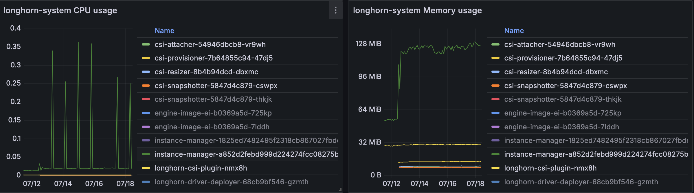
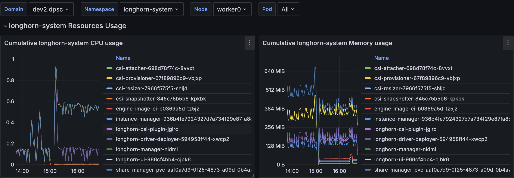
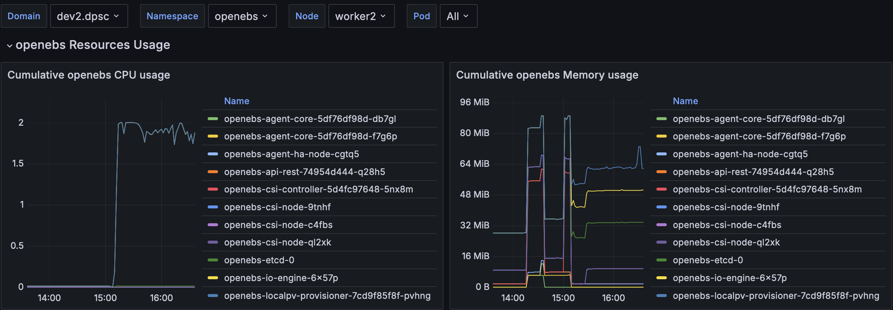

## Overview

The aim of this study, originally posted on the Kast blog [blog](https://kast-portal.dpsc-thales.fr/static/files/kast-documentation/snapshot/SNAPSHOT/blog/index.html),  is to provide to clients a replicated (or distributed) file system usable through CSI in small and medium deployments.

| Size | Nodes | vCPU | RAM (GB) | DISK (GB) |
| --- | --- | --- | --- | --- |
| Small | 3 | 4 | 4 | < 100 |
| Medium | 5 | 8 | 16 | < 1000 |

The criteria to select the solution are:

- [FLOSS](https://www.gnu.org/philosophy/floss-and-foss.en.html) (Free/Libre & Open-Source): the solution must be an open source (preferably with a permissive license) and free of use
- Data Resilience: the solution must support one node failure with minimal data loss, failover duration and disaster recovery
- Low footprint: the solution must be deployable on small and medium configurations
- Simple Usage: the solution must be simple to administer (requiring few knowledge and providing a UI)
- Shareable Data: the solution should allow providing a ReadWriteMany storage (shall be accessible outside the cluster).

The identified candidates are :

- Rook/Ceph
- Longhorn (SUSE)
- Mayastor (OpenEBS)

## Candidates

### Rook/Ceph

[Rook](https://rook.io) turns distributed storage systems into self-managing, self-scaling, self-healing storage services. It automates the tasks of a storage administrator: deployment, bootstrapping, configuration, provisioning, scaling, upgrading, migration, disaster recovery, monitoring, and resource management. Rook uses the power of the Kubernetes platform to deliver its services via a Kubernetes Operator for [Ceph](https://ceph.io/en/).

The project does not clearly declare an original company but it seems to be [Quantum](https://www.quantum.com) according to first maintainer emails. It has been accepted as a [CNCF Project](https://www.cncf.io/projects/rook/) on January 29, 2018 and moved to the **Graduated** maturity level on october 7, 2020.


The management of Mayastor is performed through a specific kubectl plugin as data are not stored in the Kubernetes database.


> Rook/Ceph is already used intenally in Kast to integrate some legacy components requiring access to a POSIX file system. It is not officially supported for Kast users and must be thus considered as an incubating (non-LTS) component. For more information see: [Distributed Storage component](../../components/distributed_storage/index.md).

### Longhorn

#### Overview

[Longhorn](https://longhorn.io) is a cloud native distributed block storage for Kubernetes.

The project was originally built by SUSE Rancher and is held by the [Linux Foundation](https://www.linuxfoundation.org/legal/trademarks). It has been accepted as a [CNCF Project](https://www.cncf.io/projects/longhorn/) on October 11, 2019 and moved to the **Incubating** maturity level on november 4, 2021.

It has a simple architecture: .


At study time, we mainly focused on Data Engine v1 as Data Engine v2 is not production ready.


The Data Engine v2 will introduce breaking changes to improve performances. It will migrate:

- iSCSI to NVME/TCP for [IO/IOPS improvements](https://kb.blockbridge.com/technote/proxmox-iscsi-vs-nvmetcp/)
- blocking to an active loop for IO Management which implies a full vCPU used for it.
- HugePage Allocation (2GB accordingly to documentation)

These requirements are exactly the same as for [OpenEBS Mayastor](https://openebs.io/docs/user-guides/replicated-storage-user-guide/replicated-pv-mayastor/rs-installation#general).

#### Deployment

Deploying longhorn on kubernetes is very simple with the helm chart. It only requires some [documented dependencies](https://longhorn.io/docs/1.6.2/deploy/install/#installation-requirements) on the Operating System and a [check script](https://longhorn.io/docs/1.6.2/deploy/install/#using-the-environment-check-script) is provided.

The deployment was straightforward without any issues.

### Mayastor (OpenEBS)

#### Overview

[OpenEBS](https://openebs.io) helps Developers and Platform SREs to easily deploy Kubernetes Stateful Workloads that require fast and highly reliable Container Native Storage. OpenEBS turns any storage available on the Kubernetes worker nodes into local or distributed Kubernetes Persistent Volumes.

It has been accepted as a [CNCF Project](https://www.cncf.io/projects/openebs/) on May 14, 2019 and moved to the **Archive** maturity level on [February 1, 2024](https://github.com/cncf/toc/issues/1051#issuecomment-1921067851). They are [currently working](https://github.com/openebs/openebs/issues/3701) to come back as a sandbox CNCF Project.

It has a simple architecture: 
The access to replicas is performed through the NVMe-TCP protocol.

#### Deployment

Deploying OpenEBS on kubernetes is simple with the helm chart. It only requires some [documented dependencies](https://openebs.io/docs/main/user-guides/replicated-storage-user-guide/replicated-pv-mayastor/rs-installation#prerequisites).

On first deployment a lot of noise appears:

- It deploys a local *AND* replicated storage, there is no way to remove the local provisioner.
- It deploys Loki and NATS server and a promtail agent which can be disabled by configuration.

```shell
helm upgrade --install openebs --namespace openebs openebs/openebs --create-namespace --set engines.local.lvm.enabled=false --set "engines.local.zfs.enabled=false"  --set "lvm-localpv.enabled=false" --set "zfs-localpv.enabled=false" --set "openebs-crds.csi.volumeSnapshots.enabled=false" --set obs.callhome.enabled=false --set "mayastor.eventing.enabled=false" --set "mayastor.loki-stack.enabled=false"
```


 The management of mayastor is performed through a specific kubectl plugin as data are not stored in kubernetes database.


## Communities

The following diagram shows popularity of the different tools based on [GitHub stars history](https://star-history.com/).


To understand this diagram it is important to note that:

- openebs/openebs is a different project from openebs/mayastor which we use in Kast for local volume provisioning (cf. Local Volume Provisioner Selection [page](./lvp-selection.md)). Only openebs/mayastor is studied here;
- rook is an operator used in conjunction with ceph (you have to consider popularity of the two tools).

## Features

| Criteria | Longhorn | Rook/Ceph | Mayastor |
| --- | --- | --- | --- |
| Replication | &#9989; | &#9989; | &#9989; |
| [Data Striping](https://en.wikipedia.org/wiki/Data_striping) | :x: | &#9989; (erasure coding) | :x: |
| Provisioning | Thin | Thin | Thick/Thin |
| Snapshots | &#9989; (with scheduler) | &#9989; | :warning: [Limited to 1 replica](https://openebs.io/docs/4.0.x/user-guides/replicated-storage-user-guide/replicated-pv-mayastor/advanced-operations/volume-snapshots#prerequisites) |
| Backup | &#9989; (with scheduler) in s3 compatible storage | &#9989; | :warning: See Velero |
| Encryption | &#9989; (LUKS) | &#9989; (LUKS v1/v2) Key rotation from CSI 1.32.0 | :x: (Planned) |
| Volume Expansion | &#9989; | &#9989; | &#9989; (no when snapshot performed) |
| Cross Cluster Replication | :x: | &#9989; (RBD Mirroring) | - |
| Read Write Many | &#9989; (NFS v4.0+) | &#9989; (CephFS/ NFS v4.1) | :x: (only with cstor) |
| Object Storage | :x: | &#9989; (Rados GW) | :x: |
| Monitoring | &#9989; Prometheus | &#9989; Prometheus | &#9989; Prometheus |
| UI | &#9989; (no sso) | &#9989; (no sso) | :x: |
| CNCF | Incubating | Graduated | :warning: Archived |
| Underlying storage | FS(v1)/Block(v2) | Block | Block/FS |
| ARM64 support | &#9989; | &#9989; | :x: |


Volume Shrinking is not part of the CSI interface.
     

## Tests

All the tests were performed using:

- longhorn 1.6.2
- mayastor 2.7.0
- rook/ceph 1.6.11/15.2.13

With a reference platform (dev1).

A network bandwidth test with iperf3 has been performed.
The bandwidth between nodes is 2 GB/s.

An IO disk test with fio has been performed.
The result on a reference node is :

```
Random Read/Write IOPS: 71.4k/22.5k. BW: 1562MiB/s / 1463MiB/s
Average Latency (µsec) Read/Write: 237.68/1094.67
Sequential Read/Write: 1609MiB/s / 1586MiB/s
Mixed Random Read/Write IOPS: 35.3k/11.8k
```

### Performances

A performance test with fio has been performed for a 2 replicas storage:

| Criteria | Base | Longhorn | Ceph (replicas) | Mayastor |
| --- | --- | --- | --- | --- |
| Random Read IOPS (higher is better) | 71k | 14k (rwx 10k) (v2 56k) | 15k | 37k |
| Random Read Bandwith in MiB/s (higher is better) | 1560 | 360 (rwx 240) (v2 395) | 520 | 680 |
| Random Write IOPS (higher is better)| 22k | 890 (rwx 843) (v2 21k) | 8.7k | 13k |
| Random Write Bandwith in MiB/s (higher is better)| 1460 | 105 (rwx 63) (v2 202) | 360 | 312 |
| Average Read Latency in µsec (lower is better) | 240 | 910 (rwx 780) (v2 610) | 770 | 706 |
| Average Write Latency in µsec (lower is better) | 1100 | 4740 (rwx 9850) (v2 1650) | 2930 | 1480 |
| Sequential Read Bandwith in MiB/s (higher is better) | 1610 | 465 (rwx 1140) (v2 390) | 500 | 870 |
| Sequential Write Bandwith in MiB/s (higher is better) | 1590 | 230 (rwx 184) (v2 207) | 360 | 470 |
| Mixed Random Read IOPS (higher is better) | 35k | 2.6k (rwx 2.5k) (v2 31k) | 10k | 18k |
| Mixed Random Write IOPS (higher is better) | 12k | 880 (rwx 850) (v2 10k) | 3.3k | 6100 |


- the RWX volume has been tested with a single pod using it (to be fair with other tests).
- Longhorn engine data v2 / Mayastor has been limited to 1Gb Huge Page to fit for small deployments.
- Ceph as using CNI which is not the best practice for good performance/ production.
 

### Resources Usage

Monitoring has been performed during FIO tests

#### Longhorn

For a long small loading running test :


The CSI Attacher/Provisioner/Resizer/Snapshotter stay below 16MB each. Instance manager reaches 128MB with a start at 121MB after 2 days.

With FIO we have the following usage:


#### Mayastore


- HugePage usage is not visible in memory management.
- The active loop leads to 2 full cpu usage all the time in monitoring.

 
With FIO we have the following usage:


### Robustness

#### Ceph

##### killing the osd process with load

A first test has been performed to check the robustness of the osd manager which runs the data engine.
A kill is performed every 20 seconds on an osd manager and an fio with mixed read write is performed.

The configuration of the pool is with min_size 1 and size 2 (not recommended by ceph for production: recommends min_size 2 and size 3).

The fio test ends without noticing any functional issue.

##### killing the rbd plugin process with load

A first test has been performed to check the robustness of the rdb plugin which runs the data engine.
A kill is performed every 20 seconds on a rbd-plugin pod and an fio with mixed read write is performed.

The fio test ends without noticing any functional issue.

##### One hard node failure (VM kill like powerloss) with load

A test has been performed by killing the node owning the pod executing the workload.
The killing of the node has been performed using the stop feature of VMWare (without ACPI extinction).
In such case the workload pod is triggered by kubernetes to failover on another node but waits for PV to be mounted.
After 20 minutes a manual action has been performed to force deletion of the workload and rdb-plugin pod in Terminating State which does not change anything. After 30 minutes failover append.

An issue exists but is closed [On NodeLost, the new pod can't mount the same volume](https://github.com/rook/rook/issues/1507). An addon is required to handle part of the [automatic failover](https://rook.io/docs/rook/v1.15/Storage-Configuration/Block-Storage-RBD/block-storage/#node-loss). Specific taints shall be applied on a node to allow the "automatic failover"


An agent shall be developed to manage the automatic failover.
    

##### Disaster Recovery

There are two options for backup:

- [RBD Mirroring](https://rook.io/docs/rook/v1.15/CRDs/Block-Storage/ceph-block-pool-crd/#mirroring) and [CephFS Mirroring](https://rook.io/docs/rook/v1.15/Storage-Configuration/Shared-Filesystem-CephFS/filesystem-mirroring/) which are the native Ceph solutions.
- Velero Backup. Accordingly to [Velero Documentation](https://velero.io/docs/main/csi-snapshot-data-movement/), you will need to use the csi snapshot data movement plugin to backup Ceph volumes ( as the snapshot remains in Ceph cluster by default).

#### Longhorn

##### killing the local process with low load

A first test has been performed to check the robustness of the instance manager which runs the data engine.
A job is started to write a file every 5 seconds and, during it's run, we run a chaos experimentation killing a random instance manager every 20 seconds.
Killing the local instance manager will stop the pod has the Persistent Volume is no more managed triggering a pod rescheduling.
We didn't notice any disk corruption with such test.

##### Destroy One replica through API UI with low load

A test has been performed with two data replicas.
We destroyed one of the replica from the UI and checked the behavior.
The workload pod does not seem impacted and a recovery process is triggered rebuilding another replica.

A ticket is identified on Longhorn side [Rebuilding Replica fails on larger volumes](https://github.com/longhorn/longhorn/issues/8745) but seems more linked to the underlying infrastructure than longhorn itself.
A test on kast infrastructure with a 127G PV was successful.

##### Destroy one replica in longhorn's back

This test has been inspired by [Potential Data loss on cluster resize with detached volumes](https://github.com/longhorn/longhorn/issues/3619).
We did a simple test to confirm the criticality of this ticket.
We create and fill a pvc with a pod and stop the pod. The volume (with two replicas) becomes detached. Then, we go on the node and remove the folder directly on the operating system. Then we attach the volume and check the result. Longhorn detect the failure, rebuild a replica and both replica becomes healthy.


A specific note to explain how to recycle notes should be written to take into account detached volume. A procedure should be applied but is not a blocking point.
        

##### One hard node failure (VM kill like powerloss) with low load

A test has been performed by killing the node owning the pod executing the workload.
The killing of the node has been performed using the stop feature of VMWare (without ACPI extinction).
In such case the workload pod is triggered by kubernetes to failover on another node but waits for PV to be mounted.
After 15 minutes a manual action has been performed to force deletion of the longhorn instance manager in Terminating State
(We did the same for the workload pod before) then the PV is mounted and the pod restarts cleanly.
This behavior has only been confirmed for Job Workload. Similar test with deployment is going well.

The issue is a bit strange, we'll need to dig a bit but some improvement are already identified for [Recovery Time](https://github.com/longhorn/longhorn/issues/6803).

##### Disaster Recovery

We setup two different platforms :

- one with rke2 and backup on a local MinIO
- another one with k3s and backup on a local MinIO

A volume has been created on the first cluster with backup enabled.
We created 3 consecutive backup with different contents.
We manually copied the MinIO content between the two servers and use the longhorn UI to restore the backup.
We restored two backup in a different PVC/PV to check the content of the disk and all was fine.


The procedure has been performed using the same version of longhorn on both platforms.
    Tickets show that using different versions of longhorn could fail.
 


Accordingly to [Velero Documentation](https://velero.io/docs/main/csi-snapshot-data-movement/), you will need to use the csi snapshot data movement plugin to backup longhorn volumes ( as the snapshot remains local) or use the Longhorn backup mechanism with storage on s3 (or NFS).
  
    

##### Stability Tests

Some tests have been performed to check the stability of the longhorn volumes, chaos testing has been performed on the instance manager (which manage disks on each node) :

- A Bandwidth limit test to 10mbps. The fio bandwidth result is consistent with the 10mbps limit without any errors on workload point of view.
- A Network latency test of 100ms. The fio bandwidth/latency result is consistent with the limitation without any errors on workload point of view.
- A Network packet loss test (10%). The fio bandwidth/latency result ends with error and the volume ends in a non healthy state. After stopping the chaos the disks are healed.
- A Disk latency test of 20ms. The fio bandwidth/latency result ends with error and the volume ends in a non healthy state. After stopping the chaos the disks are healed.

A [Possible disk corruption on load](https://github.com/longhorn/longhorn/issues/9036) is identified on longhorn side but is clearly linked to a too small underlying disk performances (write timeout above 8 seconds). This can raise an issue for a full platform power loss.

##### Security analysis

The security contexts (and some resources) are not set in the original helm chart it should be customized at kast level.


The design of longhorn is based on iSCSI protocol without CHAP authentication. Any user logged in on a node can read/corrupt the disks as a node shall access to the network storage so firewall does not block it and there is no authentication in the network protocol.
      

Sample of code with root account (but binary with correct tcp calls could do the same)
On master node which is not a longhorn node and `10.244.4.23` is a longhorn instance manager pod ip.

``` shell
$ iscsiadm -m discovery -t sendtargets -p 10.244.4.23:3260
10.244.4.23:3260,1 iqn.2019-10.io.longhorn:pvc-09ee256d-940e-4bff-92e6-cdd06b73a4e5
iscsiadm -m node -T iqn.2019-10.io.longhorn:pvc-09ee256d-940e-4bff-92e6-cdd06b73a4e5 -p 10.244.4.23:3260 -l
$ fdisk -l
Disque /dev/sdc : 20 GiB, 21474836480 octets, 41943040 secteurs
Modèle de disque : VIRTUAL-DISK
Unités : secteur de 1 × 512 = 512 octets
Taille de secteur (logique / physique) : 512 octets / 512 octets
taille d'E/S (minimale / optimale) : 512 octets / 512 octets
$ mkdir /hack
$ mount  -t ext4 /dev/sdc /hack/
$ ls /hack/
fiotest  lost+found
```

### Features

#### Longhorn

##### Volume Expansion

A test has been performed to check volume expansion.
A process writes continuously inside the pod after a while we see `/bin/sh: can't create /data/1721305318.txt: No space left on device`.
We manually edited the PVC to increase the size of the claim (from 10G to 15G) after about 30 seconds the process is allowed to write in the PV without restart.


Volume expansion has limitations for encrypted and rwx volumes and restore of expanded volumes. See [Documentation](https://longhorn.io/docs/1.7.0/nodes-and-volumes/volumes/expansion/#corner-cases)
          


The current max size of a volume is [16TB](https://github.com/longhorn/longhorn/issues/9221).
 
    

##### Data Locality

Longhorn provide a data locality feature which relocate a replica on the workload host.The aim of such strategy is to reduce network load has one of the disk is local.

A test has been performed to test the best-effort data locality mechanism.
We checked the location of the replicates and started a pod on another node.
In this case the pod is started normally and a new disk is created asynchronously on the local node.
Once synchronized, one of the old replicates is destroyed.

##### Volume Encryption

A test has been performed with fio and chaos on encrypted volume. It uses LUKS ([Linux Unified Key Setup](https://en.wikipedia.org/wiki/Linux_Unified_Key_Setup)) and works well. The key can be either a cluster wide master key or per volume. It has been identified a minor ticket about [Not accurate size](https://github.com/longhorn/longhorn/issues/9205).


The passphrase rotation is (not supported)[https://github.com/longhorn/longhorn/issues/9345]
      


The secret volume encryption can be [defined per PVC if required](
https://longhorn.io/docs/1.7.1/advanced-resources/security/volume-encryption/#setting-up-kubernetes-secrets-and-storageclasses)
 

##### RWX volume

A very simple test has been performed for rwx volume creating two pods using the same volume. One write a file the other read it.



The NFS server (one per PV) is published on the flight when a pod starts using the volume. There is no ACL and it should not be exposed externally. It would be better to create a dedicated NFS server (as a pod) with RWO (or RWX...) volume.
 

We did another load charge test with only one pod to compare performance against the RWO use-case as some discussions show limitations [even with one pod](https://github.com/longhorn/longhorn/discussions/8111) :
The performances (see global perf comparison) are not so awful, there is a decrease in performance but not so high. The memory usage can be relatively high for the share manager.


##### UI

The UI is very simple to use. No authentication is provided.

#### Rook/Ceph

Features are usually coming from Ceph validated for years and only wrapped by rook, no real tests have been performed.

##### Volume Expansion

The feature is [available](https://rook.io/docs/rook/v1.15/Storage-Configuration/Ceph-CSI/ceph-csi-drivers/?h=volume+exp#dynamically-expand-volume)

##### Data Locality

The storage is using data partitioning, no test for data locality will be performed (cache features exists but won't be studied).

##### Volume Encryption

Volume encryption is supported and encyrption key rotation is available since [CephCSI 3.12.0](https://github.com/ceph/ceph-csi/releases/tag/v3.12.0) delivered in [Rook 1.15.0](https://github.com/rook/rook/blob/v1.15.0/deploy/charts/rook-ceph/values.yaml)

##### RWX volume

Ceph provide RWX volumes through CephFS.

##### UI

The UI is only provided for Ceph and requires knowledge to use it. An admin account is generated by default.

## Synthesis


Ceph performances are in replication mode.
      

| Criteria | Longhorn | Rook/Ceph | Mayastor |
| --- | --- | --- | --- |
| FLOSS | +++ | +++ | +++ |
| Features | ++ | +++ | + |
| Performances | - | + | ++ |
| Ease of Use | +++ | ++ | + |
| Low FootPrint | ++ | - | + |
| Shareable Data | ++ | +++ | - |

## Conclusion

Rook/Ceph and Longhorn are two eligible solutions whereas Mayastore does not have all the necessary features.

Rook/Ceph provides guarantees to avoid disk corruption in case of node loss. Rook simplifies Ceph deployment but not its usage in kubernetes.
The main points are:

- the UI is Ceph dedicated with no real link to the kubernetes world.
- The failover for workload is not automated, an operator shall intervene.
- The kubernetes custom resources does not provide enough information for troubleshooting
- It requires a minimal Ceph knowledge to use it
- For performances, it would be recommended to use a dedicated network with multus implying more complexity and some [limitations according to documentation](https://rook.io/docs/rook/v1.15/CRDs/Cluster/network-providers/?h=multus#known-limitations-with-multus).

Longhorn does **not** provide full consistency on node loss. Longhorn is very well integrated in kubernetes.
The main points are:

- The UI allows a good tracking between PV and real storage and is very simple to use
- The automatic failover of workload is partially provided for RWO volumes (guaranteed for deployment but not for other kubernetes resources like job,...)
- The performances are low.
- The footprint is lower than rook/ceph.
- Exposure of disks are not fully secured.

As part of the Kast Accordingly to our criteria, with no strong consistency requirement, we will select Longhorn as our LTS component.

For these reasons, and because Kast does not provide strong consistency, Longhorn is selected as part of Kast LTS distribution.
