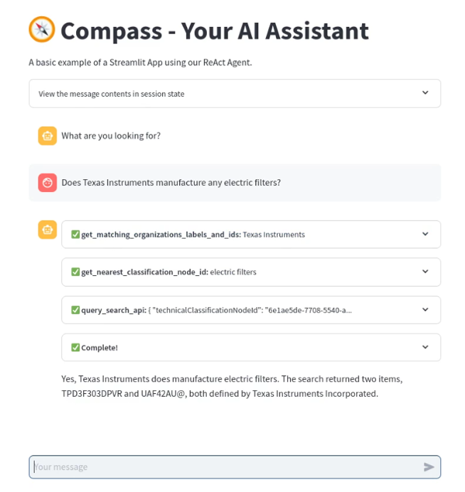

## Introduction

The European AI Act ensures that artificial intelligence systems and models marketed within the European Union are used ethically, safely and in a manner that respects EU fundamental rights. The EU has divided artificial intelligence systems into four risk levels:

* **Unacceptably risky AI**: These systems undermine the fundamental rights of EU citizens; they are prohibited and cannot be marketed in the EU,
* **High-risk AI**: These systems are deployed in high-risk sectors (e.g. road traffic management, water/gas supply); they must be CE marked to be marketed,
* **Low-risk AI**: These systems interact with natural persons and are neither unacceptable nor high-risk; they must be subject to an obligation of information and transparency towards the user,
* **Minimal-risk AI**: These systems do not belong to the first three categories; no binding obligation is imposed on them.

The MARTO (Model Assessment and Robustness TOolkit) innovation track aims to propose a methodology validating the compliance with the European AI Act of a high-risk generative AI system of the "LLM Agent" type, before its deployment in production.

## Business Case

To achieve this objective, we rely on a use case of our business partner: the corporate startup [DATX](https://portal.datx.eu/guild/none/welcome) which offers a solution, hosted on the Azure Cloud, for managing data relating to components of various types (electronic components, hardware, etc.) throughout their life cycle and for the benefit of all the professions supplying the key tools of the our group (engineering workshop, PLM and ERP). In the long term, DATX wishes to develop by monetizing this data catalog to other manufacturers.

Through a user portal, DATX offers its users a multi-criteria search engine for the components it lists. In order to expand the range of services that DATX offers, we have developed a chatbot called Compass (Components assistant) allowing users to more easily search for components by submitting questions in natural language. This chatbot is based on the "LLM Agent" paradigm, which consists of giving an LLM (Large Language Model) the possibility of orchestrating calls to tools in order to answer a user question. In this case, the tools mainly rely on APIs developed by DATX. It is up to the LLM to call these APIs in a timely manner with the right input parameters in order to collect information of interest within the DATX information system that will allow the question to be answered directly or to guide the continuation of calls to other APIs. This process is repeated iteratively until a relevant answer is obtained.

This approach is based on the **ReAct** (Reasoning and Acting) framework ([1]), developed in 2022, allowing LLMs to interact with external tools to exploit reliable information and thus reduce the risk of hallucinations. The "Reasoning" part consists of intelligently identifying at each stage the right tool to request while the "Acting" part aims to execute the selected tools: their outputs are then exploited by the LLM in order to make the most appropriate decision: propose the answer to the user or request a new tool!

If we refer to the risk level classification proposed by the European AI Act, this chatbot belongs to the low-risk AI category since it will not be deployed in a high-risk sector. However, we hypothetically place ourselves in a framework where this AI would be a high-risk system in order to put in place the technical and documentary elements to comply with the requirements imposed by the European AI Act.
In particular, we intend to implement technical building blocks to address the following three issues:

* Accuracy issue
    * We will evaluate the quality of the answers provided by the chatbot based on a set of questions/answers built jointly with DATX in order to cover all the questions representative of those asked by end users.
* Robustness issue
    * We will ensure the stability of the answers proposed by the chatbot when the same question is submitted several times and we will evaluate its ability to react to questions that go beyond the initially planned framework (Examples: off-topic question, question in a foreign language other than English).
* Transparency issue
    * We will ask ourselves what relevant information should be provided to a user so that not only is he aware that the answer is generated by an AI and therefore that a double-check is required through the DATX portal, but also that he can understand the path that led to the generation of the answer by restoring, for example, the succession of tools called.

We will also set up a platform to supervise the chatbot and meet the following objectives:

- Trace the questions submitted by users in order to understand as early as possible the origin of the errors obtained,
- Version the Prompt Systems on which the LLM is based to orchestrate the call to the tools,
- Evaluate the quality of the answers provided by the chatbot based on the question/answer set and relevant metrics.
- Compare several versions of the chatbot based on the versioned System Prompts, the LLMs made available in Azure, and the list of tools that is likely to evolve.

Finally, once this application is deployed in the DATX Azure Cloud environment, we will conduct experiments with the first users of this chatbot.

We set ourselves the objective of conducting several test campaigns in order to verify that the transparency, precision and robustness objectives imposed by the European AI Act are respected with regard to users. Regarding the last two points, a user feedback capture feature has been implemented allowing each user to rate the response generated by the chatbot and submit their own comment. During this phase, we also plan to conduct interviews in order to directly capture their feedback with a view to continuously improving the chatbot.

## Conclusions

By developing a robust methodology to assess and validate the compliance of generative AI systems like the LLM Agent, we not only address accuracy, robustness, and transparency issues but also provide a comprehensive framework for continuous improvement. This initiative not only enhances user trust and safety but also sets a precedent for future AI deployments within our company. Through rigorous testing and user feedback, we aim to ensure that AI systems operate ethically and effectively in high-stakes environments.

## References

- [1] React research paper: https://arxiv.org/pdf/2210.03629

## Contacts

- Julien Meynard