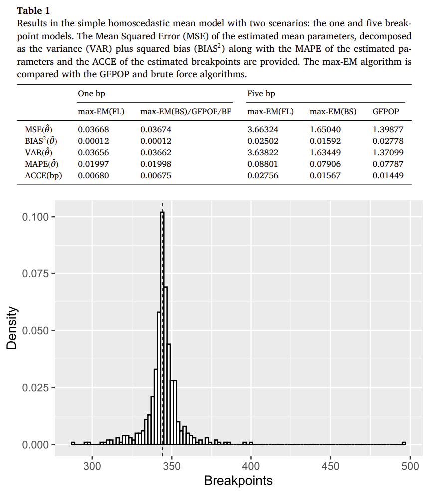

## The max-EM Algorithm: A New Frontier for Change-Point Detection in Regression Models

In many fields—from finance to genomics—data rarely behave the same way over time. A model that fits one part of a dataset may fail in another, signaling a *change-point*—a moment when the underlying process shifts. Detecting such breakpoints is essential to understand heterogeneity, adapt predictions, and avoid misleading conclusions.

The newly published paper **“Change-point detection in regression models via the max-EM algorithm”** (Computational Statistics and Data Analysis, 2025) introduces a robust, efficient, and theoretically grounded method to tackle this problem: the **max-EM algorithm**.

### A Smarter Take on Change-Point Detection

Traditional algorithms like **Optimal Partitioning** and **PELT** have been successful for simple mean models, but they struggle when covariates or regression structures are involved. Regression adds complexity—changes might affect coefficients, variances, or entire model structures.

To overcome these limitations, Diabaté, Nuel, and Bouaziz propose **max-EM**, a novel algorithm that combines a *constrained Hidden Markov Model (HMM)* with the *Classification Expectation-Maximization (CEM)* framework.  
Unlike standard EM methods that average over all possible segmentations, **max-EM searches for the segmentation that *maximizes* the likelihood**, achieving both speed and precision.

> “Each iteration of the max-EM algorithm provably increases the data likelihood, ensuring convergence toward stable and interpretable solutions.”

### How It Works

At its core, max-EM introduces a “maximum” variant of the forward–backward algorithm used in HMMs.  
Instead of summing over possible states (segments), it **takes the maximum likelihood path**, which makes it naturally suited for change-point problems.

To address the well-known sensitivity of EM methods to initialization, the authors propose two smart strategies:
- **Fused Lasso (FL) Initialization** — uses penalized regression to identify candidate breakpoints through sparsity patterns.  
- **Binary Segmentation (BS) Initialization** — recursively splits the data using a fast one-breakpoint version of the algorithm.

Both ensure stability and scalability, even for large datasets.

### Performance and Theoretical Guarantees

Theoretical analysis shows that **each iteration of max-EM increases the log-likelihood**, and under mild assumptions, the algorithm converges linearly to a stationary point.  
Simulations on **linear, logistic, Poisson, and survival regression models** confirm its strong empirical performance:

- Accurate detection of multiple breakpoints (up to 5 tested)  
- Reliable parameter estimation  
- Linear computational cost with BS initialization  

When compared to brute-force and dynamic programming methods like **GFPOP**, max-EM achieved similar accuracy with a fraction of the computational effort—while supporting full regression modeling.

When compared to brute-force and dynamic programming methods like **GFPOP**, max-EM achieved similar accuracy with a fraction of the computational effort—while supporting full regression modeling.

The figure below illustrates this accuracy: in simulated one-breakpoint scenarios, the estimated breakpoints obtained with **max-EM**, **GFPOP**, and **Brute Force** methods nearly overlap, showing that the new algorithm achieves the same precision as exhaustive approaches—at a much lower computational cost.

<figure style="text-align:center;">
  
  <figcaption style="font-size:0.9em; color:#666;">
    Figure 1 — Distribution of estimated breakpoints in a one-breakpoint simulation.
  </figcaption>
</figure>

### Adding Statistical Rigor: A Likelihood Ratio Test

Beyond detection, the authors introduce a **statistical test** to evaluate whether a breakpoint truly exists.  
This test relies on an asymptotic approximation of the likelihood ratio across all possible breakpoints, allowing efficient computation without re-running the algorithm.

The result is a practical, fast, and theoretically sound testing framework that complements max-EM—helping analysts **distinguish real structural changes from random noise.**

## Real-World Applications

Two compelling datasets illustrate the method’s flexibility:

1. **Bike Sharing Data (UCI)**  
   - Detects changes in rental trends over time.  
   - The test identifies multiple significant breakpoints, corresponding to seasonal shifts and usage surges.  
   - The Bayesian Information Criterion (BIC) selects a 5-segment model, aligning well with observed trends.

2. **Heart Disease Data (UCI)**  
   - Explores heterogeneity in the effect of *fasting blood sugar* on heart disease risk.  
   - Using principal curves to order individuals, the method uncovers two patient subgroups where the same covariate has opposite effects—shedding light on potential clinical interactions.

> “The algorithm not only finds when models change—it helps explain *why* they do.”

## Impact and Insights

The **max-EM algorithm** offers a decisive step forward for data segmentation in regression analysis.  
It transforms change-point detection from a niche statistical problem into a **versatile modeling tool**—capable of handling real-world data with covariates, heterogeneity, and complex structures.

For applied researchers and data scientists, this means:
- Detecting regime shifts directly within regression models  
- Achieving accurate, reproducible results at linear computational cost  
- Integrating model selection and statistical testing within a unified framework

## Looking Ahead

Future work may extend max-EM to cases where some regression parameters are shared across segments (e.g., common variances or baselines in survival models), broadening its scope to multi-level and hierarchical data structures.

---

## Reference

Diabaté, M., Nuel, G., & Bouaziz, O. (2025). *Change-point detection in regression models via the max-EM algorithm*. *Computational Statistics and Data Analysis.* https://doi.org/10.1016/j.csda.2025.108278

[Read the full paper](https://doi.org/10.1016/j.csda.2025.108278).

