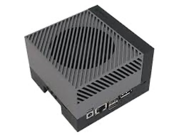
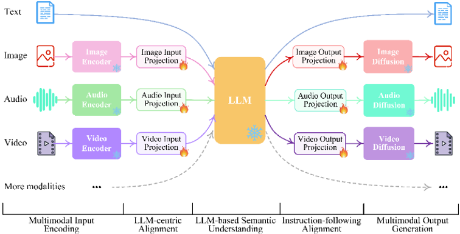
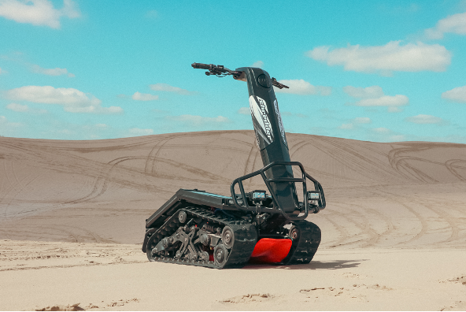
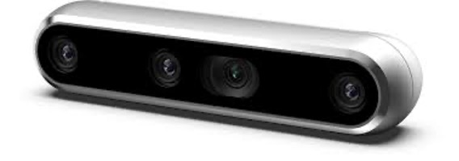

## Introduction

In an increasingly complex and demanding world, human-machine interactions will need to be more efficient and fluid to take advantage of constant technological advancements in embedded systems and robotics. To this end, the NICO innovation track aims to develop an autonomous assistant that enables a robotic platform to interact multimodally with its environment to solve complex tasks.

This assistant leverages the latest large language models and is developed on embedded hardware targets, such as the NVIDIA Jetson, to demonstrate the feasibility of using these new technologies completely autonomously. Managing energy consumption is indeed one of the key differentiators of this project, enabling the deployment of AI models in the field, close to the needs.

LLMs have made it possible to process textual data with unmatched performance. Recently, this capability has extended to other domains such as images, sound, videos, or other sensors, in an integrated manner. These are called multimodal LLMs, highlighted on the international research scene (PALM-e, Next-GPT, AnyMAL, GPT-4Vision, LLaVa, etc.).

Thanks to multimodal integration, intelligent agents can interact with the environment more comprehensively and informatively, allowing them to solve complex tasks more efficiently. 

Nico objectives are to develop the tools and software modules for implementing and using these multimodal LLMs in an intelligent assistant application.

## Value Proposition

The potential applications of such an integrated system are numerous, both in the public, defense, and space domains, such as the emergence of numerous initiatives around assistant robots, demonstrating real industrial and business interest:

* Medical personal assistant robots
* Assistant robots in hospitals
* Soldier assistant robots on the battlefield (with a perspective of participating in the COHOMA challenge organized by the DGA (Human-Machine Collaboration) in 2025).

## Demonstrator 

Nico will be demonstrated  on top of the DTV Shredder motorized platform, provided to us through a partnership with DTV Motor.

Human-machine interactions as well as environmental data collection by the system will be carried out via standard sensors such as:

* An RGBD camera system enabling scene analysis and autonomous navigation (obstacle avoidance).
* A microphone and speakers allowing communication with the system in natural language.
* GNSS positioning capabilities and/or based on the use of inertial units to offer resilience in electronic warfare situations (communication jamming).

## Contacts

- Geoffrey Portelli
- Mehdi Jendoubi

