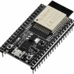
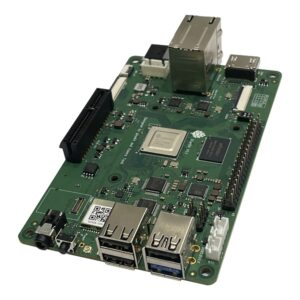
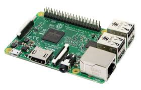
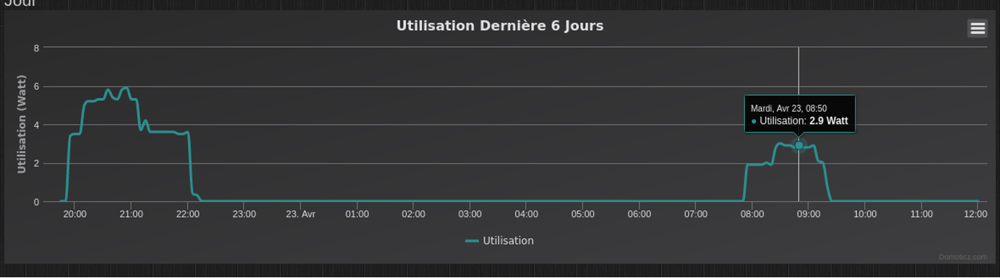
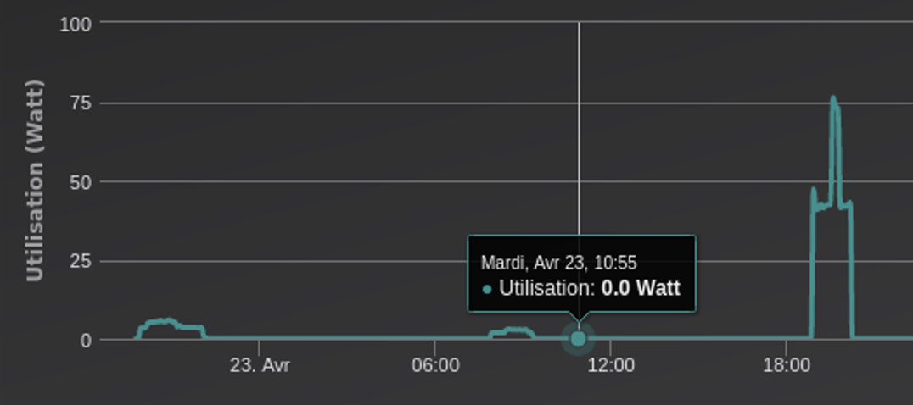


*Building efficient AI applications at the edge is not just about models. It requires a thoughtful combination of languages, runtimes, and hardware to achieve portability, performance, and energy efficiency.*


In this first blog of a new series, we pursue our bird song detection prototype by setting up a complete working solution using Rust, TensorFlow, WebAssembly, and RISC-V. We will explain why we explore such a strange cocktail.

Our goal is to run and compare the overall performance and energy consumption of various edge platforms to consolidate our expertise in running edge AI applications. In this first blog, we briefly present our working prototypes.  

We built two prototypes. The first is extremely simple and uses a pre-trained image classification model to recognize clothing outfits, the second runs the classification of audio spectra with our bird song detection model. The former is easy to run, and the latter illustrates an end-to-end smart architecture solution. 

## Overview of Our Approach

By leveraging Rust for its performance and safety features, TensorFlow for its powerful machine learning capabilities, and WebAssembly for its cross-platform compatibility, we aim to demonstrate the feasibility and effectiveness of deploying advanced machine learning models on edge devices.

**Edge Devices and Inference**: Edge devices can infer pre-trained neural models. This is required for our bird song or similar detection use cases, where latency and immediate response are crucial.  

**WebAssembly Integration**: With an appropriate runtime, WebAssembly (Wasm) enables the execution of Wasm modules on most hardware architectures without recompilation, including x86, ARM, and RISC-V. This cross-platform functionality ensures that our solution can be widely deployed.  

**Rust for WebAssembly Compilation**: Rust is a language that supports Wasm as a compilation target, allowing us to write performance-critical components of our application in Rust and compile them to Wasm for execution on various devices. The goal of our work is also to evaluate Web Assembly runtimes. Wasmtime and Wasmedge, in particular.  

**TensorFlowLite for Machine Learning**: TensorFlow is a computing framework dedicated to machine learning. It provides the tools to create, train, and deploy neural network models. TensorFlow’s open-source nature and robust community support make it an ideal choice for our project.  

## Why RISC-V?

First, RISC-V is known for its low power consumption promises, making it ideal for applications where energy efficiency is critical. RISC-V is evolving and improving rapidly and we expect it to become a serious challenger to ARM architectures. This is particularly important for applications that we envision operating in remote or battery-powered environments where conserving power is paramount.

Secondly, RISC-V’s open standard architecture offers greater flexibility and customization compared to proprietary architectures. This openness aligns with our goal of demonstrating how sovereign probe applications for the defense or cybersecurity industries, where control over hardware and software components is crucial for security and strategic autonomy. By exploring RISC-V, we aim to assess its viability for such sovereign applications, ensuring that our solutions can be both energy-efficient and secure.

## Our Development Setup

We developed a Rust application leveraging pre-trained TensorFlow predictive models. The tract crate packages and invokes the prediction model. The interesting reader can refer to the public github repositories. The application is cross-compiled on an x86 laptop to Web Assembly binary format, in turn uploaded to the target hardware: ESP32, RISC-V, or Arm.  

  
  
  

Here is our ESP32 test architecture: Wasm modules are uploaded to an HTTP server then executed on the selected Wasm runtime.  

A similar architecture is used on our other boards. We submit machine learning applications and specifically measure each hardware solution’s performance and energy consumption using a Fibaro Wall Plug controlled by a Z-Wave module (C++ OpenZWave Library). This setup allows us to evaluate the practical feasibility of our solution in real-world scenarios, ensuring that it meets the necessary performance and efficiency criteria.  

  
  

As a side note, we work in parallel to provide our users with a serverless runtime to make it even simpler to deploy Rust or Wasm functions to edge devices. This project has been presented in a previous blog and is still actively developped.  It provides supports for Wasm modules as well.

## Preliminary Results

The first results are promising. The following capture shows, as expected, the energy efficiency of RISC-V and ARM hardware compared to an Intel i5.  

A focus between our RISC-V and ARM setups shows that ARM is significantly more energy efficient than our RISC-V 2023 StarBoard 64.  However, recent advancements in RISC-V boards have shown promising improvements. For example, the StarFive VisionFive 2, a high-performance single-board computer (SBC), and the SiFive HiFive Premier P550, an out-of-order development board, have demonstrated substantial performance enhancements. These boards feature better processor frequencies, multimedia processing capabilities, and scalability, making them more competitive with ARM-based solutions.  

Note that in all cases, the plateau illustrates the idle energy consumption. The increase to the second plateau corresponds to the application load.

## Conclusions

These are, of course, preliminary results. In our view, the good news is the maturity improvements of these technologies. Our first attempts in 2022 and 2023 were a struggle only to make the whole stack properly work. With the latest release of Rust, WasmEdge, and TensorFlowLite, things went much smoothly.  

As for RISC-V, it continues its progression too. We expect it to arrive to the clouds soon.  Stay tuned for our next blogs, and do not hesitate to contact us to work with us on these innovation tracks.  

## References

- [Rust Programming Language](https://www.rust-lang.org/)  
- [TensorFlow Lite](https://www.tensorflow.org/lite)  
- [Wasmtime Runtime](https://wasmtime.dev/)  
- [WasmEdge Runtime](https://wasmedge.org/)  
- [RISC-V Foundation](https://riscv.org/)  
- [Original blog post](https://punchplatform.com/2024/05/28/rust-web-assembly-tensorflow-and-risc-v-a-powerful-cocktail-for-edge-ai/)  
