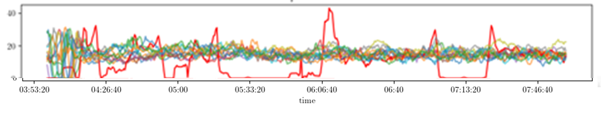
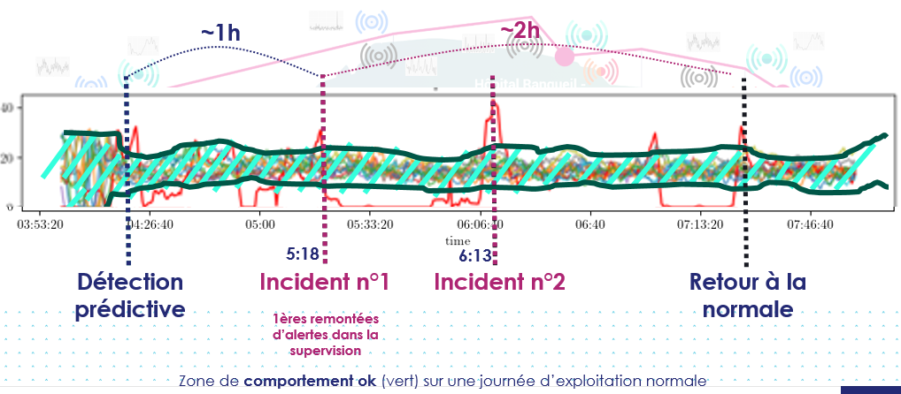

## Summary

**SENSix** is a 2025 Thales innovation initiative exploring how to detect precursor signals of complex failures in **satellite telemetry**. Building on lessons from the 2024 **POMA** project, SENSix investigates the correlation of multivariate telemetry in real time, aiming to move beyond threshold-based monitoring toward advanced anomaly detection supported by **Topological Data Analysis (TDA)** and **explainable AI (xAI)**.

---

## Objectives

- **Early detection of failures:** anticipate anomalies such as payload calibration drifts, power system degradation, attitude control drifts, or thermal instabilities.  
- **Causality modeling:** go beyond anomaly flags by providing interpretable causal links between telemetry variables.  
- **Benchmarking approaches:** compare classical techniques (thresholds, supervised/unsupervised detection) with topology-driven methods that can reveal complex system dynamics.  
- **Explainability first:** ensure that anomaly detection outputs are interpretable and actionable for mission operations.

## Visual Insights

The figures below illustrate the kind of behaviors SENSix aims to detect and explain in telemetry streams.

### Cycles of behavior in equipment

  
*Raw multivariate telemetry shows repeated cycles of equipment behavior (e.g., satellite subsystems). Within these patterns, subtle anomalies can emerge well before they surface in operations.*

### From predictive detection to resolution

  
*An example anomaly sequence: the system detects deviations ~1h before the first incident, continues through multiple events, and tracks the return to nominal behavior.*

---

## Approach

SENSix evaluates a pipeline where **multivariate telemetry streams** are processed to highlight divergent patterns before they evolve into failures. The research contrasts:

- **Classical anomaly detection:** widely used but often limited when anomalies emerge from subtle, multi-sensor correlations.  
- **Topology-based methods:** resilient to noise and designed to capture global structure in data, potentially revealing hidden precursors.  

By combining these approaches with **explainable AI techniques**, the project seeks to provide not only detection but also **understanding**—a critical element for trusted decision-making in space operations.

---

## Why It Matters

Satellites operate in harsh environments with long lifetimes and limited maintenance opportunities. Detecting weak signals of degradation **several orbits in advance** can directly extend asset lifetime, improve reliability, and reduce operational risks.  

Moreover, insights gained in SENSix apply beyond space: the ability to **correlate complex telemetry** and surface precursor signals is relevant to many connected systems and critical infrastructures.

---

## Looking Ahead

The first experiments focus on **ESA’s OPS-SAT telemetry dataset**, providing a realistic testbed for benchmarking anomaly detection approaches. Future steps will consolidate results, evaluate robustness, and share lessons with the broader research and engineering communities.

---

*Through SENSix, Thales continues to explore advanced techniques at the intersection of data analysis, AI, and critical system monitoring—pushing the frontier of predictive maintenance and trusted operations in aerospace.*
