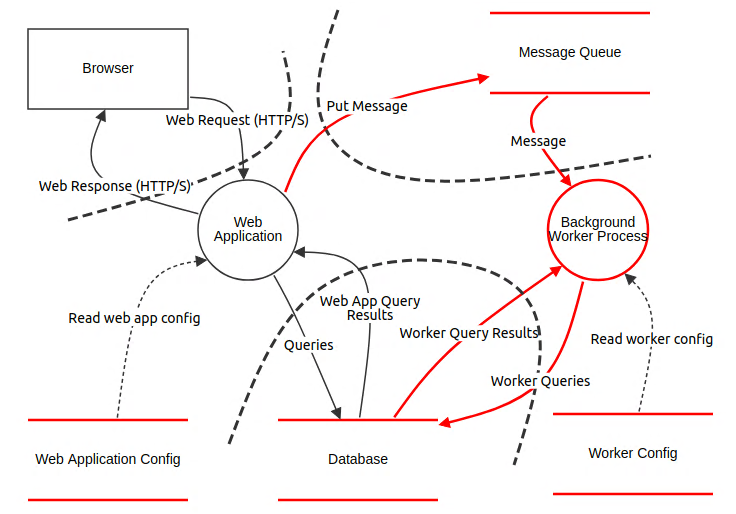

## Introduction

Entering the complex and often daunting field of cybersecurity can be challenging, 
especially when tasked with securing a new application. Will I survive as a newbie ? as a non cybesecurity expert ? How do I start ?

The [Stride methodology](https://www.gov.uk/government/publications/secure-connected-places-playbook-documents/conducting-a-stride-based-threat-analysis) 
is advocated by the National Cyber Security Centre (NCSC) in their [Connected Places Cyber Security Principles](https://www.ncsc.gov.uk/collection/connected-places-security-principles) to assess and design systems architecture.
Stride is not about having a PhD in cybersecurity, nor about having 20 years of experience, nor being a genius. It is more about asking the right questions at the right time and breaking big problems into many small, easy-to-solve problems.

Stride emerged from Microsoft in the 2000s, and its main concern is to remain pragmatic within the developer community that wants to invest more in cybersecurity concerns. Stride involves teamwork and brainstorming sessions. Here are the typical steps of thought.

The first question is: What are we building? To answer this question, a data flow diagram can be drawn. To better break down the problem, each element can be described while keeping this in mind: Is it a *flow*, is it a *storage*, is it a *process*, or is it a *user* ?

Images are better than words:

  

## What can go wrong ? 

The second question is: What can go wrong ? To answer this question, the methodology suggests to analyse the **Stride** 
(**S**poofing, **T**ampering, **R**epudiation, **I**nformation disclosure, **D**enial of service, **E**levation of privilege) threats for each components previously described. 

### Spoofing

Spoofing happens when a person or a program successfully masquerades as another by falsifying data, thereby gaining an illegitimate advantage.

Strong password policies and robust authentication mechanisms are the first things to do to mitigate this threat.

### Tampering

Tampering with data when an attacker manipulates data in transit or at rest, altering it in unauthorized ways. This can compromise the integrity and reliability of the data, leading to various negative consequences.

To prevent tampering, one can rely on encryption, access controls, and integrity checks mechanisms.

### Repudiation

Repudiation or non repudiation is when an entity (user or system) denies having performed an action, and there is no way to prove otherwise. This can lead to disputes and a lack of accountability, making it difficult to trust the system's records and transactions.

One can mitigate repudiation threats by implementing logging systems and "acknowledgement" mechanisms. 

### Information Disclosure

Refers to the threat where confidential information is exposed to unauthorized parties. This can lead to breaches of privacy, intellectual property loss, or the exposure of sensitive data, potentially resulting in significant harm to individuals or organizations.

Typically, the first things to prevent information disclosure is by implementing access control and encryption.

### Denial of Service

Denial of Service (DoS) refers to the threat where an attacker disrupts or completely disables a service, making it unavailable to legitimate users. 

To mitigate Dos threats, on can use rate limiting traffic routing with scalable and hardened resources. 

### Elevation of privilege

Elevation of privilege is when an attacker gains higher access rights or privileges than they are supposed to have. This can allow them to perform unauthorized actions, access sensitive data, or control system functions.

To mitigate elevation of privilege threats, one can implement principle of least privilege and regularly review vulnerabilities in the  product/application.

## Why Stride ?

The Stride modeling lies at the intersection of two cutting processes:

- The Data Flow Diagram which identifies each component of an application
- The threats (Spoofing, Tampering, Repudiation, Information disclosure, Denial of Service, Elevation of privilege)

The benefits compared to other methods are the following: 

* Comprehensive: Stride is simple, intuitive. No need to be an expert to engage the process. This is of great value to involve all the parties in an iterative process. 
* Proactive: Stride promotes a proactive stance by encouraging the identification and mitigation of potential threats early in the development process. Here also simplicity is key.
* Agile and Devops friendly
* Stride facilitates better communication and collaboration between security professionals and development teams, ensuring that security considerations are consistently addressed.

## Contacts

- mahmoud.chilali@thalesgroup.com
- hadrien.leclerc@thalesgroup.com
