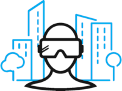

## Introduction

## Augmented or Virtual Reality?

Augmented Reality and Virtual Reality are two 3D use cases that place the user at the center of applications by breaking down physical limits in complete safety.

| Augmented Reality | Virtual Reality |
| :---------------: | :-------------: |
| Display information on top of **reality** | Immerse yourself in a **virtual** 3D environment |
|  |  |
| For remote assistance, site preparation or helping with design | For training in critical or dangerous situations |
| With a smartphone, tablet or glasses to “see through” | With a standalone headset or connected to a computer |

## Why vTraining?

Let's get back to our subject, vTraining... Many initiatives are being deployed with Virtual Reality and are pushing these new generation simulators into our customers' support contracts.

Despite the innovative aspect and the acceptance of end users, today, Virtual Reality projects are difficult to scale. The applications are developed according to specifications, generally in one-shot. Then, when the system in question evolves, you have to go back to the developer team to update it... There’s a problem!

> Let's take an example. Imagine a famous car manufacturer, which would market a new range of innovative cars. Due to its Premium positioning, this company would even offer its customers the possibility of learning the first technical maintenance procedures with a Virtual Reality application. I'm learning to change my wheel in Virtual Reality! Very good idea: even if it may seem simple, having done the operation at least once helps reduce stress and makes the operation safer when it occurs in a real situation.

> Unfortunately, the first customer orders a car with a new accessory: rims. Barely released, the Virtual Reality application is already obsolete... vTraining directly responds to this need by allowing our manufacturer to update its application itself and personalize it for each client.

### Respond to the challenges of scaling immersive training applications with a VR-as-a-Service platform

Therefore, the objective for TSN is to develop a platform to make our clients autonomous in the creation of Virtual Reality training.
Engineers can now imagine and create Virtual Reality training on their own; directly from a Web application and without any special knowledge in development or 3D.

This project is part of the 3D-as-a-Service ambition supported by the TSN teams. Its achievement requires multidisciplinary skills and a real mastery of industrial issues, in several technological areas of expertise: Web front, micro-services backend, CI/CD pipelines and specialized 3D developments. Fortunately, two assets secure the development of vTraining:
- Capitalizing on experiences acquired on Virtual Reality projects for many years
- The instantiation of the ThEye asset. Several software components are reused to build the base of vTraining. And yes, even if ThEye uses Augmented Reality, it is mainly a subject of “connected 3D” and therefore we find many similarities with this Virtual Reality platform project.

## Contacts

- Guillaume Blaise
- Aude Chenet
