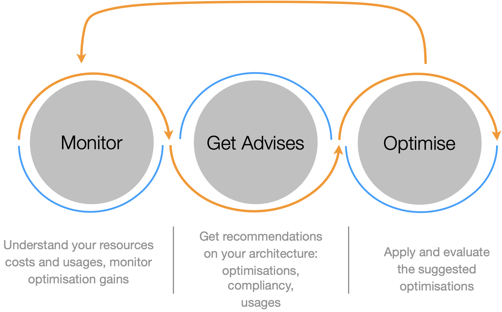
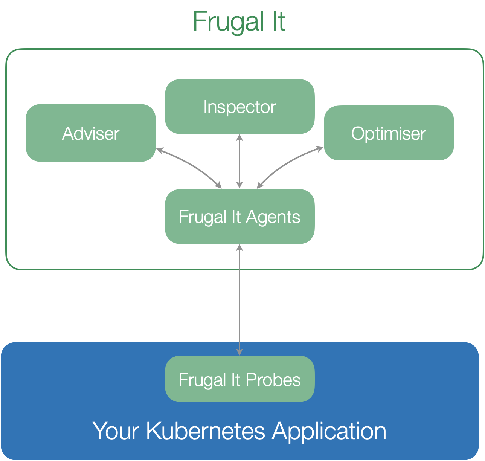

## Unlock Intelligent Automation and Optimization for Kubernetes Applications

Managing cloud-native applications efficiently is critical for staying competitive. Kubernetes, the backbone of modern application orchestration, presents immense power but also complexity. Businesses struggle to balance performance, cost-efficiency, and sustainability when running large-scale Kubernetes clusters.

Our AI-powered Kubernetes optimization platform is designed to simplify and enhance how enterprises manage their Kubernetes applications. By combining advanced generative AI with human expertise, our platform goes beyond simple monitoring. We offer automated insights, scoring, and actionable recommendations to optimize applications for cost, carbon footprint, and performance.

What sets us apart is our dual focus on sustainability and business optimization. By incorporating external data, such as real-time electricity mix, and capturing business usage patterns from users, we enable smarter, greener decision-making. This approach helps businesses not only reduce costs but also minimize their carbon footprint, all while aligning infrastructure with actual business demands.

	

## Key Benefits

### Automated Documentation & Scoring

Our system leverages AI to analyze your Kubernetes applications, automatically generating detailed documentation and performance scores.

### Human-in-the-Loop Optimization

We capture insights from users to improve the AI’s understanding, ensuring that optimization suggestions align with business objectives.

### Proactive Scaling & Cost Reduction

Our AI recommends scaling actions to optimize resource usage, reducing costs and improving sustainability.

### Sustainability Focus

We help companies reduce their carbon footprint by identifying resource-hungry workloads and suggesting greener alternatives.

## Key Features

Frugal IT proposes three main functions: the **inspector**, the **optimizer** and the **adviser**.

	

### Inspector : Understand your Costs

The inspector monitors your application in real-time and report finops and greenops indicators: 

* Gain clear visibility into your cloud expenditures with intuitive monitoring dashboards.
* Deploy advanced probes to track and analyze cost drivers in real-time.

### Optimizer : Reduce your Costs

Leverage intelligent algorithms to identify potential areas for cost reduction and efficiency improvements.

Receive actionable recommendations to optimize your Kubernetes clusters and, eventually, your entire cloud-native environment.

### Adviser : Audit Reporting and Architecture Scoring

Generate comprehensive audit reports to evaluate the financial and environmental performance of your architecture.

Obtain a "frugality score" to benchmark and improve your infrastructure’s efficiency and sustainability.

## State of the Art

In this chapter, we explore existing solutions in the market that address these challenges and position **Frugal IT** within this competitive landscape.

###  Commercial Platforms

#### [CAST AI](https://cast.ai/)

CAST AI focuses on **cost optimization** and automated scaling for Kubernetes clusters. It provides multi-cloud management, real-time optimization, and AI-powered automation to reduce cloud costs.

- **Key Features:**
  - Automatic rightsizing of workloads
  - AI-driven autoscaling
  - Multi-cloud management with cost comparisons
  - Real-time cloud cost optimization and insights

#### [Kubecost](https://kubecost.com/)

Kubecost offers **real-time cost monitoring** and optimization for Kubernetes clusters. It tracks spending, identifies inefficiencies, and provides recommendations to reduce costs.

- **Key Features:**
  - Real-time cost monitoring for Kubernetes workloads
  - Visibility into resource usage (CPU, memory, storage)
  - Recommendations for reducing cloud costs
  - Integration with Prometheus and Grafana

#### [StormForge](https://www.stormforge.io/)

StormForge uses **machine learning** to optimize Kubernetes application performance and cost, focusing on resource tuning and efficiency.

- **Key Features:**
  - Automatic Kubernetes workload optimization
  - ML-driven recommendations for resource tuning
  - Cost and performance optimization
  - Integration with DevOps workflows for CI/CD

#### [Karpenter](https://karpenter.sh/)

Karpenter is an **open-source autoscaler** developed by AWS for Kubernetes clusters. It dynamically provisions resources based on application demands.

- **Key Features:**
  - Dynamic scaling of clusters based on real-time workload needs
  - Just-in-time provisioning for cost efficiency
  - Native Kubernetes integration for autoscaling
  - Reduces overprovisioning of resources

### Open-Source Solutions

#### [Keptn](https://keptn.sh/)

Keptn is an open-source project for **cloud-native application lifecycle orchestration**, including automated performance and cost optimization for Kubernetes environments.

- **Key Features:**
  - Automation for application deployment and operations
  - Continuous delivery and performance monitoring
  - Integration with Prometheus and Grafana
  - Enforces SLOs for Kubernetes deployments

#### [Loft Labs](https://loft.sh/)
Loft Labs focuses on **multi-tenancy** and resource efficiency in Kubernetes clusters through virtual clusters, enabling isolation and optimized resource usage.

- **Key Features:**
  - Virtual Kubernetes clusters for multi-tenant environments
  - Resource optimization through isolation and self-service
  - Cost allocation and billing for multi-tenant usage

### Specialized Kubernetes Tools

#### [OptScale by Hystax](https://hystax.com/optscale/)
OptScale provides **FinOps** and cloud cost optimization for Kubernetes clusters, offering insights into resource usage and cost savings opportunities.

- **Key Features:**
  - Advanced cost management and FinOps insights
  - Resource optimization recommendations
  - Cloud provider integration for detailed cost analysis

#### [BotKube](https://www.botkube.io/)

BotKube is an open-source tool that integrates with **Slack** and other communication platforms to provide real-time Kubernetes monitoring and optimization suggestions.

- **Key Features:**
  - Automated alerts and optimization suggestions via Slack or MS Teams
  - Real-time monitoring of cluster health and performance
  - Recommendations for scaling and improving efficiency

#### [Komodor](https://komodor.com/)

Komodor is a Kubernetes troubleshooting platform that focuses on diagnosing issues in clusters and optimizing performance.

- **Key Features:**
  - Automated insights into Kubernetes incidents and issues
  - Troubleshooting guides and suggestions
  - Integration with observability and monitoring tools

### Frugal IT’s Position

**Frugal IT** builds upon these existing solutions by offering a unique combination of **AI-powered documentation**, **human-in-the-loop optimization**, and **scalability recommendations** via tools like KEDA or Karpenter. 

Our focus on **sustainability** and **cost-efficiency** sets us apart from other platforms, with the goal of reducing the environmental impact of cloud-native applications. Through a proactive approach to resource management, **Frugal IT** provides detailed insights and actionable recommendations to help businesses optimize Kubernetes clusters for both performance and sustainability.

## References

Visit the in depth overview of frugal IT components:

- [frugal-it inspector](/blogs/frugalit-inspector)
- [frugal-it optimiser](/blogs/frugalit-optimiser)
- [frugal-it adviser](/blogs/frugalit-adviser)

## Contacts

- dimitri.tombroff@thalesgroup.com
- tanguy.jouannic@thalesgroup.com
- jean-felix.berthiau@thalesgroup.com
- gilles.poirot@thalesgroup.com

