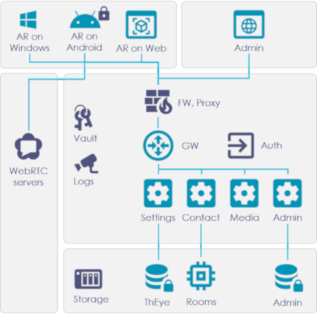

# ThEye

## Introduction and context

### Augmented Reality in Remote Assistance

The effectiveness of condition monitoring & maintenance teams depends on qualified expert’s diagnosis; reactive, preventive and predictive maintenance skills.

Thales provides considerable cost-savings involved in travel expenses by providing maintenance teams with mobile solutions which allow effective communication with remote experts.

### Thales & Industry 4.0: the Human factor

- As part of the digital manufacturing transformation of production systems, Thales takes the lead in helping companies through the Industry 4.0 transformation, increasing productivity and competitiveness, making respect for: **market, product, production** and considering the **human factor**. 

- Integrating the Industry 4.0 principles : augmented reality solutions to improve **efficiency** and **competiveness**.

- Thales designed an innovative augmented reality solution to assist its activities involving **machine condition monitoring** and **maintenance management systems**.

## ThEye: Remote Assistance solution

|       | ThEye |
|:-----:|-------|
|  | Is a **mobile Application** (Android, UWP, Web) |
|  | Establishes a **secured connection** between **onsite technicians** and **remote experts** |
|  | Allows **realtime** sharing of **audio, video and augmented reality** components, to guide onsite maintainers by giving real-time instructions via **smartphones** or AR glasses. |
|  | **Cloud-based** solution, or **private network** mode (“on premise”). Up to french "Restricted" accreditation. |
|  | **User Friendly** (designed to be used in Critical and Emergency situations) |

## Key Features

###  Audio & Video secured conference
- Encrypted communications from end to end (HTTPS, SRTP, SCTP)
- Multi users conferences

###  Augmented Reality
- Real-time 3D annotations synchronization on the operator field of view, even in video mode
- 3D Annotations: arrow, screw driver, geometric shapes...

###  Multi platform: Android - UWP - Web application
- **Live video stream, photo and whiteboard**
- **Chat messaging**
- **Documents transfert**
- Screen sharing
- Remote controls
- Voice commands
- Adaptive video quality (QoS)
- Record and Replay
- External cameras

## Hardware

**Android smartphones and tablets**
- Compliant with most **Android** devices (version 10 minimum)
- No specific device. Works on smartphone and tablet.

**Windows**
- Compliant with UWP version
- Works on Windows 10+ and Surface tablet

**Connected glasses**
- Compliant with Realwear HMT-1 and HMT-1Z1
- Best connected glasses for industrial environment. ATEX version available for explosive environment

**Web browsers**
- Mozilla Firefox, Microsoft Edge Chromium and Google Chrome (recommended)

## Technical overview

### High-level application architecture

- SecuredByDesign: SoC, WebRTC and strong frameworks
- KISS principle: no labyrinth app, only usefull features
- Continous innovation: evolutive conception (microservices architecture and K8S ; multi-platforms engine)

### Technologies

*State of the art technologies and assets. From the Microsoft .NET ecosystem to the Thales world.*

## Contacts

- aude.chenet@thalesgroup.com
- eric-e.lefevre@thalesgroup.com
