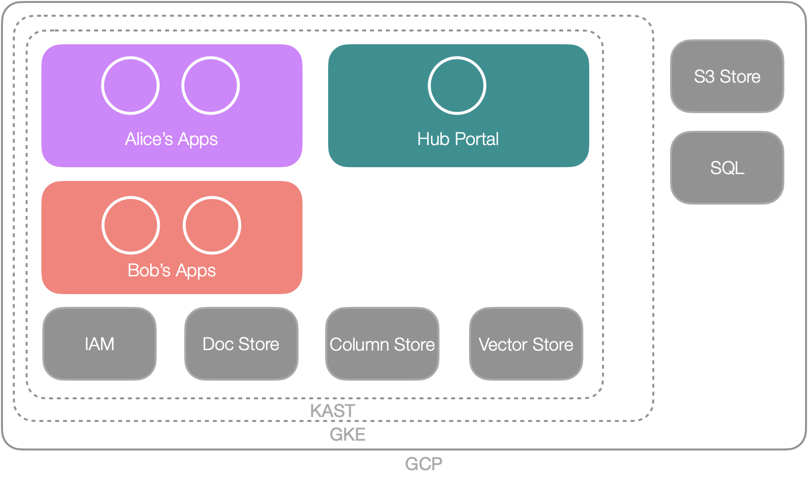

## Benefits

The hub is an online platform that provides two main features. The first is to expose a simple portal (you are reading it now)
to help us all (including customers) to easily and quickly understand our innovation, expertise and offerings. 

Second it provides thales developpers and architects with a sandboxed, ready-to-use platform to prototype and deploy
new projects. 

This has several benefits.

### What you see is what you get

The hub is a simple lightweight platform that is designed using good will and collaborative effort. 
It was quickly implemented because of our expertise in cloud native development,
our involvement in designing Thales on-premise data containerized platforms, 
our pragmatic secured-by-design approach. Not to forget our internal engineering services 
such as the [Thales Digital Platform Gitlab](https://gitlab.thalesdigital.io), registries, security tools. 

This is illustrative of Thales Services Numériques competitive offerings,
on time delivery and our focus on designing simple and effective solutions, easy to be operated and maintained.

Note that simple does not mean it is a toy. Advanced features make it possible to scale up or down
the required ressources. Our goal is to demonstrate how cost effective yet powerful a well-designed 
cloud native platform can be.

### Go experiment 

With The Hub, designing smart data applications becomes astonishingly straightforward and rapid. 
In just a few hours, you can move from concept to creation.

Deploying standard containerized applications is simplicity itself. All it takes is designing 
your application, adding a few deployment files to GitLab, and crafting an intuitive user interface.
Our documentation points to several starting templates to make all that really simple.

### Think forward

This approach not only accelerates the development cycle but also democratizes application design, 
enabling you to focus on innovation and user experience without being bogged down by backend logistics. 
The Hub is your gateway to deploying smart data applications with ease, speed, and reliability, 
transforming the way applications are developed and launched.

## Architecture

The hub architecture is quite simple. The following schema highlight the essential parts. 

### Fundations 

- It runs on [google cloud platform](https://cloud.google.com) (GCP). It uses the cloud storage and cloud SQL managed services.
- In there we deployed a [managed kubernetes engine](https://cloud.google.com/kubernetes-engine) (GKE), 
- and inside that GKE we deploy [Kast](/building-blocks/kast) security, monitoring and data components. 

Why GKE ? because if your application runs on GKE, it runs everywhere. 

Why Kast ? because it provides us with ready-to-use patterns and data components and is supported on all managed kubernetes and of course on premise platforms. That is, any application you run on the Hub is guaranteed to run seamlessly on another kubernetes provider or on your on premise platform. 

Why not on Azure, Aws, Ovh or the thales digital platform managed Kubernetes services ? Because it matters to us to master and
demonstrate GCP and GKE usages. The other platforms are excellent too, but our strategy is to anticipate for the arrival of [S3NS](https://www.s3ns.io/en). Last, our goal is to benefit from an innovation platform, not exactly the same scope than our friends.

### Your Apps

A simple multi-tenant architecture provides you (Bob or Alice in the previous schema) with the ressource you need to deploy and run your project. 

## Is there a Roadmap ?

Yes. We are working on three main streams.

1. Securing the Hub to C2 to C3* security levels. This is joint work with out technical direction cybersecurity team.
2. Improving the multi-tenancy without sacrificing a shared kubernetes instance. 
3. Finops and GreenOps. The Hub is meant to be extremally frugal and cheap. In fact it helps us developping our innovative tracks 

Many finer grain improvements issues are defined in the Hub issue backlog. 

## Who will Pay ?

Our goal is to quickly end up with a pay what you use model. As of now it is still free to use. 
So why not joining ? 

## Contact

- olivier.jobert@thalesgroup.com: hub contributor
- kevin.denis@thalesgroup.com: hub contributor
- hadrien.leclerc@thalesgroup.com: hub (cybersecurity) contributor
- mahmoud.chilali@thalesgroup.com: cybersecurity authority
- dimitri.tombroff@thlesgroup.com: hub contributor

References:

- [Everything is on the Gitlab](https://gitlab.thalesdigital.io/tsn/innovation)

