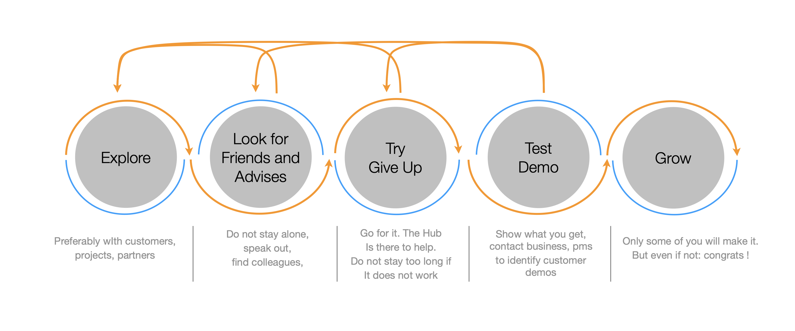

You will find on the hub some posts tagged as 'innovation tracks'. What are these ? 
Each innovation track is a spontaneous or a self-funded project that has been selected by a college of business
and technical stakeholders. In all cases, the topics are identified to be conform with our technical and business 
strategy.

## Innovation Process

Nothing complex. Innovation processes often look like something shown next. 

The point here is to emphasis that the hub will possibly help you in the try, test and demo phases. 
Of course self-funded innovation tracks follow a more rigourous process than shown here.

## Join the Innovation

### Self-funded innovation tracks

The self-funded innovation track (*SFRD*s) program is directed by the technical 
direction and the innovation first teams, with
review and participation of all business units. There is a yearly ideation 
process to select the best ideas. Best means:

* in line with our business and technical strategy.
* possibly joint effort with a customer: co-innovation is important.
* feasible technically.
* realistic in terms of team, delivery and organisation.

It is open to all Thales Services Numériques employee.

### Innovation booster tracks

The [innovation booster](https://gitlab.thalesdigital.io/tsn/innovation) program lets you use your standby (if you have some) to join the team. Share your ideas or pick one.
You will find on the Hub and around (on the innovation central gitlab organisation) topics we are interested in.
The innovation booster is a great way to learn new technologies, and/or to contribute. 

If you do not have standby but are passionate, that works too, of course. What is crucial is to share your ideas.

## Technical Policy

During the course of innovation, it is very useful to share progresses, for example by publishing blogs or retexes or even ideas. This said, what appear on the hub **MUST** ultimately fortify our technical policy. 

## Contact

- ines.khoudour@thalesgroup.com: innovation first
- dimitri.tombroff@thlesgroup.com: innovation first
- oceane.audrain@thalesgroup.com: innovation booster
- jean-felix.berthiau@thalsgroup.com: innovation booster
- nicolas.mortier@thalesgroup.com: technical policy

