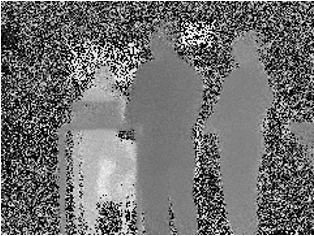

## Overview

The **digital twin** is a concept increasingly used in industry, healthcare and construction. It consists of a real-time digital representation of a physical object, system or process. This virtual representation is used to monitor, simulate and optimize the operation of the physical object.
Introduced by NASA for the Apollo missions, this concept played a crucial role in identifying the mitigation scenario for an Oxygen tank explosion and bringing the crew back to Earth.

In a system based on the digital twin, a network of connected objects (sensors, controllers, etc.) collect and exchange data to feed the virtual representation of the physical object in real time. This makes it possible to continuously monitor performance, detect potential problems and make decisions based on concrete data.

## The case of IoT applications

The use of an IoT park enables quality information to be continuously fed back to a central platform, providing a global view of logistics resources. However, the field of logistics transport poses a number of constraints, in particular when it comes to integrating sensors on mobile containers, limiting the need for cabling, so that they are powered independently and have wireless connectivity. What's more, these systems must be able to be operated by non-technical operators, limiting the need for intervention and simplifying handling as much as possible.

The Swish innovation track aims to develop an IoT gateway that meets these constraints, to complement the value proposition of the IoTalk platform for IoT data feedback.

## Objectives 

Swish aims to develop the concept of *silent technology*, which embodies a certain number of fundamental principles to facilitate the adoption of a new technology on several levels:

1.	Easy to install and maintain: this saves time and resources during installation, reduces operational constraints and enables users to rapidly benefit from the advantages of the technology. What's more, easy maintenance facilitates the management and regular servicing of the system, guaranteeing its long-term smooth operation and therefore long service life.
2.	No mission disruption: In many fields, ongoing operations are critical, and any disruption can have serious consequences. Silent technology aims to complete the core mission while minimizing potential interference or interruptions, allowing users to concentrate without distraction. This improves operational efficiency and ensures the continuity of essential activities.
3.	Low energy consumption & low carbon: Energy consumption is a crucial aspect of sustainable technology, all the more so in the case of nomadic systems requiring battery power. Low energy consumption increases autonomy and reduces the need for recharging or battery replacement. What's more, an informed choice of electronic components and suppliers can help to reduce energy consumption.

Each of these points is crucial to guaranteeing an optimal user experience, while taking into account operational efficiency and ecological considerations. The combination of easy installation/maintenance, mission-criticality and low power consumption/carbon footprint enables us to offer a silent technology that meets users' needs while minimizing its impact on the environment.

## A co-innovation track

IoT technologies are generally used to supervise industrial parks with substantial infrastructures.
In the case of mobile systems, Thales Services Numériques does not currently have a sufficiently representative infrastructure to demonstrate an industrial use that meets the needs of its customers.

This is why we are developing this project in co-innovation with the La Poste group, and more specifically the mail-package branch, in order to reuse the infrastructures and operational needs of the Colissimo brand to develop and test our technologies in a logistics transport environment.

The project is divided into four main phases.

### Study and Design

The aim of this first stage was to determine the system's requirements in response to the various operational issues at Colissimo, and to anticipate the future of logistics transport within La Poste. Given that this project is split between two companies, with very different visions and markets, we set up workshops to reflect on different topics.
A first workshop was organized to review operational needs and study the complexity of integrating digital twins into mobile use cases and logistics transport issues.

A second workshop gave Swish teams the opportunity to visit the Colissimo platform in Le Thillay, near Charles de Gaulle airport. A detailed presentation of the physical infrastructure and logistics organization enabled us to project ourselves onto a concrete use case and start taking measurements inside the target facilities to validate or invalidate several hypotheses.

A third workshop enabled us to discover the issues surrounding the eco-design of our system, and to anticipate the various projects that would have to be undertaken to propose a solution that met both operational and environmental needs.
A fourth workshop enabled us to review the constraints associated with different connectivity, computing and power supply technologies, and to define the system's hardware architecture.

### Development and Integration

In this study, development is based on the need for experimentation, in order to provide a permanent response to a research question.
At the start of the project, we were looking for technological validation to enable us to compare theory with practical infrastructure constraints.
Before visiting the logistics platform, we took the time to develop an initial wireless data capture demonstrator, which we were able to test directly on Colissimo's premises.
The demonstrator involved integrating a Time-of-Flight (ToF) camera on an electronic board and transmitting the image stream to a smartphone in real time.

The ToF camera is a sensor that allows you to retrieve an image or video stream from the distance of the objects it is observing. The model we selected had good image resolution, but was limited to a distance of 4 meters.
The electronic board we chose was equipped with a Wifi chip, enabling the camera stream to be transmitted wirelessly to any other device. In our case, we developed an Android application.

During the tests, this approach enabled one person to position the capture device at the various candidate locations, while another supervised the placement and saved the various shots on his or her phone.
For ergonomic reasons, we also modeled and 3D printed a case to facilitate packaging and handling. The device was powered by an external battery, so it could be positioned without needing to be connected to the mains.

We were thus able to quickly test sensors and develop a wireless communication protocol that could be reused in the rest of the project. This sensor system will not be included in the study, but it enabled us to make rapid progress on the hardware requirements.
Once the hardware architecture has been defined, we will continue to develop our devices upstream, in order to launch regular measurement campaigns in infrastructures, so as to rapidly iterate on technological choices and resolve integration problems as soon as possible.
The development phases will also be an opportunity for La Poste to work on integrating the park into their platforms with a dedicated in-house team.
This project therefore requires the intervention and development of both technical teams to achieve an effective result: a crucial point in a co-innovation approach that meets operational constraints.

### Field Testing

Once the first versions have been developed, we'll be able to launch the road test phases to iterate on the constraints on the move.
Test sites and periods have already been identified with the customer to integrate our systems on transport infrastructures and test our devices in operational conditions.
During these test phases, particular attention will be paid to the type and quantity of information we collect, to assess the effectiveness of our developments as exhaustively as possible.
Probes to measure computation load, memory footprint, energy consumption and response times will be integrated to accurately assess the areas for improvement in the technologies we implement.
In addition, an assessment of installation and maintenance constraints will also be carried out to understand the limits of our tool and evaluate its level of maturity for production use.

### Integration and Conclusions

Following the road tests, we will consolidate an analysis outlining the successes and points for improvement of the current system, in order to understand the technological leap required for series production.
An eco-design report will also be drawn up, including the various iterations carried out, to provide a clear understanding of the environmental impact of each technological choice.
Finally, a joint communication project will be carried out with La Poste to widely disseminate the benefits observed by the system in meeting the operational need, but also to highlight the benefits linked to co-innovation.

## Perspectives

The Internet of Mobile Things (IMoT) offers a wide range of opportunities in different sectors.
Our use case, following on from that proposed by SFRD ESC4L, focuses on electronic integration on land vehicles.
Even if these environments present specific constraints (vibration & dust), the fact remains that connectivity and power supply constraints are equivalent to many other vehicles such as boats (salinity and humidity constraints), aircraft (certification and temperature constraints), UAVs (critical payload weight) and many others.
Following on from vehicles, robotics is another area that will benefit from the technologies developed in this SFRD. As it stands, a robot can be considered as an autonomous mobile vehicle without a pilot inside, or with a remote pilot. Such a network of sensors and computational capabilities can greatly increase the vehicle's autonomy and simplify remote control and monitoring. The simplification of maintenance operations and the reduction of energy consumption also make this an important component of a self-maintaining system.

But it's not just vehicles that can benefit from silent technologies. Connected “wearable” equipment - anything that can be worn by humans (or animals) - is opening up new prospects in industry (augmented maintenance, training, etc.), the military (training, operations, etc.) and healthcare (remote monitoring, fall detection, etc.). These devices need to be discreet so as not to hinder the wearer's movements, consume little energy to limit the need for recharging, and be easy to maintain to ensure maximum uptime.
Last but not least, a wireless sensor hub is also very attractive for installation in remote areas with no power supply. The ability to carry its own power supply, autonomous or easy-to-maintain recharging facilities, and low energy consumption without disturbing local wildlife, can be equally useful in difficult-to-access mountainous regions, in the middle of the forest, or on off-shore industrial estates.
The ability to add networks of connected intelligent sensors to existing or future systems will enable both equipment and mission supervision, facilitating remote monitoring of system status, projection into the future and remote piloting: 3 key components of digital twins.

## Contacts

- quentin.gasparrotto@thalesgroup.com

