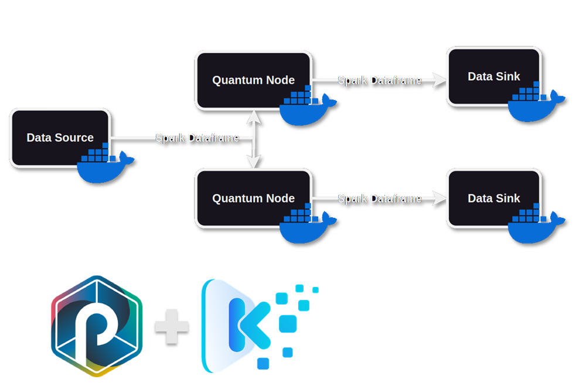
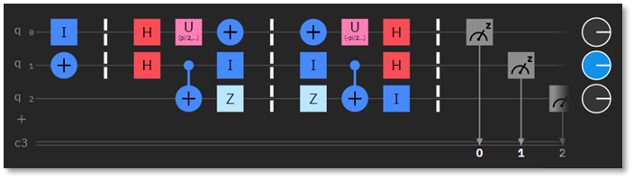
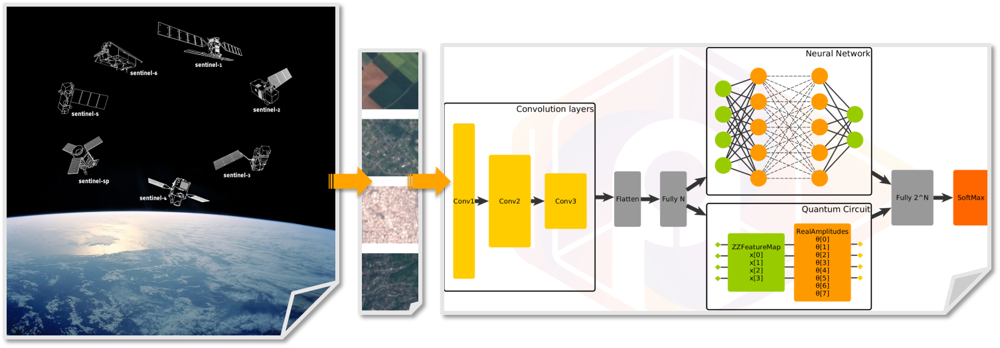
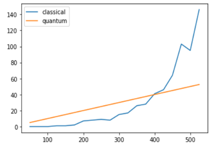
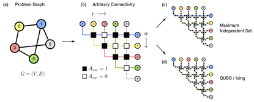
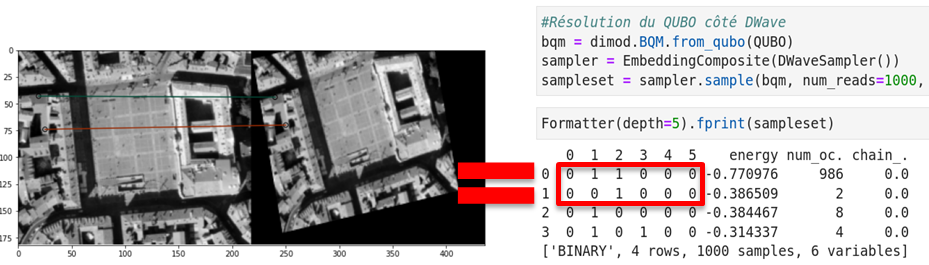
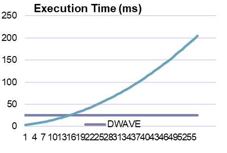

  #  What is the Quantum Kubernetes Platform ?
  
  Quantum Punch proposes a unique solution enabling the creation of quantum algorithms independent of the hardware or service on which it runs.
  Quantum punch connects you to the quantum calculators of :
  + [Amazon Braket](https://aws.amazon.com/fr/braket/)
  + [Microsoft Azure Quantum](https://azure.microsoft.com/fr-fr/products/quantum)
  + [IBM Quantum Platform](https://quantum.ibm.com/)
  + [D-Wave Leap](https://cloud.dwavesys.com/leap/login/?next=/leap/)
  
  This works by creating a set of plugins for the punch platform, compatible with the rest of the punch ecosystem and enabling access to online quantum calculators. Each plugin relies on a common open-source language and translates the task to the target specification. The task is then sent to the targeted quantum calculator, monitored and the result is automatically retrieved.
  
  
  
  # What is it good for ?
  
  We currently have 3 real world use-cases, one for each plugin.
  
  Each one is illustrated by a demonstration.
  
  ## Quantum circuit demo
  
  The quantum circuit demonstration leverages the [OpenQASM](https://en.wikipedia.org/wiki/OpenQASM) format to send quantum circuit to multiple quantum computers and desplay the results.
  
  
  
  You can access the demo by clicking [here](https://quantum.forthales.com/punchlines/view?version=latest&name=qp-demo-quantumpunch-qasm.yaml).
  
  ## Quantum Machine Learning demo
  
  The machine learning demo leverages quantum computing in order to train an artificial intelligence to recognize terrain for space probe mapping initiative.
  
  
  
  Our tests proved that quantum computing increases drastically the learning curve of the machine learning model.
  
  
  
  You can access the demo by clicking [here](https://quantum.forthales.com/punchlines/view?version=latest&name=qp-demo-quantumpunch-jpy.yaml).
  
  ## Quantum Optimizer demo
  
  
  
  The quantum optimizer demonstration leverages the [quadratic unconstrained binary optimization](https://en.wikipedia.org/wiki/Quadratic_unconstrained_binary_optimization) format to send optimization problems to multiple quantum computers and desplay the results.
  
  The optimizer use-case was applied once again on image recognition in degraded conditions.
  
  
  
  Our tests proved that quantum computing allows problem solving in fixed time compared to the quadratic time of classical computing.
  
  
  
  You can access the demo by clicking [here](https://quantum.forthales.com/punchlines/view?version=latest&name=qp-demo-quantumpunch-qubo.yaml).
